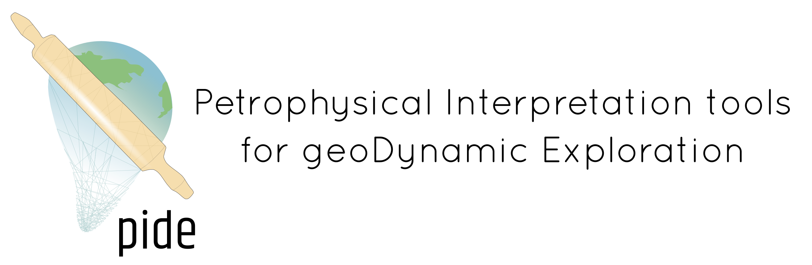
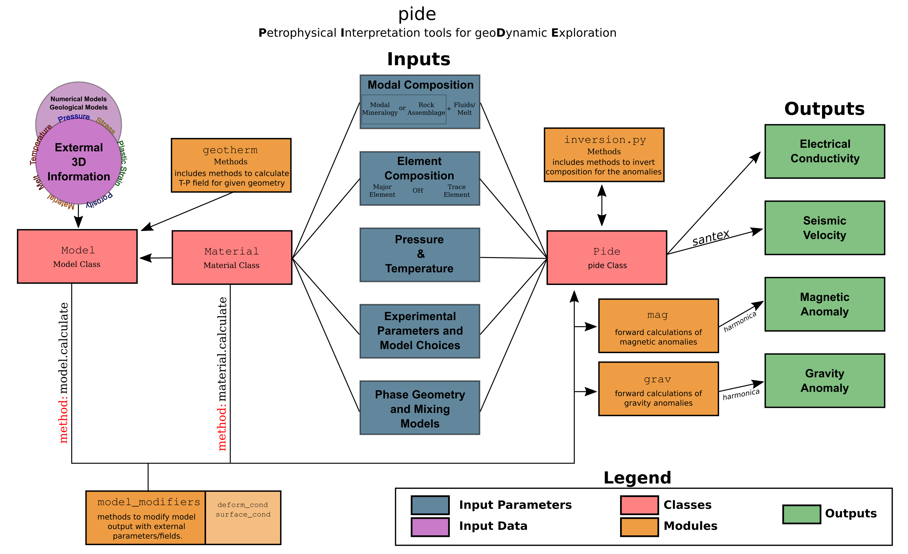

# pide

# About
*pide* is a Python3 library for calculating geophysical parameters (e.g., electrical conductivity, seismic velocity), employing the results from experimental petrology, mineral/rock physics, and thermomechanical modelling studies. *pide* can calculate the theoretical electrical conductivity of any earth material that exists in the literature. *pide* can also calculate seismic velocity utilising the external 'sister' library *santex*. Using these theoretical calculations, users can utilise inversion modules to decode geophysical anomalies compositionally or convert thermomechanical models into geophysical observables. With a given spatial mapping of earth materials, which can preferentially be loaded from a thermomechanical model, *pide*  can be used to build synthetic electrical conductivity and seismic velocity models and generate gravity and magnetic anomalies. Moreover, it is built as a modular tool, so users can easily build their functions.

# Installation

To install pide, the user can simply go their terminal and type the following command:

`> pip install pide`

or alternatively, they can clone the repository, then go to the directory of the source with *cd* and perform:

`> pip install .`

If you want to help develop and change code as it is being used:

`> pip install -e .`

# Workflow and how to use

How to use *pide* can be learned through Jupyter notebooks provided in examples/notebooks directory. The general workflow can be tracked through the chart below:

Information on all methods (input/output, examples) can be accesed through the pide object method as follows:
<pre>

pide_object = pide.pide()

pide_object.list_methods()
pide_object.get_method_manual(method_name)

</pre>

# Getting Involved

Since *pide* is an open-source library, users are encouraged to be contribute and become developers of the project. For further information about how to contribute, please refer to the [Contributing Guide](https://github.com/sinanozaydin/pide/blob/post_joss/CONTRIBUTING.md).

# Contacts

| **Sinan Özaydın** | sinan.ozaydin@protonmail.com | sinan.ozaydin@sydney.edu.au
