## <span style="color:green"> Notebook - Starting with pide </span>
<span style="color:purple">Sinan Ozaydin, School of Geosciences, The University of Sydney, NSW 2006, Australia <br/> </span>
<span style="color:purple">sinan.ozaydin@protonmail.com</span>

pide is a python3 library to calculate geophysical observables like electrical conductivity and seismic velocity for the given compositional and thermodynamic environment. To derive this information it uses library of experimental models on electrical conductivity and thermoelastic constants. pide is constituted by three main classes:

<span style="color:red;">-pide:</span> This is the class where calculations related to electrical conductivity and seismic velocities are performed. pide object is central to the library and all material and model classes utilizes pide object to calculate electrical conductivities and seismic velocities. 

<span style="color:red;">-material:</span> A material holder class where the user can define a compositional environment and choices relevant to how the geophysical observables are going to be calculated. This can be done in the pide class by directly setting these parameters on a pide class, however, material class should create a tidy and interoperable environment for more complex calculations that can be streamlined through other processes.

<span style="color:red;">-model:</span> The model class represents a collection of materials that are geospatially indexed and thermodynamically defined. The users can create model objects from informations derived from thermomechanical numerical (like underworld or aspect outputs), or geological models.

**Other tools included in the toolkit of pide are:**

<span style="color:green;">-geodyn:</span> A collection of scripts and methods to deal with input/output/processing of thermomechanical models.

<span style="color:green;">-gravity and mag:</span> A collection of methods to calculate gravity and magnetic anomalies from given 3D environment set by a model object.

<span style="color:green;">-mt:</span> A collection of tools to convert the outputs of pide into MT input scripts for forward and inverse modelling of these synthetic models. The codes currently implemented are ModEM and MARE2DEM.

<span style="color:green;">-rheology:</span> A collection of methods to perform rheological calculations from the outputs of pide (e.g., mantle viscosity from MT driven water contents).

<span style="color:green;">-inversion:</span> A collection of methods to invert for compositional parameterisations used in pide (e.g., mineral/melt contents, interconnectivity of phases, water contents) from real data.

To understand the functions used in pide, one can utilise the following workflow:


```python
import pide

#creating the pide object
p_object = pide.pide()

#Now, we can list all the methods used in pide class by:
p_object.list_methods()


```

    - calculate_arrhenian_single
    - calculate_bulk_mantle_water_solubility
    - calculate_conductivity
    - calculate_density_solid
    - calculate_fluids_conductivity
    - calculate_melt_conductivity
    - calculate_mineral_conductivity
    - calculate_mineral_water_solubility
    - calculate_o2_fugacity
    - calculate_rock_conductivity
    - calculate_seismic_velocities
    - calculate_transition_zone_water_solubility
    - calculate_water_fugacity
    - get_method_manual
    - get_mineral_index
    - get_rock_index
    - list_available_minerals
    - list_available_rocks
    - list_fluid_econd_models
    - list_mantle_water_partitions_melt
    - list_mantle_water_partitions_solid
    - list_mantle_water_solubilities
    - list_melt_econd_models
    - list_methods
    - list_mineral_econd_models
    - list_phs_melt_fluid_mix_methods
    - list_phs_mix_methods
    - list_rock_econd_models
    - list_transition_zone_water_partitions_solid
    - mantle_water_distribute
    - reset
    - revalue_arrays
    - set_alopx
    - set_bulk_water
    - set_composition_solid_mineral
    - set_composition_solid_rock
    - set_depth
    - set_fluid_properties
    - set_grain_boundary_H_Diffusion
    - set_grain_boundary_water_partitioning
    - set_grain_size
    - set_mantle_transition_zone_water_partitions
    - set_mantle_water_partitions
    - set_mantle_water_solubility
    - set_melt_fluid_conductivity_choice
    - set_melt_fluid_frac
    - set_melt_fluid_interconnectivity
    - set_melt_or_fluid_mode
    - set_melt_properties
    - set_mineral_conductivity_choice
    - set_mineral_water
    - set_o2_buffer
    - set_param1_mineral
    - set_param1_rock
    - set_parameter
    - set_phase_interconnectivities
    - set_pressure
    - set_rock_conductivity_choice
    - set_rock_water
    - set_seismic_velocity_properties
    - set_solid_melt_fluid_mix_method
    - set_solid_phase_method
    - set_solid_phs_mix_method
    - set_temperature
    - set_watercalib
    - set_xfe_mineral
    - transition_zone_water_distribute
    - write_data


```python
#In order to get manual of a certain method one can do:
p_object.get_method_manual('calculate_mineral_conductivity')
```

    The Manual for the calculate_mineral_conductivity:
    A method to calculate mineral conductivity with the environment set up.
    		
    		Input:
    		int: min_idx - Name of the mineral or index of the mineral chosen.
    		
    		str: method - 'array' or 'index'|| Default - 'array
    		int: sol_idx: index parameter if method|index is chosen.
    		
    		Output:
    		float/array: conductivity || in (S/m)
    		
    		Example:
    		calculate_mineral_conductivity(min_idx = 'ol')


A lot of environment variables to set in pide can be access through the **list methods**. An example can be:


```python
#To list all available electrical electrical conductivity models and get their indexes.
p_object.list_mineral_econd_models('ol')
```

    Electrical conductivity models for the given mineral: ol
    0.   Dai2014_DryandWetOlivine_fo2  -----  polaron+proton
    1.   Dai2020_WetOlivine_200ppmTi_fo2  -----  polaron+proton
    2.   Dai2020_WetOlivine_683ppmTi_fo2  -----  polaron+proton
    3.   Fei2020_WetOlivineIonic_Isotropic  -----  ionicWet
    4.   Gardes2014_DryandWetOlivine  -----  ionic+polaron+proton
    5.   Jones2012_WetOlivine  -----  proton
    6.   Liu2021_DryOlivine_NNOBuffer  -----  polaron
    7.   Poe2010_DryandWetOlivine  -----  polaron+proton
    8.   Wang2006_DryandWetOlivine  -----  polaron+proton
    9.   Yoshino2009_DryandWetOlivine  -----  ionic+polaron+proton
    10.   Constable2006_dryOlivine_fo2  -----  polaron
    11.   Dai2014_DryOlivine_xFe  -----  polaron
    12.   Fullea2011_DryOlivine_xFe  -----  polaron
    13.   Pommier2018_ShearedDryOlivine  -----  polaron
    14.   Xu1998_DryOlivine  -----  polaron
    15.   Yoshino2012_DryOlivine_xFe  -----  polaron
    16.   Novella2017_HDiffusion  -----  protondiffusion
    17.   Sun2019_HDiffusion  -----  protondiffusion
    18.   DuFrane2012_HDiffusion  -----  protondiffusion
    19.   Kohlstedt1998_HDiffusion  -----  protondiffusion
    20.   Demouchy2006_HDiffusion  -----  protondiffusion


    ['Dai2014_DryandWetOlivine_fo2',
     'Dai2020_WetOlivine_200ppmTi_fo2',
     'Dai2020_WetOlivine_683ppmTi_fo2',
     'Fei2020_WetOlivineIonic_Isotropic',
     'Gardes2014_DryandWetOlivine',
     'Jones2012_WetOlivine',
     'Liu2021_DryOlivine_NNOBuffer',
     'Poe2010_DryandWetOlivine',
     'Wang2006_DryandWetOlivine',
     'Yoshino2009_DryandWetOlivine',
     'Constable2006_dryOlivine_fo2',
     'Dai2014_DryOlivine_xFe',
     'Fullea2011_DryOlivine_xFe',
     'Pommier2018_ShearedDryOlivine',
     'Xu1998_DryOlivine',
     'Yoshino2012_DryOlivine_xFe',
     'Novella2017_HDiffusion',
     'Sun2019_HDiffusion',
     'DuFrane2012_HDiffusion',
     'Kohlstedt1998_HDiffusion',
     'Demouchy2006_HDiffusion']


Then we can use this information to set our olivine conduction model as Gardes2014_DryandWetOlivine:


```python
p_object.set_mineral_conductivity_choice(ol = 4)
```

The pide object can be reset to default values can be done as follows:


```python
p_object.reset()
```
## <span style="color:green"> Notebook - Conversion of 2D Underworld Model II - Narrow Rift Inversion</span>
<span style="color:purple">Sinan Ozaydin, School of Geosciences, The University of Sydney, NSW 2006, Australia <br/> </span>
<span style="color:purple">sinan.ozaydin@protonmail.com | sinan.ozaydin@sydney.edu.au </span>

In this notebook, we will convert a numerical model output from underworld to geophysical parameters, electrical conductivity and seismic velocity. First, let's import the functions we are going to use.


```python
import os
from pathlib import Path

import pide
from pide.material import Material
from pide.model import Model
from pide.geodyn.read_uw_model import *
from pide.geodyn.interpolate_fields import interpolate_2d_fields
from pide.geodyn.plot_models import *
from pide.geodyn.material_process import *
from pide.geodyn.write_uw_model import write_2d_field_h5

#setting up source folder of the files
notebook_path = Path().resolve()
source_folder = os.path.join(notebook_path,'..','example_data','uwconversion', 'NRift')
```

    /home/sinan/.local/lib/python3.10/site-packages/matplotlib/projections/__init__.py:63: UserWarning: Unable to import Axes3D. This may be due to multiple versions of Matplotlib being installed (e.g. as a system package and as a pip package). As a result, the 3D projection is not available.
      warnings.warn("Unable to import Axes3D. This may be due to multiple versions of "


Reading the data files of thermomechanical model outputs in h5 formats. They can be read by the ***read_h5_file*** function.


```python
#setting up filename folders for the h5 files.
temp_fnm = os.path.join(source_folder,'temperature-152.h5')
pstrain_fnm = os.path.join(source_folder,'projPlasticStrain-152.h5')
material_fnm = os.path.join(source_folder,'projMaterialField-152.h5')
melt_fnm = os.path.join(source_folder,'projMeltField-152.h5')
pressure_fnm = os.path.join(source_folder,'pressureField-152.h5')
mesh_fnm = os.path.join(source_folder,'mesh.h5')

py_start_fnm = os.path.join(source_folder,'NRiftExtInv.py')

temp_data = read_h5_file(temp_fnm)
pressure_data = read_h5_file(pressure_fnm)
mesh_data = read_h5_file(mesh_fnm)
material_data = read_h5_file(material_fnm)
pstrain_data = read_h5_file(pstrain_fnm)
melt_data = read_h5_file(melt_fnm)


```

We can scrape the material names and their relevant index numbers from the input python script with ***read_uw_material_names*** function. 2D mesh can be set up by ***setup_2d_mesh***. It outputs mesh (np.meshgrid), mesh_center (np.meshgrid), x_mesh and y_mesh (1D np.arrays of mesh), x_mesh_centers and y_mesh centers (1D np.arrays of mesh centers). With the given material_names, we can set up the material array in concordance with the mesh using ***setup_material*** function.


```python
#reading startup py file to get material order and properties.
material_names = read_uw_material_names_from_py_input(py_start_fnm)

#reading 2d mesh params mesh itself, mesh_centers mesh, array in x direction, array in y direction, borders of the mesh[max_x, min_x, max_y, min_y]
mesh, mesh_center, x_mesh, y_mesh, x_mesh_centers, y_mesh_centers, borders_mesh = setup_2d_mesh(mesh_data)

#getting material_array
material_array, air_material_idx = setup_material(material_data, material_names)
```

    #######################
    Setting up the mesh parameters...
                        
                        
                        
    Maximum X:  680.0   km
    Minimum X:  0.0   km
    Maximum Y:  190.0   km
    Minimum Y:  -30.000000000000007   km
     
    Materials included in the py startup file, matching up with the projMaterial.h5 material index identifiers.
    id    materialname
    1    air
    2    sediment
    3    Sediment1
    4    Sediment2
    5    Sediment3
    6    Sediment4
    7    Sediment5
    8    Sediment6
    9    continentalcrustL3
    10    continentalcrustL4
    11    continentalcrustL5
    12    continentalcrustL6
    13    continentalcrustL7
    14    continentalcrustL8
    15    continentalcrustL9
    16    continentalcrustL10
    17    uppermantle
    18    asthenosphere


Read data files can be turned into np arrays with ***setup_uw_data_array_PROJ_2D***.


```python
#getting strain array
pstrain_array = setup_uw_data_array_PROJ_2D(pstrain_data)
melt_array = setup_uw_data_array_PROJ_2D(melt_data)

temp_array = setup_uw_data_array_PROJ_2D(temp_data) #mesh
pressure_array = setup_uw_data_array_PROJ_2D(pressure_data) / 1e9 #converting to gigapascal
```

In underworld outputs, PROJ files are smaller in size and also contains data at the mesh centers. On the other hand, some fields are not projected and appear on nodes. To make all our calculations agree with each other. We interpolate all the data to mesh_center locations. This can be done by using ***interpolate_2d_fields*** function. For material_array, it is important to use method as 'nearest' since we do not want floating numbers at the mesh centers and only integers as material indexes.


```python
#Converting larger arrays into mesh_center locations.
temp_array = interpolate_2d_fields(mesh,temp_array,mesh_center)
pressure_array = interpolate_2d_fields(mesh_center,pressure_array,mesh_center)
melt_array = interpolate_2d_fields(mesh,melt_array,mesh_center)
pstrain_array = interpolate_2d_fields(mesh,pstrain_array,mesh_center)
material_array = interpolate_2d_fields(mesh,material_array,mesh_center,method = 'nearest') #using nearest for the material for them to stay integers
```

These values now can be plotted with ***plot_2D_underworld_Field*** function. 


```python
plot_2D_underworld_Field(xmesh = x_mesh_centers, ymesh = y_mesh_centers, Field = material_array,cblimit_up = len(material_names), cblimit_down = 0,
                         log_bool=False, cb_name = 'tab20b',label = 'material.png', cbar_label = 'Material Index',plot_save = False)
plot_2D_underworld_Field(xmesh = x_mesh_centers, ymesh = y_mesh_centers, Field = temp_array, cblimit_up = 1500, cblimit_down = 600,
                         log_bool=False, cb_name = 'coolwarm', label = 'temperature.png',cbar_label = r'Temperature [$C^{\circ}$]', plot_save = False)
plot_2D_underworld_Field(xmesh = x_mesh_centers, ymesh = y_mesh_centers, Field = pstrain_array,cblimit_up = 1e2, cblimit_down = 1e-2, log_bool=True,
                         cb_name = 'binary', cbar_label = 'Plastic Strain',plot_save = False)

```


    
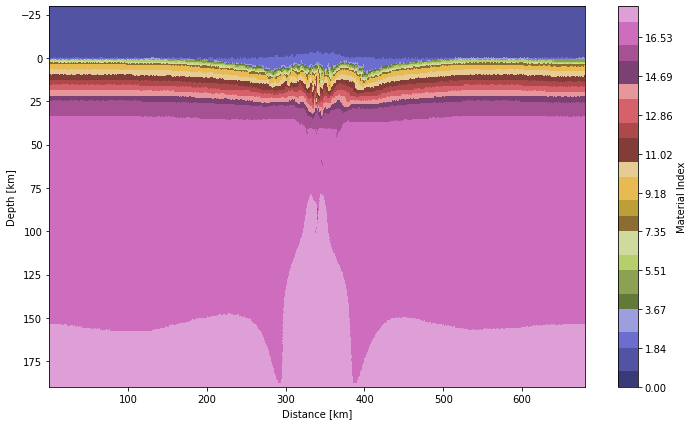
    


    
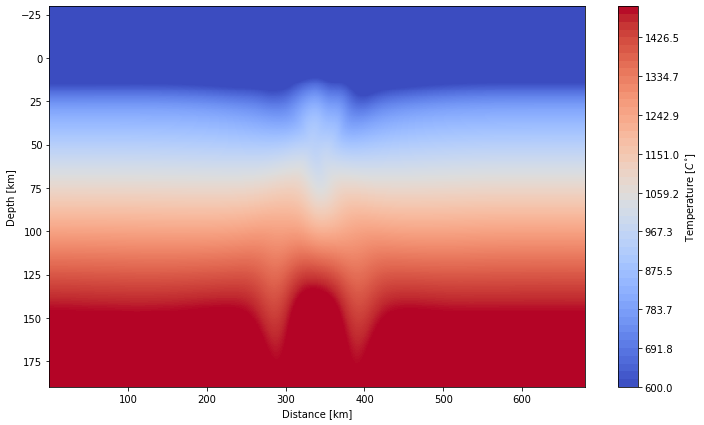
    


    
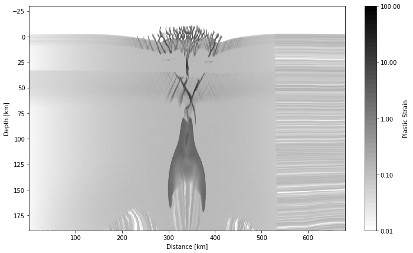
    


To convert the thermomechanical model into geophysical observables, we first have to define material objects that will correspond to materials used in the thermomechanical model. To set this up we have to refer to the material indexes we scraped from the .py file earlier. In this current example we have 14 materials. In these we will define their composition, mineral interconnectivities, water thermodynamic parameters, and how they will behave when they are to be used with ***deform_cond*** functions, which we will get into it in the later cells. For now, we will going to define two materials for each material we see in the thermomechanical model. One that is a 'background' or 'boring' conductivity model. With this, we will have a conservative estimate of the electrical conductivity. On the other hand, we will also define the most conductive endmember composition and conditions for that material. For instance, in the following cell we will define Eclogites as *Eclogite_Object* and *Eclogite_Object_2*:

Eclogite_Object: An dry eclogitic composition where conductivity is controlled by the volumetric percentages of constituent minerals, i.e. Hashin-Shtrikman Model.
Eclogite_Object_2: A dry eclogitic composition where 5% sulphides added into the composition and they are perfectly interconnected.


```python
import pide
from pide.material import Material
p_obj = pide.pide()

################
#Loose sediments
Sediment_0 = Material(name = 'Sediment_0', material_index = 2, calculation_type = 'value',
resistivity_medium = 50.0,vp_medium = 6,vs_medium = 3,
deformation_dict = {'function_method':'exponential',
'conductivity_decay_factor':0.7, 'conductivity_decay_factor_2':0.2,'strain_decay_factor':0.3,'strain_percolation_threshold':None})

Sediment_0_b = Material(name = 'Sediment_0', material_index = 2, calculation_type = 'value',
resistivity_medium = 1.0,vp_medium = 6,vs_medium = 3,
deformation_dict = {'function_method':'exponential',
'conductivity_decay_factor':0.7, 'conductivity_decay_factor_2':0.2,'strain_decay_factor':0.3,'strain_percolation_threshold':None})
```

In a similar manner, we can define the remaining materials as we like to as well:


```python
################
#Sediment Layers
Sediment_1 = Material(name = 'Sediment_1', material_index = 3, calculation_type = 'value',
resistivity_medium = 100.0,vp_medium = 6,vs_medium = 3,
deformation_dict = {'function_method':'exponential',
'conductivity_decay_factor':0.7, 'conductivity_decay_factor_2':0.2,'strain_decay_factor':0.3,'strain_percolation_threshold':None})

Sediment_1_b = Material(name = 'Sediment_1', material_index = 3, calculation_type = 'value',
resistivity_medium = 10.0,vp_medium = 6,vs_medium = 3,
deformation_dict = {'function_method':'exponential',
'conductivity_decay_factor':0.7, 'conductivity_decay_factor_2':0.2,'strain_decay_factor':0.3,'strain_percolation_threshold':None})

#We want to define empty materials with similar compositional varieties but only change some of those attributes
Sediment_2 = Material()
Sediment_2_b = Material()
Sediment_3 = Material()
Sediment_3_b = Material()
Sediment_4 = Material()
Sediment_4_b = Material()
Sediment_5 = Material()
Sediment_5_b = Material()
Sediment_6 = Material()
Sediment_6_b = Material()

#Using copy attributes from Sediment_1 objects.
Sediment_1.copy_attributes([Sediment_2,Sediment_3,Sediment_4,Sediment_5,Sediment_6])
Sediment_1_b.copy_attributes([Sediment_2_b,Sediment_3_b,Sediment_4_b,Sediment_5_b,Sediment_6_b])

Sediment_2.material_index = 4
Sediment_3.material_index = 5
Sediment_4.material_index = 6
Sediment_5.material_index = 7
Sediment_6.material_index = 8

Sediment_2_b.material_index = 4
Sediment_3_b.material_index = 5
Sediment_4_b.material_index = 6
Sediment_5_b.material_index = 7
Sediment_6_b.material_index = 8
```


```python
################
#Upper crust layers
Granitic_Upper_Crust = Material(name = 'Granitic_Upper_Crust', material_index = 9, calculation_type = 'mineral', composition = {'kfelds': 0.30, 'quartz': 0.35, 'plag': 0.25, 'amp': 0.1},
el_cond_selections = {'plag':1, 'garnet': 0, 'opx':0, 'amp':0, 'quartz': 7}, solid_phase_mixing_idx = 1,
                                param1 = {'plag':0.1},
deformation_dict = {'function_method':'exponential',
'conductivity_decay_factor':0.7, 'conductivity_decay_factor_2':0.2, 'strain_decay_factor':0.3,
                    'strain_percolation_threshold':None})

Granitic_Upper_Crust_b = Material(name = 'Granitic_Upper_Crust', material_index = 9, calculation_type = 'mineral', composition = {'kfelds': 0.285, 'quartz': 0.3325, 'plag': 0.2375, 'amp': 0.095,'sulphide': 0.05},
el_cond_selections = {'plag':1, 'garnet': 0, 'opx':0, 'amp':0, 'quartz': 7}, solid_phase_mixing_idx = 2,
                                  param1 = {'plag':0.1},
deformation_dict = {'function_method':'exponential',
'conductivity_decay_factor':0.7, 'conductivity_decay_factor_2':0.2, 'strain_decay_factor':0.3,
                    'strain_percolation_threshold':None})

Granitic_Upper_Crust_2 = Material()
Granitic_Upper_Crust_2_b = Material()
Granitic_Upper_Crust_3 = Material()
Granitic_Upper_Crust_3_b = Material()

Granitic_Upper_Crust.copy_attributes([Granitic_Upper_Crust_2, Granitic_Upper_Crust_3])
Granitic_Upper_Crust_b.copy_attributes([Granitic_Upper_Crust_2_b, Granitic_Upper_Crust_3_b])

Granitic_Upper_Crust_2.material_index = 10
Granitic_Upper_Crust_3.material_index = 11
Granitic_Upper_Crust_2_b.material_index = 10
Granitic_Upper_Crust_3_b.material_index = 11
```


```python
#Felsic Granulite Layers
Felsic_Granulite_Lower_Crust = Material(name = 'Felsic_Granulite_Lower_Crust', material_index=12, calculation_type = 'mineral', composition = {'plag':0.45, 'garnet': 0.25,
'opx':0.05, 'amp':0.1, 'quartz': 0.15},
el_cond_selections = {'plag':1, 'garnet': 0, 'opx':0, 'amp':0, 'quartz': 7}, solid_phase_mixing_idx = 1,
                                        param1 = {'plag':0.1},
deformation_dict = {'function_method':'exponential',
'conductivity_decay_factor':0.7, 'conductivity_decay_factor_2':0.2, 'strain_decay_factor':0.3,
                    'strain_percolation_threshold':None})

Felsic_Granulite_Lower_Crust_b = Material(name = 'Felsic_Granulite_Lower_Crust_b', material_index=12, calculation_type = 'mineral', composition = {'plag':0.4275, 'garnet': 0.2375,
'opx':0.0475, 'amp':0.095, 'quartz': 0.1425, 'sulphide': 0.05},
el_cond_selections = {'plag':1, 'garnet': 0, 'opx':0, 'amp':0, 'quartz': 7, 'sulphide': 0}, solid_phase_mixing_idx = 2,
                                          param1 = {'plag':0.1},
deformation_dict = {'function_method':'exponential',
'conductivity_decay_factor':0.7, 'conductivity_decay_factor_2':0.2, 'strain_decay_factor':0.3,'strain_percolation_threshold':None})

Felsic_Granulite_Lower_Crust_2 = Material()
Felsic_Granulite_Lower_Crust_2_b = Material()
Felsic_Granulite_Lower_Crust_3 = Material()
Felsic_Granulite_Lower_Crust_3_b = Material()

Felsic_Granulite_Lower_Crust.copy_attributes([Felsic_Granulite_Lower_Crust_2, Felsic_Granulite_Lower_Crust_3])
Felsic_Granulite_Lower_Crust_b.copy_attributes([Felsic_Granulite_Lower_Crust_2_b, Felsic_Granulite_Lower_Crust_3_b])

Felsic_Granulite_Lower_Crust_2.material_index = 13
Felsic_Granulite_Lower_Crust_3.material_index = 14
Felsic_Granulite_Lower_Crust_2_b.material_index = 13
Felsic_Granulite_Lower_Crust_3_b.material_index = 14
```


```python
#Mafic Granulite Layers
Mafic_Granulite_Lower_Crust = Material(name = 'Mafic_Granulite_Lower_Crust', material_index=15, calculation_type = 'mineral', composition = {'plag':0.31, 'garnet':0.19,
'cpx':0.25, 'opx':0.05,'amp':0.12, 'quartz':0.04,'kfelds':0.03,'other':0.01},param1 = {'plag':0.1},
el_cond_selections = {'plag':1, 'garnet': 0, 'opx':0, 'amp':0, 'quartz': 7, 'cpx':9, 'kfelds':2, 'other':0}, solid_phase_mixing_idx = 1,
deformation_dict = {'function_method':'exponential',
'conductivity_decay_factor':0.7, 'conductivity_decay_factor_2':0.2, 'strain_decay_factor':0.3,'strain_percolation_threshold':None})

Mafic_Granulite_Lower_Crust_b = Material(name = 'Mafic_Granulite_Lower_Crust_b', material_index=15, calculation_type = 'mineral', composition = {'plag':0.2945, 'garnet':0.1805,
'cpx':0.2375, 'opx':0.0475,'amp':0.114, 'quartz':0.038,'kfelds':0.0285,'other':0.0095, 'sulphide': 0.05},param1 = {'plag':0.1},
el_cond_selections = {'plag':1, 'garnet': 0, 'opx':0, 'amp':0, 'quartz': 7, 'cpx':9, 'kfelds':2, 'other':0, 'sulphide': 0}, solid_phase_mixing_idx = 2,
deformation_dict = {'function_method':'exponential',
'conductivity_decay_factor':0.7, 'conductivity_decay_factor_2':0.2, 'strain_decay_factor':0.3,'strain_percolation_threshold':None})

Mafic_Granulite_Lower_Crust_2 = Material()
Mafic_Granulite_Lower_Crust_2_b = Material()


Mafic_Granulite_Lower_Crust.copy_attributes(Mafic_Granulite_Lower_Crust_2)
Mafic_Granulite_Lower_Crust_b.copy_attributes(Mafic_Granulite_Lower_Crust_2_b)

Mafic_Granulite_Lower_Crust_2.material_index = 16
Mafic_Granulite_Lower_Crust_2_b.material_index = 16

```


```python
#Mantle
Upper_Mantle = Material(name = 'Upper_Mantle', material_index = 17,
calculation_type = 'mineral', composition = {'ol':0.65,'opx':0.25,'garnet':0.05,'cpx':0.05},
interconnectivities = {'ol':1,'opx':2,'garnet':5, 'cpx':5}, 
el_cond_selections = {'ol':4, 'opx':0, 'garnet':0,'cpx':0}, water_distr = True, water = {'bulk':100},
xfe = {'ol':0.1,'opx':0.1,'garnet':0.1, 'cpx':0.1}, solid_phase_mixing_idx = 0,
deformation_dict = {'function_method':'exponential',
'conductivity_decay_factor':0.7, 'conductivity_decay_factor_2':0.2, 'strain_decay_factor':0.3,'strain_percolation_threshold':None})

Upper_Mantle_b = Material(name = 'Upper_Mantle', material_index = 17, 
calculation_type = 'mineral', composition = {'ol':0.62,'opx':0.24,'garnet':0.045,'cpx':0.045,'sulphide':0.05},
interconnectivities = {'ol':1,'opx':2,'garnet':5, 'cpx':5,'sulphide':1}, 
el_cond_selections = {'ol':4, 'opx':0, 'garnet':0,'cpx':0,'sulphide':0}, water_distr = True, water = {'bulk':100},
xfe = {'ol':0.1,'opx':0.1,'garnet':0.1, 'cpx':0.1}, solid_phase_mixing_idx = 0,
deformation_dict = {'function_method':'exponential',
'conductivity_decay_factor':0.7, 'conductivity_decay_factor_2':0.2, 'strain_decay_factor':0.3,'strain_percolation_threshold':None})

#Asthenospheric mantle - A lherzolite with 100 ppm water object where conductive counterpart has 300 ppm water in it. 
Asthenosphere = Material(name = 'Asthenospheric_Mantle_Object', material_index = 18, 
calculation_type = 'mineral', composition = {'ol':0.65,'opx':0.25,'garnet':0.05,'cpx':0.05},
interconnectivities = {'ol':1,'opx':2,'garnet':5, 'cpx':5}, 
el_cond_selections = {'ol':4, 'opx':0, 'garnet':0,'cpx':0}, water_distr = True, water = {'bulk':100},
xfe = {'ol':0.1,'opx':0.1,'garnet':0.1, 'cpx':0.1}, solid_phase_mixing_idx = 0,
deformation_dict = {'function_method':'exponential',
'conductivity_decay_factor':0.7, 'conductivity_decay_factor_2':0.2, 'strain_decay_factor':0.3,'strain_percolation_threshold':None})

Asthenosphere_b = Material(name = 'Asthenospheric_Mantle_Object', material_index = 18,
calculation_type = 'mineral', composition = {'ol':0.65,'opx':0.25,'garnet':0.05,'cpx':0.05},
interconnectivities = {'ol':1,'opx':2,'garnet':5, 'cpx':5}, 
el_cond_selections = {'ol':4, 'opx':0, 'garnet':0,'cpx':0}, water_distr = True, water = {'bulk':300},
xfe = {'ol':0.1,'opx':0.1,'garnet':0.1, 'cpx':0.1}, solid_phase_mixing_idx = 0,
deformation_dict = {'function_method':'exponential',
'conductivity_decay_factor':0.7, 'conductivity_decay_factor_2':0.2, 'strain_decay_factor':0.3,'strain_percolation_threshold':None})
```

Now, we want to put them in a list in order to put them in a *Model* object. We also want to define a *material_skip_list*, which is the node skip rate for each material included in the lists. This is useful for something like asthenosphere where we do not have much heterogeneity and value can be calculated on a basis of calculating only some of the nodes.


```python
#creating material_object_list:
material_object_list = [Sediment_0, Sediment_1,Sediment_2,Sediment_3, Sediment_4,Sediment_5,Sediment_6,Granitic_Upper_Crust,Granitic_Upper_Crust_2,Granitic_Upper_Crust_3,
Felsic_Granulite_Lower_Crust,Felsic_Granulite_Lower_Crust_2,Felsic_Granulite_Lower_Crust_3,Mafic_Granulite_Lower_Crust,Mafic_Granulite_Lower_Crust_2,Upper_Mantle,Asthenosphere]

material_object_list_2 = [Sediment_0_b, Sediment_1_b,Sediment_2_b,Sediment_3_b, Sediment_4_b,Sediment_5_b,Sediment_6_b,Granitic_Upper_Crust_b,Granitic_Upper_Crust_2_b,Granitic_Upper_Crust_3_b,
Felsic_Granulite_Lower_Crust_b,Felsic_Granulite_Lower_Crust_2_b,Felsic_Granulite_Lower_Crust_3_b,Mafic_Granulite_Lower_Crust_b,Mafic_Granulite_Lower_Crust_2_b,Upper_Mantle_b,Asthenosphere_b]

material_skip_list = [None,None,None,None,None,None,None,None,None,None,None,None,None,None,None,5,5]
```

Now, we are creating the model object by assigning it the material lists, material array, temperature, pressure, melt, and plastic strain fields. After that, we can simply calculate the conductivities by saying, ***object.calculate_conductivity***. Number of CPUs can be specified.


```python
#creating model_object
mt_model_object = Model(material_list = material_object_list, material_array = material_array, T = temp_array, P = pressure_array, model_type = 'underworld_2d', melt = melt_array,
p_strain = pstrain_array, material_node_skip_rate_list = material_skip_list)
backgr_cond = mt_model_object.calculate_model(type = 'conductivity', num_cpu = 6)
```

    Initiating calculation for the materials appended to the model.
    ##############################################################
    The conductivity for the material  Sediment_0  is calculated.
    The conductivity for the material  Sediment_1  is calculated.
    The conductivity for the material  Sediment_1  is calculated.
    The conductivity for the material  Sediment_1  is calculated.
    The conductivity for the material  Sediment_1  is calculated.
    The conductivity for the material  Sediment_1  is calculated.
    The conductivity for the material  Sediment_1  is calculated.
    The conductivity for the material  Granitic_Upper_Crust  is calculated.
    The conductivity for the material  Granitic_Upper_Crust  is calculated.
    The conductivity for the material  Granitic_Upper_Crust  is calculated.
    The conductivity for the material  Felsic_Granulite_Lower_Crust  is calculated.
    The conductivity for the material  Felsic_Granulite_Lower_Crust  is calculated.
    The conductivity for the material  Felsic_Granulite_Lower_Crust  is calculated.
    The conductivity for the material  Mafic_Granulite_Lower_Crust  is calculated.
    The conductivity for the material  Mafic_Granulite_Lower_Crust  is calculated.
    The conductivity for the material  Upper_Mantle  is calculated.
    The conductivity for the material  Asthenospheric_Mantle_Object  is calculated.
    ##############################################################


```python
plot_2D_underworld_Field(xmesh = x_mesh_centers, ymesh = y_mesh_centers, Field = backgr_cond,cblimit_up = 1,
cblimit_down = 1e-4, log_bool=True, cb_name = 'Spectral_r',cbar_label = 'Conductivity [S/m]',plot_save = False)
```


    
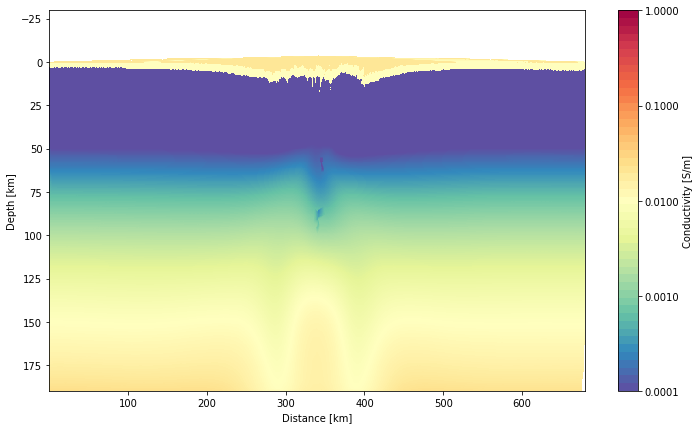
    


```python
#creating model_object
mt_model_object = Model(material_list = material_object_list_2, material_array = material_array, T = temp_array, P = pressure_array, model_type = 'underworld_2d', melt = melt_array,
p_strain = pstrain_array, material_node_skip_rate_list = material_skip_list)
max_cond = mt_model_object.calculate_model(type = 'conductivity', num_cpu = 6)
```

    Initiating calculation for the materials appended to the model.
    ##############################################################
    The conductivity for the material  Sediment_0  is calculated.
    The conductivity for the material  Sediment_1  is calculated.
    The conductivity for the material  Sediment_1  is calculated.
    The conductivity for the material  Sediment_1  is calculated.
    The conductivity for the material  Sediment_1  is calculated.
    The conductivity for the material  Sediment_1  is calculated.
    The conductivity for the material  Sediment_1  is calculated.
    The conductivity for the material  Granitic_Upper_Crust  is calculated.
    The conductivity for the material  Granitic_Upper_Crust  is calculated.
    The conductivity for the material  Granitic_Upper_Crust  is calculated.
    The conductivity for the material  Felsic_Granulite_Lower_Crust_b  is calculated.
    The conductivity for the material  Felsic_Granulite_Lower_Crust_b  is calculated.
    The conductivity for the material  Felsic_Granulite_Lower_Crust_b  is calculated.
    The conductivity for the material  Mafic_Granulite_Lower_Crust_b  is calculated.
    The conductivity for the material  Mafic_Granulite_Lower_Crust_b  is calculated.
    The conductivity for the material  Upper_Mantle  is calculated.
    The conductivity for the material  Asthenospheric_Mantle_Object  is calculated.
    ##############################################################


```python
plot_2D_underworld_Field(xmesh = x_mesh_centers, ymesh = y_mesh_centers, Field = max_cond,cblimit_up = 1,
cblimit_down = 1e-4, log_bool=True, cb_name = 'Spectral_r',cbar_label = 'Conductivity [S/m]',plot_save = False)
```


    
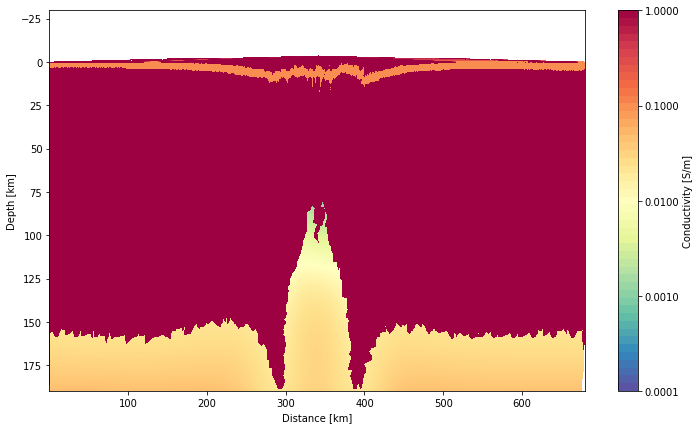
    


```python
deform_cond, rms = mt_model_object.calculate_deformation_related_conductivity(method = 'plastic_strain',
                                                        cond_min = backgr_cond,
                                                        cond_max = max_cond,                                      
                                                        low_deformation_threshold = 1e-2, high_deformation_threshold = 10, num_cpu = 6)
```

    The deformation related conductivity for the material  Sediment_0  is calculated.
    The deformation related conductivity for the material  Sediment_1  is calculated.
    The deformation related conductivity for the material  Sediment_1  is calculated.
    The deformation related conductivity for the material  Sediment_1  is calculated.
    The deformation related conductivity for the material  Sediment_1  is calculated.
    The deformation related conductivity for the material  Sediment_1  is calculated.
    The deformation related conductivity for the material  Sediment_1  is calculated.
    The deformation related conductivity for the material  Granitic_Upper_Crust  is calculated.
    The deformation related conductivity for the material  Granitic_Upper_Crust  is calculated.
    The deformation related conductivity for the material  Granitic_Upper_Crust  is calculated.
    The deformation related conductivity for the material  Felsic_Granulite_Lower_Crust_b  is calculated.
    The deformation related conductivity for the material  Felsic_Granulite_Lower_Crust_b  is calculated.
    The deformation related conductivity for the material  Felsic_Granulite_Lower_Crust_b  is calculated.
    The deformation related conductivity for the material  Mafic_Granulite_Lower_Crust_b  is calculated.
    The deformation related conductivity for the material  Mafic_Granulite_Lower_Crust_b  is calculated.
    The deformation related conductivity for the material  Upper_Mantle  is calculated.
    The deformation related conductivity for the material  Asthenospheric_Mantle_Object  is calculated.


```python
plot_2D_underworld_Field(xmesh = x_mesh_centers, ymesh = y_mesh_centers, Field = deform_cond,cblimit_up = 1e1,
cblimit_down = 1e-4, log_bool=True, cb_name = 'Spectral_r',cbar_label = 'Conductivity [S/m]',plot_save = True)
```

    The file is saved as: Interpolated_UW_Figure.png at location: /home/sinan/src/SEL/examples/notebooks


    
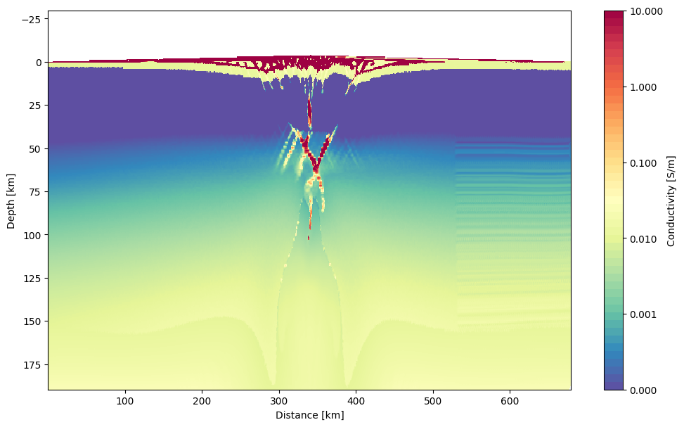
    


Using the first material list (conservative estimate), we can calculate the seismic velocities of the model with the following code block:


```python
seismic_model_object = Model(material_list = material_object_list, material_array = material_array, T = temp_array,
                             P = pressure_array,
                        model_type = 'underworld_2d', melt = melt_array,
p_strain = pstrain_array, material_node_skip_rate_list = material_skip_list)

v_p, v_s = seismic_model_object.calculate_model(type = 'seismic', num_cpu = 5)

plot_2D_underworld_Field(xmesh = x_mesh_centers, ymesh = y_mesh_centers, Field = v_p,cblimit_up = 8,
cblimit_down = 6, log_bool=False, cb_name = 'coolwarm_r',cbar_label = r'$V_P$ [km/s]',plot_save = False)

plot_2D_underworld_Field(xmesh = x_mesh_centers, ymesh = y_mesh_centers, Field = v_s, cblimit_up = 5,
cblimit_down = 3, log_bool=False, cb_name = 'coolwarm_r',cbar_label = r'$V_S$ [km/s]',plot_save = False)
```

    Initiating calculation for the materials appended to the model.
    ##############################################################
    The conductivity for the material  Sediment_0  is calculated.
    The conductivity for the material  Sediment_1  is calculated.
    The conductivity for the material  Sediment_1  is calculated.
    The conductivity for the material  Sediment_1  is calculated.
    The conductivity for the material  Sediment_1  is calculated.
    The conductivity for the material  Sediment_1  is calculated.
    The conductivity for the material  Sediment_1  is calculated.
    The conductivity for the material  Granitic_Upper_Crust  is calculated.


If the user wants to print out the results, one can use h5 file write functions included in `pide` as follows.


```python
from pide.geodyn.write_uw_model import write_2d_field_h5
write_2d_field_h5(Field = deform_cond, filename_out='DeformCond.h5')
```


```python

```
## <span style="color:green"> Notebook - Olivine Conduction Mechanisms </span>
<span style="color:purple">Sinan Ozaydin, School of Geosciences, The University of Sydney, NSW 2006, Australia <br/> </span>
<span style="color:purple">sinan.ozaydin@protonmail.com</span>

This jupyter notebook calculates selected olivine conductivities to compare the conduction mechanisms. The conduction mechanisms in olivine can be summed up as:

$$\sigma_{tot} = \sigma_{ion} + \sigma_{pol} + \sigma_{p} \qquad \text{(1)}$$ 

All of them are temperature dependent semi-conduction and follow an Arrhenian formalism:

$$\sigma = \sigma_0 exp(-\frac{\Delta H}{RT}) \qquad \text{(2)}$$

where $\sigma_0$ is pre-exponent in (S/m), $\Delta H$ is activation enthalpy in J/mol, R is the gas constant in J/mol.K and T is temperature in Kelvin (K). In ***pide***, the summation of these mechanisms (1) can be summarised in the following default form:

$$\sigma_{tot} = \sigma_0^{ion} exp(-\frac{\Delta H^{ion}}{RT}) + \sigma_0^{pol} exp(-\frac{\Delta H^{pol}}{RT})  + \sigma_0^{p} C_w^r exp(-\frac{\Delta H^{p} + \alpha C_w}{RT}) \qquad \text{(3)}$$

where $C_w$ is water ($OH^{-}$) content in wt %, $r$ is the water exponent, $\alpha$ is water-related enthalpy modifier. Other formalisms such as, the ones that deal with effect of pressure or certain compositional variations are included the software differently, but how to work with them from a user perspective is the same. In this notebook, we will go through these examples and try to plot different olivine conductivity models with their mechanisms.

Firstly, importing the neccesary libraries:


```python
import pide
import numpy as np
import matplotlib.pyplot as plt
```

    /home/sinan/.local/lib/python3.10/site-packages/matplotlib/projections/__init__.py:63: UserWarning: Unable to import Axes3D. This may be due to multiple versions of Matplotlib being installed (e.g. as a system package and as a pip package). As a result, the 3D projection is not available.
      warnings.warn("Unable to import Axes3D. This may be due to multiple versions of "


Setting up temperature and pressure environment, then listing all the olivine conductivity models.


```python
p_obj = pide.pide() #forming the pide object

#Setting up temperature array ranging from 600 to 2000K at each 5 degrees.
temperature = np.arange(600,2500,5) 
p_obj.set_temperature(temperature)
p_obj.set_pressure(1.0)
list_olivine_models = p_obj.list_mineral_econd_models('ol') #listing all olivine electrical conductivity methods
```

    Electrical conductivity models for the given mineral: ol
    0.   Dai2014_DryandWetOlivine_fo2
    1.   Dai2020_WetOlivine_200ppmTi_fo2
    2.   Dai2020_WetOlivine_683ppmTi_fo2
    3.   Fei2020_WetOlivineIonic_Isotropic
    4.   Gardes2014_DryandWetOlivine
    5.   Jones2012_WetOlivine
    6.   Liu2021_DryOlivine_NNOBuffer
    7.   Poe2010_DryandWetOlivine
    8.   Wang2006_DryandWetOlivine
    9.   Yoshino2009_DryandWetOlivine
    10.   Constable2006_dryOlivine_fo2
    11.   Dai2014_DryOlivine_xFe
    12.   Fullea2011_DryOlivine_xFe
    13.   Pommier2018_ShearedDryOlivine
    14.   Xu1998_DryOlivine
    15.   Yoshino2012_DryOlivine_xFe
    16.   Novella2017_HDiffusion
    17.   Sun2019_HDiffusion
    18.   DuFrane2012_HDiffusion
    19.   Kohlstedt1998_HDiffusion
    20.   Demouchy2006_HDiffusion


Now let's try to plot different conduction mechanisms and all olivine conductivity model Gardes2014_DryandWetOlivine. The default way of choosing a conductivity model is to set an integer. In this case, it will use all the available conduction mechanisms in that model. If the user wants to use the conduction mechanisms seperately, they have to define a string in this fashion: '4/proton', where proton conduction mechanism of Gardes2014_DryandWetOlivine is chosen.


```python
p_obj.set_mineral_water(ol = 50) #inppm

p_obj.set_mineral_conductivity_choice(ol = '4/proton')
cond_proton = p_obj.calculate_mineral_conductivity(min_idx = 'ol')

p_obj.set_mineral_conductivity_choice(ol = '4/polaron')
cond_polaron = p_obj.calculate_mineral_conductivity(min_idx = 'ol')

p_obj.set_mineral_conductivity_choice(ol = '4/ionic')
cond_ionic = p_obj.calculate_mineral_conductivity(min_idx = 'ol')

p_obj.set_mineral_conductivity_choice(ol = 4)
cond_all = p_obj.calculate_mineral_conductivity(min_idx = 'ol')
```


```python
#Plotting the results
figure = plt.figure(figsize = (15,10))
ax = plt.subplot(111)

ax.plot(1e4/temperature, cond_proton, color = '#58A4B0', label = 'Proton Conduction',linewidth = 2)
ax.plot(1e4/temperature, cond_polaron, color = '#A62639', label = 'Polaron Conduction',linewidth = 2)
ax.plot(1e4/temperature, cond_ionic, color = '#6CB27B', label = 'Ionic Conduction',linewidth = 2)
ax.plot(1e4/temperature, cond_all, color = '#1B1B1E', label = 'All Mechanisms', linestyle = '--',linewidth = 2)
ax.set_xlabel('10000/T [1/K]')
ax.set_ylabel('Conductivity [S/m]')

ax.set_yscale('log')
ax.grid(which = 'both')
ax.legend()
plt.show()

```


    
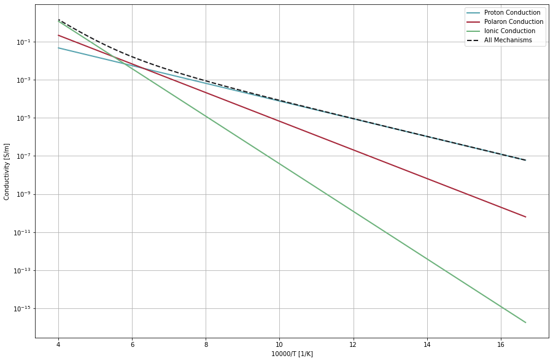
    


Now let's try to mix a dry model "Liu2021_DryOlivine_NNOBuffer" - id:6 with proton conduction of "Dai2014_DryandWetOlivine_fo2" id:'0/proton'. ***pide*** can sum up two different models by identifying them as a list as follows:


```python
p_obj.set_mineral_conductivity_choice(ol = '0/proton')
cond_dai_proton = p_obj.calculate_mineral_conductivity(min_idx = 'ol')

p_obj.set_mineral_conductivity_choice(ol = 6)
cond_liu_dry = p_obj.calculate_mineral_conductivity(min_idx = 'ol')

p_obj.set_mineral_conductivity_choice(ol = [6,'0/proton'])
cond_both = p_obj.calculate_mineral_conductivity(min_idx = 'ol')
```


```python
#Plotting the results
figure = plt.figure(figsize = (15,10))
ax = plt.subplot(111)

ax.plot(1e4/temperature, cond_dai_proton, color = '#58A4B0', label = 'Proton Conduction Dai 2014',linewidth = 2)
ax.plot(1e4/temperature, cond_liu_dry, color = '#A62639', label = 'Dry Conduction Liu 2021',linewidth = 2)
ax.plot(1e4/temperature, cond_both, color = '#1B1B1E', label = 'All Mechanisms', linestyle = '--',linewidth = 2)
ax.set_xlabel('10000/T [1/K]')
ax.set_ylabel('Conductivity [S/m]')

ax.set_yscale('log')
ax.grid(which = 'both')
ax.legend()
plt.show()
```


    
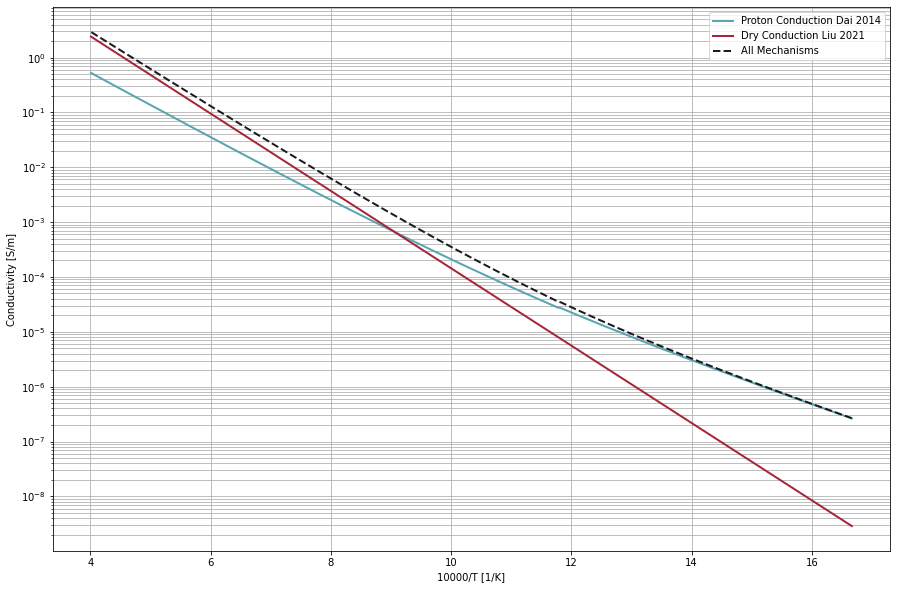
    


```python

```
## <span style="color:green"> Notebook - Phase Mixing Functions and Water Distribution </span>
<span style="color:purple">Sinan Ozaydin, School of Geosciences, The University of Sydney, NSW 2006, Australia <br/> </span>
<span style="color:purple">sinan.ozaydin@protonmail.com | sinan.ozaydin@sydney.edu.au </span>

This notebook will demonstrate how to use the phase mixing functions and water distribution works for electrical conductivity calculation. Phase mixing functions are used to calculate the bulk conductivity of a mineral assemblage with the given geometrical assumptions. Since electrical conductivity is a measure of how easily can electrons can flow through a system, the connectivity of conductive phases in a matrix has crucial importance when it comes to interpreting the electrical conductivity variations measured with MT method.

In ***pide***, there are six solid-state phase mixing functions are available to use. Which can be listed with the code snippet below:


```python
import pide
import numpy as np
import matplotlib.pyplot as plt

p_obj = pide.pide() #forming the pide object
mixing_list = p_obj.list_phs_mix_methods()
```

    Solid Phase Mixing Models:
    0.   Generalized Archie's Law (Glover, 2010)
    1.   Hashin-Shtrikman Lower Bound (Berryman, 1995)
    2.   Hashin-Shtrikman Upper Bound (Berryman, 1995)
    3.   Parallel Model (Guegen and Palciauskas, 1994)
    4.   Perpendicular Model (Guegen and Palciauskas, 1994)
    5.   Random Model (Guegen and Palciauskas, 1994)


    /home/sinan/.local/lib/python3.10/site-packages/matplotlib/projections/__init__.py:63: UserWarning: Unable to import Axes3D. This may be due to multiple versions of Matplotlib being installed (e.g. as a system package and as a pip package). As a result, the 3D projection is not available.
      warnings.warn("Unable to import Axes3D. This may be due to multiple versions of "


$$\sigma = \sum_{i = 1}^n \sigma_{i} \phi^{m} \qquad \text{(1)} \quad \text{Generalized Archie's Law}$$
$$\sigma = \left( \sum_{i = 1}^n \frac{\phi_i}{\sigma_i + 2\sigma_{min}}   \right)^{-1} - 2\sigma_{min} \qquad \text{(2)} \quad \text{Hashin-Shtrikman Lower Bound}$$
$$\sigma = \left( \sum_{i = 1}^n \frac{\phi_i}{\sigma_i + 2\sigma_{max}}   \right)^{-1} - 2\sigma_{max} \qquad \text{(3)} \quad \text{Hashin-Shtrikman Upper Bound}$$
$$\sigma = \sum_{i = 1}^n \phi_i \sigma_i \quad \text{(4)} \quad \text{Parallel Model}$$
$$\sigma = \sum_{i = 1}^n \frac{\sigma_i}{\phi_i} \quad \text{(5)} \quad \text{Perpendicular Model}$$
$$\sigma = \prod \sigma_i^{\phi_i} \quad \text{(6)} \quad \text{Random Model}$$


where volumetrically dominant cementation exponent for m in Generalized Archie's law is:

$$m_j = log \left( 1 - \sum_{i \neq j} \phi_i^{m_j} \right) / log \left( 1 - \sum_{i \neq j} \phi_i \right) \quad \text{(7)}$$


```python
temp = np.arange(600,1300,5) #setting up temperature array
p_obj = pide.pide() #creating the initial object

p_obj.set_temperature(temp) #setting temperature array in K
p_obj.set_pressure(1.0) #GPa

#Setting a basic garnet-lherzolite matrix. The composition has to be summed
#up to 1.
p_obj.set_composition_solid_mineral(ol = 0.6,opx = 0.25,cpx = 0.1, garnet= 0.05)

#Setting m values for Generalised Archie's Law.
#Here the m value for the dominant phase will be overwritten and will
#be recalculated as m_j as in equation 7.
p_obj.set_phase_interconnectivities(ol = 1, opx = 2, cpx = 4, garnet = 4)
```


```python
#Setting bulk water(hydroxyl(OH^-1)) content to 100 ppm H2O wt
p_obj.set_bulk_water(100)

#Now we have to distribute this water content using water partitioning coefficients.
#To do this, let's list all the possible water partitioning coefficients first for the minerals we used.
p_obj.list_mantle_water_partitions_solid('opx')
p_obj.list_mantle_water_partitions_solid('cpx')
p_obj.list_mantle_water_partitions_solid('garnet')
```

    Mantle solid-state water partition coefficients for the mineral: opx
    0.   Ozaydin2020_Opx1  -  Type  1
    1.   Ozaydin2020_Opx2  -  Type  1
    2.   Aubaud2004_Opx -  Type   0   -   Opx/Ol :  8.92
    3.   Demouchy2017_Opx -  Type   0   -   Opx/Ol :  5.6
    4.   Ferot2012_Opx  -  Type  1
    5.   Grant2006_Opx -  Type   0   -   Opx/Ol :  2.52
    6.   Hauri2006_Opx -  Type   0   -   Opx/Ol :  6.93
    7.   Koga2003_Opx -  Type   0   -   Opx/Ol :  12.0
    8.   Kovacs2012_Opx -  Type   0   -   Opx/Ol :  5.34
    9.   Kovacs2012_Opx2  -  Type  1
    10.   Novella2014_Opx -  Type   0   -   Opx/Ol :  1.91
    11.   Sakurai2014_Opx  -  Type  1
    12.   Withers2011_Opx1 -  Type   0   -   Opx/Ol :  1.505
    13.   Withers2011_Opx2  -  Type  1
                     
                     
    Mantle solid-state water partition coefficients for the mineral: cpx
    0.   Ozaydin2020_Cpx1  -  Type  1
    1.   Ozaydin2020_Cpx2  -  Type  1
    2.   Aubaud2004_Cpx -  Type   0   -   Cpx/Ol :  12.5
    3.   Aubaud2004_Cpx2  -  Type  1
    4.   Demouchy2016_Cpx  -  Type  1
    5.   Demouchy2017_Cpx -  Type   0   -   Cpx/Ol :  10.6
    6.   Demouchy2017_Cpx2  -  Type  1
    7.   Hauri2006_Cpx -  Type   0   -   Cpx/Ol :  14.92
    8.   Kovacs2012_Cpx  -  Type  1
    9.   Liu2020_Cpx1_NNO  -  Type  1
    10.   Liu2020_Cpx1_NNO_Low_Pressure -  Type   0   -   Cpx/Ol :  0.67
    11.   Liu2020_Cpx2_IW -  Type   0   -   Cpx/Ol :  1.6095
    12.   Novella2014_Cpx -  Type   0   -   Cpx/Ol :  3.19
    13.   Novella2014_Cpx2  -  Type  1
    14.   Tenner2009_Cpx  -  Type  1
                     
                     
    Mantle solid-state water partition coefficients for the mineral: garnet
    0.   Novella2014_Gt -  Type   0   -   Garnet/Ol :  0.8
    1.   Mookherjee2010_Gt1 -  Type   0   -   Garnet/Ol :  0.83
    2.   Mookherjee2010_Gt2 -  Type   0   -   Garnet/Ol :  5.428
    3.   Mookherjee2010_Gt3 -  Type   0   -   Garnet/Ol :  4.16
    4.   Hauri2006_Gt -  Type   0   -   Garnet/Ol :  2.14
                     
                     


    ['Novella2014_Gt',
     'Mookherjee2010_Gt1',
     'Mookherjee2010_Gt2',
     'Mookherjee2010_Gt3',
     'Hauri2006_Gt']


```python
#Now, let's set the water partitioning coefficients depending on the experimental
#laboratory measurements we want to use.
p_obj.set_mantle_water_partitions(opx_ol = 3, cpx_ol = 6, garnet_ol = 0)
```

We then have to distribute the bulk water content to the minerals by using mantle_water_distribute. This function will only work within nominally anhydrous minerals NAMs, namely; olivine, pyroxenes, and garnet. The water will be distributed depending on the fractions ($\phi_{min}$), partitioning coefficients ($D_{min}^{OH^-}$), and bulk water content of solid materials ($C_w^{solid}$) with the following formulas:

First we have to calculate the olivine water content as a reference, since all partitioning coefficients work through olivine.

$$C_w^{ol} = C_w^{solid} / (\phi_{ol} + (\sum \phi_{min} D_{min/ol}^{OH^-})) \quad \text{(8)}$$

From here, the water can be distributed through olivine by multiplying with water partitioning coefficients. 

$$C_w^{min} = C_w^{ol} D_{min/ol}^{OH^-} \quad \text{(9)}$$

This can be automatically calculated with **mantle_water_distribute** function.


```python
p_obj.mantle_water_distribute()
```

Now, that we set the thermodynamic and compositional environment; we can calculate bulk conductivity by using the function **calculate_conductivity**. To see the effect of all the mixing functions, let's loop over them and append the result of calculated conductivities to a list and plot the results.


```python
cond_lists = []
for i in range(0,len(mixing_list)):
	p_obj.set_solid_phs_mix_method(method = i)
	cond = p_obj.calculate_conductivity()
	cond_lists.append(cond)
    
lines = ['-','--','-.','-','--','-.','-','--','-.','-','--','-.','-','--','-.']

fig = plt.figure(figsize = (15,10))
ax = plt.subplot(111)
for i in range(0,len(mixing_list)):
	ax.plot(1e4/temp, cond_lists[i], label = mixing_list[i], linestyle = lines[i])
ax.set_yscale('log')
ax.set_xlabel('10000/T [$K^{-1}$]')
ax.set_ylabel('Conductivity [S/m]')
ax.grid(which = 'both')
ax.legend(fontsize = 10)
ax.set_title('Wet Lherzolite with different solid phase mixing methods',fontsize = 9)
ax.set_ylim((1e-9,10))
```


    (1e-09, 10)


    
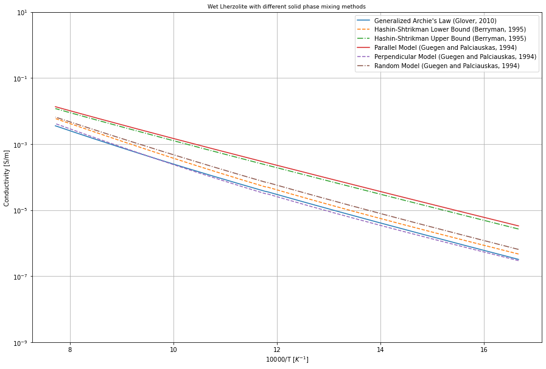
    


Now let's try to calculate the same situation considering there is some melt in the matrix. First, let's set up the solid environment and calculate


```python
#Starting the new calculation space by resetting the object. Alternatively, one can also create a new pide object to
#perform calculations. However, using the same object can cause mismatches between array lengths that are assigned
#before.
p_obj.reset()

#setting up the new thermodynamic and compositional environment at higher tempeartures
temp_melt = np.arange(1300,1800,5)
p_obj.set_temperature(temp_melt)
p_obj.set_pressure(3.0)
p_obj.set_composition_solid_mineral(ol = 0.6,opx = 0.25,cpx = 0.1, garnet = 0.05)
p_obj.set_phase_interconnectivities(ol = 1, opx = 2, cpx = 4, gt = 4)
p_obj.set_mantle_water_partitions(opx_ol = 3, cpx_ol = 6, garnet_ol = 0)

#Setting bulk water(hydroxyl(OH^-1)) content to 1,000 ppm H2O wt and distributing the water content.
p_obj.set_bulk_water(0)
p_obj.mantle_water_distribute()

#Setting up the solid mixing as H-S lower bound for comparison with melt-bearing composition.
p_obj.set_solid_phs_mix_method(method = 1) #H-S lower bound

#calculating the conductivity of solid matrix
cond_solid_dry_matrix_hT = p_obj.calculate_conductivity()
p_obj.set_bulk_water(1000)
p_obj.mantle_water_distribute()
cond_solid_wet_matrix_hT = p_obj.calculate_conductivity()
```

Let's list the available melt mixing methods

Now let's set up the environment for melt inclusion in the calculations. In pide, melt or fluid (free fluid or water, not to be confused with $OH^-$) cannot exist at the same time for the same object.So, the user has to choose whether they want to calculate a melt-bearing or fluid-bearing environment. 


```python
p_obj.set_melt_or_fluid_mode(mode = 'melt')
melt_frac = 0.02
p_obj.set_melt_fluid_frac(melt_frac)
```

Now, we want to form water ($OH^-$) partitioning coefficients between solid medium and melt. To calculat melt water content that is in equilibrium with the coexisting solid matrix, we first have to calculate the $D_{melt/solid}^{OH^-}$:

$$D_{melt/solid}^{OH^-} = \sum \phi_{min} D_{melt/mineral}^{OH^-} \quad \text{(10)}$$

We can do this by first listing what is available at the library with the following method:


```python
p_obj.list_mantle_water_partitions_melt('ol')
p_obj.list_mantle_water_partitions_melt('opx')
p_obj.list_mantle_water_partitions_melt('cpx')
p_obj.list_mantle_water_partitions_melt('garnet')
```

    Mantle melt/NAMs water partition coefficients for the mineral:   ol
    0.   Hirschmann2009_OlMelt  -  Type  0   -   Ol/Melt :  0.0017
    1.   Tenner2012_OlMelt  -  Type  0   -   Ol/Melt :  0.0085
    Mantle melt/NAMs water partition coefficients for the mineral:   opx
    0.   Hirschmann2009_OpxMelt  -  Type  1   -  Specific Function.
    1.   Tenner2012_OpxMelt  -  Type  0   -   Opx/Melt :  0.00515
    2.   Novella2014_OpxMelt  -  Type  1   -  Specific Function.
    Mantle melt/NAMs water partition coefficients for the mineral:   cpx
    0.   Hirschmann2009_CpxMelt  -  Type  1   -  Specific Function.
    1.   Tenner2012_CpxMelt  -  Type  0   -   Cpx/Melt :  0.00515
    2.   OLeary2010_CpxMelt1  -  Type  0   -   Cpx/Melt :  0.0477
    3.   OLeary2010_CpxMelt2  -  Type  0   -   Cpx/Melt :  0.0228
    4.   OLeary2010_CpxMelt3  -  Type  0   -   Cpx/Melt :  0.0071
    5.   OLeary2010_CpxMelt4  -  Type  0   -   Cpx/Melt :  0.0045
    Mantle melt/NAMs water partition coefficients for the mineral:   garnet
    0.   Novella2014_GtMelt  -  Type  0   -   Garnet/Melt :  0.0032
    1.   Hauri2006_GtMelt  -  Type  0   -   Garnet/Melt :  0.003


    ['Novella2014_GtMelt', 'Hauri2006_GtMelt']


```python
#Then we can choose these by setting up the partition coefficients:
p_obj.set_mantle_water_partitions(opx_ol = 3, cpx_ol = 6, garnet_ol = 0, ol_melt = 1, opx_melt = 1,
                                  cpx_melt = 1, garnet_melt = 0)
```

After water partition coefficients are set, we can calculate the water content of the system by following equation:

$$C_w^{melt} = C_w^{bulk} / (\phi_{melt}^{mass} + ((1-\phi_{melt}^{mass}) D_{melt/solid}^{OH^-}) \quad \text{(11)}$$

where melt mass fraction ($\phi_{melt}^{mass}$) is not the same as melt fraction ($\phi_{melt}$), which would be used in solid/melt mixing functions and will be dependent on density of the melt and the solid matrix. $\phi_{melt}$ can be calculated from:

$$\phi_{melt} = 1 / (1 + (\frac{1}{\phi_{melt}^{mass} -1} \frac{\rho_{melt}}{\rho_{solid}}) \quad \text{(12)}$$

All of these calculations are automatically made when the user runs the function **mantle_water_distribute** with a composition setup in the object.


```python
p_obj.mantle_water_distribute()
```

Now, that we set up the environment with melt inside, we can calculate the conductivity of the system. However, we first have to set up the solid/melt mixing function first. The solid melt mixing functions implemented in ***pide*** are:

$$\sigma = \sigma_{solid} (1-\phi_{melt}^p) + (\sigma_{melt})  \phi_{melt}^m \quad \text{(13)} \quad \text{Modified Archie's Law} $$
$$p = log(1 - \sigma_{melt} * \phi_{melt}**m) / log(1 - \phi_{melt}) $$

$$\sigma = (\frac{1}{3} \phi_{melt} \sigma_{melt}) + ((1-\phi_{melt}) \sigma_{solid}) \quad \text{(15)} \quad \text{Tubes Model}$$

$$\sigma = \sigma_{melt} + \frac{(1-\phi_{melt})}{1/(\sigma_{solid} - \sigma_{melt}) + \phi_{melt}/3\sigma_{melt})} \quad \text{(16)} \quad \text{Spheres Model}$$

$$\sigma = \sigma_{melt}\frac{(\sigma_{melt}(\phi_{melt}^{2/3}-1) - \sigma_{solid}\phi_{melt}^{2/3})}{\sigma_{solid}(\phi_{melt} - \phi_{melt}^{2/3}) + \sigma_{melt} (\phi_{melt}^{2/3} - \phi_{melt} -1)} \quad \text{(17)}\quad\text{Modified Brick-Layer Model}$$

$$\sigma = \sigma_{melt} (1 - \frac{3(1-\phi_{melt})(\sigma_{melt}-\sigma_{solid})}{3 \sigma_{melt} - \phi_{melt}(\sigma_{melt}-\sigma_{solid})}) \quad \text{(18)} \quad \text{Hashin-Shtrikman Upper Bound}$$

$$\sigma = \sigma_{solid} (1 + \frac{3\phi_{melt}(\sigma_{melt}\sigma_{solid})}{3\sigma_{solid} + (1-\phi_{melt})(\sigma_{melt}-\sigma_{solid})}) \quad \text{(19)} \quad \text{Hashin-Shtrikman Lower Bound}$$


```python
melt_mixing_lists = p_obj.list_phs_melt_fluid_mix_methods()

#setting up interconnectivity for modifier Archie's Law (exponent m)
p_obj.set_melt_fluid_interconnectivity(2.0)
```

    Solid-Fluid/Melt Mixing models:
    0.   Modified Archie's Law (Glover et al., 2000)
    1.   Tubes Model (ten Grotenhuis et al., 2005)
    2.   Spheres Model (ten Grotenhuis et al., 2005)
    3.   Modified Brick-layer Model (Schilling et al., 1997)
    4.   Hashin-Shtrikman Upper-Bound (Glover et al., 2000)
    5.   Hashin-Shtrikman Lower-Bound (Glover et al., 2000)


```python
cond_melt_lists = []

for i in range(0,len(melt_mixing_lists)):

	p_obj.set_solid_melt_fluid_mix_method(method = i)
	cond = p_obj.calculate_conductivity()

	cond_melt_lists.append(cond)
```


```python
cond_melt = p_obj.calculate_melt_conductivity()
```


```python
lines = ['-','--','-.','-','--','-.','-','--','-.','-','--','-.','-','--','-.']

fig = plt.figure(figsize = (15,10))


ax2 = plt.subplot(111)
ax2.plot(1e4/temp_melt, cond_solid_wet_matrix_hT, label = 'Wet Lherzolite with 1000 ppm water', linestyle = '-',linewidth = 4)
ax2.plot(1e4/temp_melt, cond_solid_dry_matrix_hT, label = 'Dry Lherzolite', linestyle = '-',linewidth = 4,color = 'k')
for i in range(0,len(mixing_list)):
	ax2.plot(1e4/temp_melt, cond_melt_lists[i], label = melt_mixing_lists[i], linestyle = lines[i])
	
ax2.plot(1e4/temp_melt, cond_melt, label = 'Melt Conductivity', linestyle = ':',linewidth = 4)

ax2.set_yscale('log')
ax2.set_xlabel('10000/T [$K^{-1}$]')
ax2.set_ylabel('Conductivity [S/m]')
ax2.grid(which = 'both')
ax2.legend(fontsize = 10)
ax2.set_title('Wet Lherzolite with ' +str(melt_frac*100) + '% melt fraction'' with different solid-melt mixing methods',fontsize = 9)
ax2.set_ylim((1e-5,100))
```


    (1e-05, 100)


    
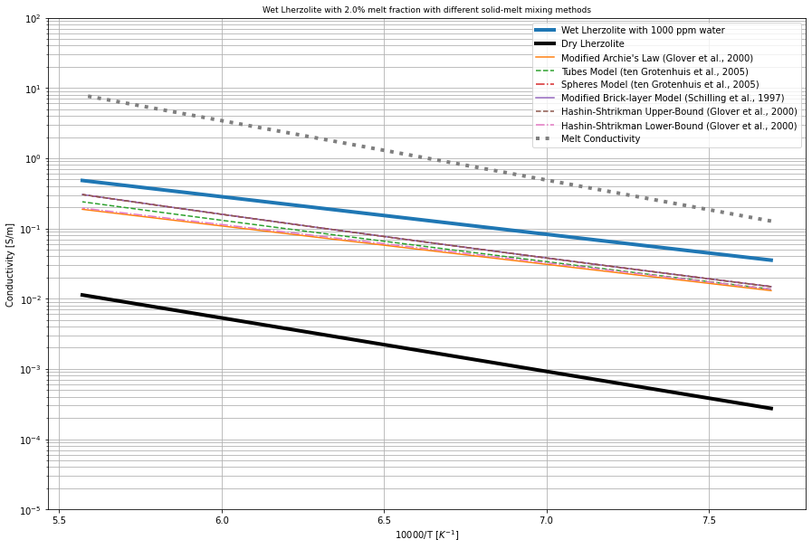
    


This result rather illustrates the unprecedented effect of melt on electrical conductivity. In this example, even though the melt is more conductive than the solid matrix, the resulting bulk conductivity with melt is actually lower than the hydrous rock with same bulk water content. This is due to the incredibly high partitioning rate towards melt of volatiles. So, in terms of conductivity, there will be a delicate equilibrium between, bulk water content, melt $CO_2$, and melt fraction.
## <span style="color:green"> Notebook - Calculating Seismic Velocities </span>
<span style="color:purple">Sinan Ozaydin, School of Geosciences, The University of Sydney, NSW 2006, Australia <br/> </span>
<span style="color:purple">sinan.ozaydin@protonmail.com</span>

In this notebook, we we will explore how to calculate seismic velocities using the library pide for a given earth material. Seismic velocities in **pide** library are calculated by utilising the 'sister' library of pide **santex**. The isotropic velocities are calculated by the methods described in **Hacker et al., (2003)**. Material elastic parameters entered for all minerals are stored in materials.json file in pide_src and isotropy folder in santex. When a rock entered for the composition in pide, associated mineral assemblages in correspondent electrical conductivity models chosen are automatically calculated. Bulk velocities of the material formed are calculated by using Hashin-Shtrikman mixing function.


```python
import pide
import numpy as np
import matplotlib.pyplot as plt
```

    /home/sinan/.local/lib/python3.10/site-packages/matplotlib/projections/__init__.py:63: UserWarning: Unable to import Axes3D. This may be due to multiple versions of Matplotlib being installed (e.g. as a system package and as a pip package). As a result, the 3D projection is not available.
      warnings.warn("Unable to import Axes3D. This may be due to multiple versions of "


Let's try to make a contour figure to plot the effect of pressure and temperature on different compositional environment, namely Lherzolite, Harzburgite and Lherzolite with 8% Phlogopite.


```python
#Setting the temperature and pressure arrays
temp = np.arange(600,1500,10) #setting up temperature array
pressure = np.arange(1,6,0.1)
#Creating a meshgrid
T,P = np.meshgrid(temp,pressure)
#flattening the arrays to load into pide
T_array = T.ravel()
P_array = P.ravel()

p_obj = pide.pide() #creating the initial object

#Setting the temperature and pressure arrays.
p_obj.set_temperature(T_array) #setting temperature array in K
p_obj.set_pressure(P_array) 
#Setting the composition of the material.
p_obj.set_composition_solid_mineral(ol = 0.6, opx = 0.25, cpx = 0.1, garnet = 0.05)

#Calculating the seismic velocities.
v_bulk_lherz,v_p_lherz,v_s_lherz = p_obj.calculate_seismic_velocities()
#Calculating for a harzburgite
p_obj.set_composition_solid_mineral(ol = 0.85, opx = 0.13, cpx = 0.02)
v_bulk_harz,v_p_harz,v_s_harz = p_obj.calculate_seismic_velocities()
#Calculating for a lherzolite with 8% phlogopites
p_obj.set_composition_solid_mineral(ol = 0.57, opx = 0.22, cpx = 0.08, garnet = 0.05,mica = 0.08)
v_bulk_phlg_lherz,v_p_phlg_lherz,v_s_phlg_lherz = p_obj.calculate_seismic_velocities()
```


```python
fig = plt.figure(figsize = (20,10))
ax = plt.subplot(121)
cax = ax.tricontourf(T_array,P_array, v_p_lherz, cmap = 'coolwarm_r',levels = 100)
cax.set_clim(np.amin(v_p_lherz),np.amax(v_p_lherz))
ax.set_xlabel(r'Temperature [$K^{\circ}$]')
ax.set_ylabel(r'Pressure [GPa]')
cax_cb = fig.colorbar(cax, orientation="horizontal", pad=0.1,
			 ax = ax, label = r'$V_P$ [km/s]')

ax = plt.subplot(122)
cax = ax.tricontourf(T_array,P_array, v_s_lherz, cmap = 'coolwarm_r',levels = 100)
cax.set_clim(np.amin(v_s_lherz),np.amax(v_s_lherz))
ax.set_xlabel(r'Temperature [$K^{\circ}$]')
ax.set_ylabel(r'Pressure [GPa]')
cax_cb = fig.colorbar(cax, orientation="horizontal", pad=0.1,
			ax = ax, label = r'$V_S$ [km/s]')
fig.suptitle('Lherzolite - Composition')

```


    Text(0.5, 0.98, 'Lherzolite - Composition')


    
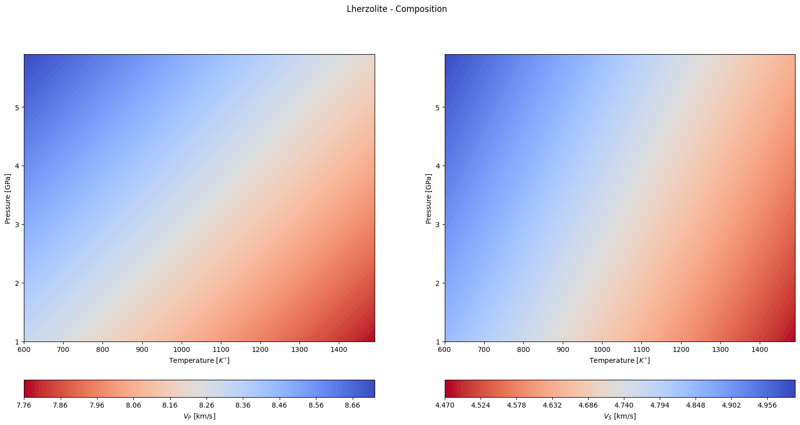
    


```python
fig = plt.figure(figsize = (20,10))
ax = plt.subplot(121)
cax = ax.tricontourf(T_array,P_array, v_p_harz, cmap = 'coolwarm_r',levels = 100)
cax.set_clim(np.amin(v_p_harz),np.amax(v_p_harz))
ax.set_xlabel(r'Temperature [$K^{\circ}$]')
ax.set_ylabel(r'Pressure [GPa]')
cax_cb = fig.colorbar(cax, orientation="horizontal", pad=0.1,
			 ax = ax, label = r'$V_P$ [km/s]')

ax = plt.subplot(122)
cax = ax.tricontourf(T_array,P_array, v_s_lherz, cmap = 'coolwarm_r',levels = 100)
cax.set_clim(np.amin(v_s_lherz),np.amax(v_s_lherz))
ax.set_xlabel(r'Temperature [$K^{\circ}$]')
ax.set_ylabel(r'Pressure [GPa]')
cax_cb = fig.colorbar(cax, orientation="horizontal", pad=0.1,
			ax = ax, label = r'$V_S$ [km/s]')
fig.suptitle('Harzburgite - Composition')
```


    Text(0.5, 0.98, 'Harzburgite - Composition')


    
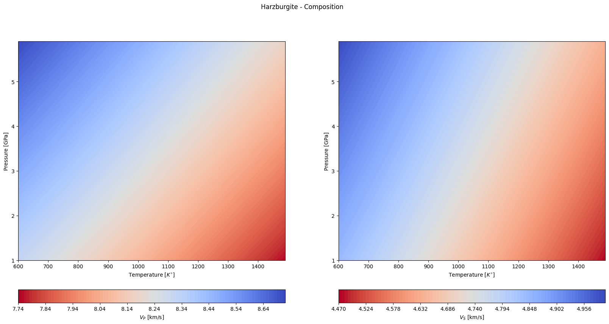
    


```python
fig = plt.figure(figsize = (20,10))
ax = plt.subplot(121)
cax = ax.tricontourf(T_array,P_array, v_p_phlg_lherz, cmap = 'coolwarm_r',levels = 100)
cax.set_clim(np.amin(v_p_phlg_lherz),np.amax(v_p_phlg_lherz))
ax.set_xlabel(r'Temperature [$K^{\circ}$]')
ax.set_ylabel(r'Pressure [GPa]')
cax_cb = fig.colorbar(cax, orientation="horizontal", pad=0.1,
			 ax = ax, label = r'$V_P$ [km/s]')

ax = plt.subplot(122)
cax = ax.tricontourf(T_array,P_array, v_s_phlg_lherz, cmap = 'coolwarm_r',levels = 100)
cax.set_clim(np.amin(v_s_phlg_lherz),np.amax(v_s_phlg_lherz))
ax.set_xlabel(r'Temperature [$K^{\circ}$]')
ax.set_ylabel(r'Pressure [GPa]')
cax_cb = fig.colorbar(cax, orientation="horizontal", pad=0.1,
			ax = ax, label = r'$V_S$ [km/s]')
fig.suptitle('Lherzolite with 8% Phlogopite - Composition')
```


    Text(0.5, 0.98, 'Lherzolite with 8% Phlogopite - Composition')


    
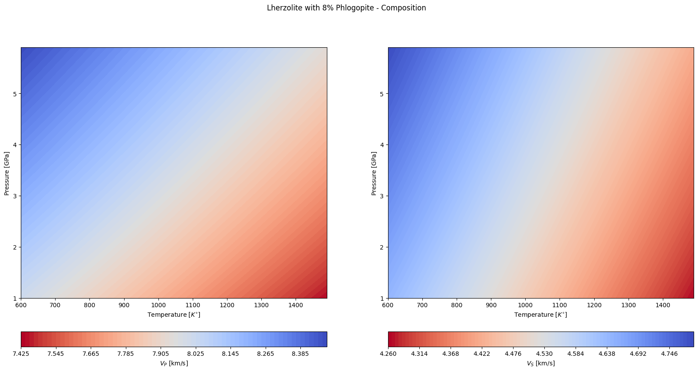
    


```python
fig = plt.figure(figsize = (20,10))
ax = plt.subplot(121)
cax = ax.tricontourf(T_array,P_array, v_p_lherz - v_p_phlg_lherz, cmap = 'viridis',levels = 100)
cax.set_clim(np.amin(v_p_lherz - v_p_phlg_lherz),np.amax(v_p_lherz - v_p_phlg_lherz))
ax.set_xlabel(r'Temperature [$K^{\circ}$]')
ax.set_ylabel(r'Pressure [GPa]')
cax_cb = fig.colorbar(cax, orientation="horizontal", pad=0.1,
			 ax = ax, label = r'$V_P$ [km/s]')

ax = plt.subplot(122)
cax = ax.tricontourf(T_array,P_array, v_s_lherz - v_s_phlg_lherz, cmap = 'viridis',levels = 100)
cax.set_clim(np.amin(v_s_lherz - v_s_phlg_lherz),np.amax(v_s_lherz - v_s_phlg_lherz))
ax.set_xlabel(r'Temperature [$K^{\circ}$]')
ax.set_ylabel(r'Pressure [GPa]')
cax_cb = fig.colorbar(cax, orientation="horizontal", pad=0.1,
			ax = ax, label = r'$V_S$ [km/s]')
fig.suptitle('Difference between Lherzolite and Lherzolite with phlogopite')
```


    Text(0.5, 0.98, 'Difference between Lherzolite and Lherzolite with phlogopite')


    
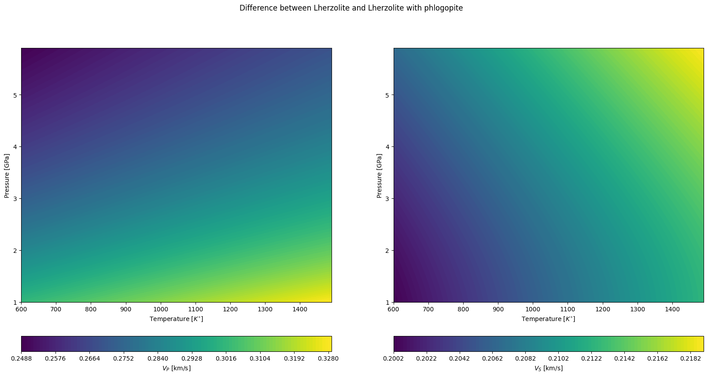
    


```python
p_obj.set_solid_phase_method('rock')
p_obj.set_composition_solid_rock(granite = 1)
v_bulk_granite,v_p_granite,v_s_granite = p_obj.calculate_seismic_velocities()

fig = plt.figure(figsize = (20,10))
ax = plt.subplot(121)
cax = ax.tricontourf(T_array,P_array, v_p_granite, cmap = 'coolwarm_r',levels = 100)
cax.set_clim(np.amin(v_p_granite),np.amax(v_p_granite))
ax.set_xlabel(r'Temperature [$K^{\circ}$]')
ax.set_ylabel(r'Pressure [GPa]')
cax_cb = fig.colorbar(cax, orientation="horizontal", pad=0.1,
			 ax = ax, label = r'$V_P$ [km/s]')

ax = plt.subplot(122)
cax = ax.tricontourf(T_array,P_array, v_s_granite, cmap = 'coolwarm_r',levels = 100)
cax.set_clim(np.amin(v_s_granite),np.amax(v_s_granite))
ax.set_xlabel(r'Temperature [$K^{\circ}$]')
ax.set_ylabel(r'Pressure [GPa]')
cax_cb = fig.colorbar(cax, orientation="horizontal", pad=0.1,
			ax = ax, label = r'$V_S$ [km/s]')
fig.suptitle('Lherzolite with 8% Phlogopite - Composition')
```


    Text(0.5, 0.98, 'Lherzolite with 8% Phlogopite - Composition')


    
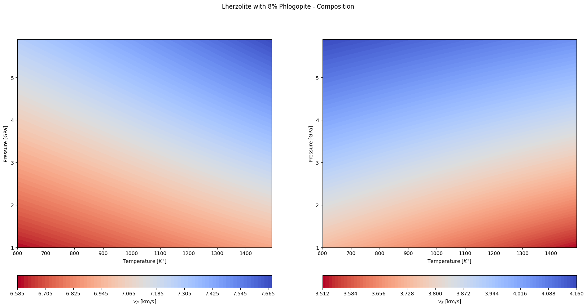
    


```python

```
## <span style="color:green"> Notebook - Material Class </span>
<span style="color:purple">Sinan Ozaydin, School of Geosciences, The University of Sydney, NSW 2006, Australia <br/> </span>
<span style="color:purple">sinan.ozaydin@protonmail.com</span>


```python
import numpy as np
import matplotlib.pyplot as plt
```

    /home/sinan/.local/lib/python3.10/site-packages/matplotlib/projections/__init__.py:63: UserWarning: Unable to import Axes3D. This may be due to multiple versions of Matplotlib being installed (e.g. as a system package and as a pip package). As a result, the 3D projection is not available.
      warnings.warn("Unable to import Axes3D. This may be due to multiple versions of "


In this notebook, we will learn how to use the material class in pide library. 

Material is an object that can be constructed in *pide* that can be used to define a compositional environment. A user might want to define a material rather than defining the parameters on a *pide* object because they might want to streamline a calculation or append these materials into *model* class to use the other functionalities exist in pide, such as 3D model conversion. First, we have to import neccesary 


```python
from pide.material import Material
```

Let's define a material using a mineral matrix, a pyroxenite!


```python
Pyroxenite_Material = Material(name = 'Pyroxenite', calculation_type = 'mineral', composition = {'opx':0.6,'cpx':0.3,'ol':0.1},
el_cond_selections = {'opx':0,'cpx':0, 'ol':4}, solid_phase_mixing = 1)
```


```python
temp = np.arange(600,1300)
p = np.ones(len(temp)) * 3.0
cond_px = Pyroxenite_Material.calculate_conductivity(T = temp, P = p)
v_bulk_px, v_p_px, v_s_px = Pyroxenite_Material.calculate_seismic_velocity(T = temp, P = p)

fig = plt.figure(figsize = (15,5))
ax1 = plt.subplot(131)
ax2 = plt.subplot(132)
ax3 = plt.subplot(133)

ax1.plot(cond_px,temp)
ax2.plot(v_p_px,temp)
ax3.plot(v_s_px,temp)

ax1.set_xscale('log')

ax1.set_ylabel('Temperature [$K^{\circ}$]')
ax1.set_xlabel('Conductivity [S/m]')
ax2.set_xlabel('$V_P$ [km/s]')
ax3.set_xlabel('$V_S$ [km/s]')

ax1.grid(which = 'major')
ax2.grid(which = 'both')
ax3.grid(which = 'both')

ax2.set_yticklabels([])
ax3.set_yticklabels([])
plt.show()
```


    
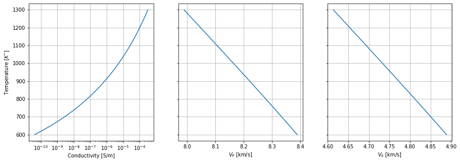
    


Now, let's define a material with 'rock' method, a granite.


```python
Granite_Material = Material(name = 'Granite', calculation_type = 'rock', composition = {'granite':1.0},
							   el_cond_selections = {'granite': 10},solid_phase_mixing_idx = 1)
```

Here, we defined the 'Granite_Material' where the electrical conductivity calculation will be carried out as 'rock' method, completely made out of granite, use electrical conductivity selection as the 10th index, use Hashin-Shtrikman Lower Bound to calculate the mixture. Using this material, now let's calculate electrical conductivity and seismic velocities at the given temperature and pressure.


```python
temp2 = np.arange(300,600)
p2 = np.ones(len(temp2)) * 0.5
cond = Granite_Material.calculate_conductivity(T = temp2, P = p2)
v_bulk, v_p, v_s = Granite_Material.calculate_seismic_velocity(T = temp2, P = p2)

fig = plt.figure(figsize = (15,5))
ax1 = plt.subplot(131)
ax2 = plt.subplot(132)
ax3 = plt.subplot(133)

ax1.plot(cond,temp2)
ax2.plot(v_p,temp2)
ax3.plot(v_s,temp2)

ax1.set_xscale('log')

ax1.set_ylabel('Temperature [$K^{\circ}$]')
ax1.set_xlabel('Conductivity [S/m]')
ax2.set_xlabel('$V_P$ [km/s]')
ax3.set_xlabel('$V_S$ [km/s]')

ax1.grid(which = 'major')
ax2.grid(which = 'both')
ax3.grid(which = 'both')

ax2.set_yticklabels([])
ax3.set_yticklabels([])
plt.show()
```


    
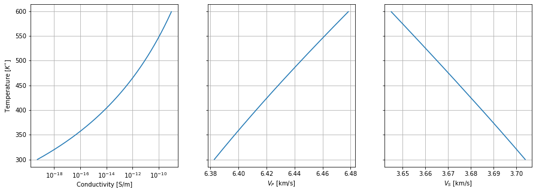
    


As One can see an unlikely inverse relationship is there between $V_P$ and temperature. This is due to rare negative thermal expansion coefficients observed in beta-quartz. On the other hand, the electrical conductivity of granite at these temperatures are quite low. This is the general behaviour of silicate rocks who behave as a semi-conductor.

Attributes of a material object can also be copied into another material object. Now, let's try to copy the Pyroxenite object into another object called Pyroxenite_Material_2.


```python
temp = np.arange(600,1300)
p = np.ones(len(temp)) * 3.0
#First create the empty object.
Pyroxenite_Material_2 = Material()
#Now we can copy the attributes using copy_attributes method
Pyroxenite_Material.copy_attributes(Pyroxenite_Material_2)
#Now, let's change the copied materials name and el_cond_method:
Pyroxenite_Material_2.name = 'Pyroxenite_Material_2'
Pyroxenite_Material_2.el_cond_selections = {'opx':5,'cpx':0, 'ol':1}

#Now, let's calculate the same conductivities and plot them!
cond_px_2 = Pyroxenite_Material_2.calculate_conductivity(T = temp, P = p)
v_bulk_px_2, v_p_px_2, v_s_px_2 = Pyroxenite_Material_2.calculate_seismic_velocity(T = temp, P = p)

fig = plt.figure(figsize = (15,5))
ax1 = plt.subplot(131)
ax2 = plt.subplot(132)
ax3 = plt.subplot(133)

ax1.plot(cond_px,temp)
ax1.plot(cond_px_2,temp,linestyle = '--')
ax2.plot(v_p_px,temp)
ax2.plot(v_p_px_2,temp,linestyle = '--')
ax3.plot(v_s_px,temp)
ax3.plot(v_s_px_2,temp,linestyle = '--')

ax1.set_xscale('log')

ax1.set_ylabel('Temperature [$K^{\circ}$]')
ax1.set_xlabel('Conductivity [S/m]')
ax2.set_xlabel('$V_P$ [km/s]')
ax3.set_xlabel('$V_S$ [km/s]')

ax1.grid(which = 'major')
ax2.grid(which = 'both')
ax3.grid(which = 'both')

ax2.set_yticklabels([])
ax3.set_yticklabels([])
plt.show()
```


    
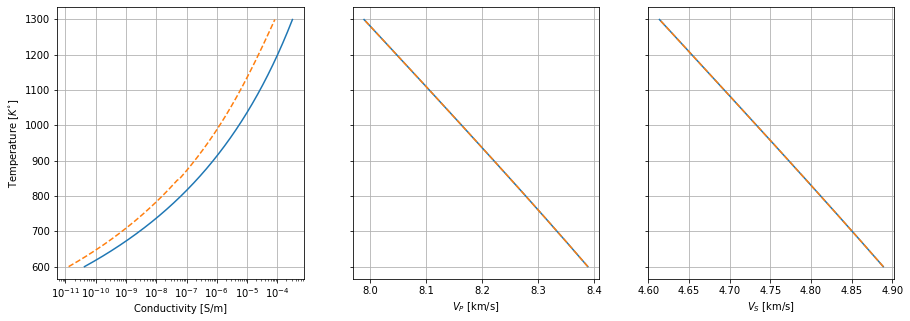
    


## <span style="color:green"> Notebook - Geophysical anomalies along a continental geotherm </span>
<span style="color:purple">Sinan Ozaydin, School of Geosciences, The University of Sydney, NSW 2006, Australia <br/> </span>
<span style="color:purple">sinan.ozaydin@protonmail.com | sinan.ozaydin@sydney.edu.au </span>

This notebook shows how to calculate a geotherm with conventional methods and calculate the associated conductivity and seismic velocity values. Geotherm here is calculated using the existing continental geotherm function described in **Hasterok et al. (2011)** and adiabatic mantle potential temperature gradients values of **Katsura (2022)**. The intesection of two curves assumed to be defining the LAB.


```python
import pide
import numpy as np
import matplotlib.pyplot as plt
import matplotlib.patches as patches

#For building a geotherm.
from pide.geodyn.geotherm import calculate_hasterok2011_geotherm
```

    /home/sinan/.local/lib/python3.10/site-packages/matplotlib/projections/__init__.py:63: UserWarning: Unable to import Axes3D. This may be due to multiple versions of Matplotlib being installed (e.g. as a system package and as a pip package). As a result, the 3D projection is not available.
      warnings.warn("Unable to import Axes3D. This may be due to multiple versions of "


```python
moho = 38 #km
max_depth = 250

T, depth, p, idx_LAB = calculate_hasterok2011_geotherm(SHF = 40, T_0 =25.0,max_depth = max_depth, moho = moho)
```

where, SHF is Surface Heat Flow in $mW/m^2$, T_0 is temperature at the surface in $C^{\circ}$. Now let's plot the geotherm...


```python
fig = plt.figure(figsize = (3,7))
ax = plt.subplot(111)
ax.plot(T-273.15,depth,color = 'k')
ax.axhline(moho,linestyle = '--', color = 'g')
ax.axhline(depth[idx_LAB],linestyle = '--', color = 'r')
ax.set_ylim(0,250.0)
ax.grid(which = 'both')
ax.set_xlabel(r'Temperature [$C^{\circ}$]')
ax.set_ylabel('Depth [km]')
ax.invert_yaxis()
ax.set_title('Geotherm')
plt.show()

```


    
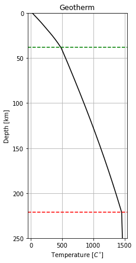
    


Now, let's calculate the electrical conductivity and seismic velocities that would result form this geotherm. We assume a simple lherzolitic matrix with 100 ppm bulk water content. The below cell will calculate the electrical conductivities. Once the compositional and thermodynamic environment set in the pide object, the conductivities can be calculate via **calculate_conductivity** method.


```python
p_obj = pide.pide()

p_obj.set_temperature(T)
p_obj.set_pressure(p)

#Setting the composition
p_obj.set_composition_solid_mineral(ol = 0.6,opx = 0.25,cpx = 0.1, garnet= 0.05)
#Setting water content in ppm
p_obj.set_bulk_water(100)
#Setting water partitioning models and distributing the water.
p_obj.set_mantle_water_partitions(opx_ol = 3, cpx_ol = 6, garnet_ol = 0)
p_obj.mantle_water_distribute()
#Electrical conductivity model choices for reach mineral
p_obj.set_mineral_conductivity_choice(ol = 4, opx = 2, cpx = 4, gt = 4)
#Setting the phase mixing method to Lower Hashin-Shtrikman Bound
p_obj.set_solid_phs_mix_method(method = 1)
#Finally calculating the conductivity.
cond = p_obj.calculate_conductivity()
```

In pide, the seismic velocities can be calculated by simply running ***calculate_seismic_velocities*** method.


```python
v_bulk, v_p, v_s = p_obj.calculate_seismic_velocities()
```

Now, let's plot them all together... We will plot electrical resistivity (1/electrical conductivity) since it is the general convention in magnetotelluric studies instead of plotting the conductivity. 


```python
fig = plt.figure(figsize = (12,7))
ax = plt.subplot(131)
ax.plot(T-273.15,depth,color = 'k')
ax.axhline(moho,linestyle = '--', color = 'g')
ax.axhline(depth[idx_LAB],linestyle = '--', color = 'r')
ax.set_ylim(0,250.0)
ax.grid(which = 'both')
ax.set_xlabel(r'Temperature [$C^{\circ}$]')
ax.set_ylabel('Depth [km]')
ax.invert_yaxis()
ax.set_title('Geotherm')

#Plotting the electrical resistivity profile.
ax2 = plt.subplot(132)
ax2.plot(1./cond,depth,color = 'k')
ax2.axhline(moho,linestyle = '--', color = 'g')
ax2.axhline(depth[idx_LAB],linestyle = '--', color = 'r')
ax2.set_ylim(0,250.0)
ax2.set_xscale('log')
ax2.grid(which = 'both')
ax2.set_xlabel(r'$\rho$ [$\Omega m$] ')
ax2.set_yticks([])
ax2.invert_yaxis()
ax2.set_title('Electrical Resistivity')

#plotting the seismic velocities

ax3 = plt.subplot(133)
ax3.plot(v_p,depth,color = 'k', label = r'$V_P$')
ax3.plot(v_s,depth,color = 'r', label = r'$V_S$')
ax3.axhline(moho,linestyle = '--', color = 'g')
ax3.axhline(depth[idx_LAB],linestyle = '--', color = 'r')
ax3.set_ylim(0,250.0)
ax3.set_xlim(1,13)
ax3.grid(which = 'both')
ax3.set_xlabel(r'Seismic Velocities [$km/s$]')
ax3.set_yticks([])
ax3.invert_yaxis()
ax3.legend()
ax3.set_title('Seismic Velocities')


```


    Text(0.5, 1.0, 'Seismic Velocities')


    
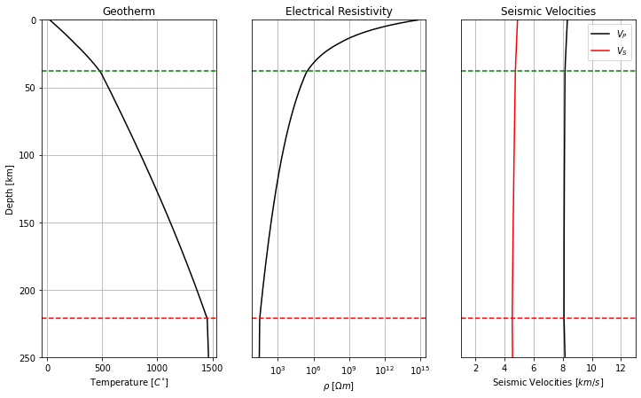
    


Now, let's do the same with assuming different compositional layers along the geotherm. We can do this by first creating materials. Here, we need to import material and model objects. The material objects can be used to set up a calculation environment. After creating the materials, these can be put into a model object alongside with temperature and pressure.


```python
from pide.material import Material
from pide.model import Model

#Here, other than the compositional and geometrical parameters, the user should also indicate the top and the bottom of the layers in km.
Layer_1_Upper_Crust = Material(name = 'Layer_1_Upper_Crust', calculation_type = 'rock', composition = {'granite':1.0},
                               el_cond_selections = {'granite': 10},solid_phase_mixing_idx = 1,top = 0, bottom = 15)

#Instead of using 15, the user here can also use another objects bottom variable.
Layer_2_Lower_Crust = Material(name = 'Layer_2_Lower_Crust', calculation_type = 'rock', composition = {'granulite':1.0},
                               el_cond_selections = {'granulite': 2},solid_phase_mixing_idx = 1,top = Layer_1_Upper_Crust.bottom, bottom = 38)

Layer_3_Upper_Mantle = Material(name = 'Layer_3_Upper_Mantle', calculation_type = 'mineral',
                                composition = {'ol':0.65,'opx':0.25,'garnet':0.05,'cpx':0.05},
                                solid_phase_mixing_idx = 1,
                                el_cond_selections = {'ol':4, 'opx':0, 'garnet':0,'cpx':0},
                                water_distr = True, water = {'bulk':0}, xfe = {'ol':0.1,'opx':0.1,'garnet':0.1, 'cpx':0.1},
                                top = Layer_2_Lower_Crust.bottom, bottom = 75)

#A layer's attributes can also be copied by the copy_attributes method in a material object:
Layer_4_Upper_Mantle = Material()
Layer_3_Upper_Mantle.copy_attributes(Layer_4_Upper_Mantle)
#Now change just only the water content and layer position from Layer_3
Layer_4_Upper_Mantle.water = {'bulk':200}
Layer_4_Upper_Mantle.top = Layer_3_Upper_Mantle.bottom
Layer_4_Upper_Mantle.bottom = 150

#Defining Layer_5 through layer 4 but changing the position and adding 5% phlogopites (mica) to the matrix.
Layer_5_Upper_Mantle = Material()
Layer_4_Upper_Mantle.copy_attributes(Layer_5_Upper_Mantle)
Layer_5_Upper_Mantle.composition = {'ol':0.60,'opx':0.20,'garnet':0.05,'mica':0.1,'cpx':0.05}
Layer_5_Upper_Mantle.param1 = {'mica':0.52}
Layer_5_Upper_Mantle.top = Layer_4_Upper_Mantle.bottom
Layer_5_Upper_Mantle.bottom = 250

#Now creating a model object to put these layers in alongside with our thermodynamic conditions (T,P,Depth)
Layers = Model(material_list = [Layer_1_Upper_Crust,Layer_2_Lower_Crust,Layer_3_Upper_Mantle,Layer_4_Upper_Mantle,Layer_5_Upper_Mantle],
               T = T, P = p, depth = depth)


```

After Layers model object is set, this could be used to perform specific **calculate_geothermal_block** method. There are two types of this method, where user either choose to calculate conductivity or seismic velocities:


```python
cond = Layers.calculate_geothermal_block(type = 'conductivity')
v_bulk,v_p,v_s = Layers.calculate_geothermal_block(type = 'seismic')
```

Now, let's plot these by running similar plotting code as before.


```python
fig = plt.figure(figsize = (12,7))
ax = plt.subplot(131)
ax.plot(T-273.15,depth,color = 'k')
ax.axhline(moho,linestyle = '--', color = 'g',label = 'Moho')
ax.axhline(depth[idx_LAB],linestyle = '--', color = 'r',label = 'LAB')
ax.set_ylim(0,250.0)
ax.grid(which = 'both')
ax.set_xlabel(r'Temperature [$C^{\circ}$]')
ax.set_ylabel('Depth [km]')
ax.invert_yaxis()
ax.set_title('Geotherm')

ax.axhline(Layer_1_Upper_Crust.bottom,linestyle = '-.',color = 'b', label = 'Layers')
ax.axhline(Layer_2_Lower_Crust.bottom,linestyle ='-.',color = 'b')
ax.axhline(Layer_3_Upper_Mantle.bottom,linestyle ='-.',color = 'b')
ax.axhline(Layer_4_Upper_Mantle.bottom,linestyle ='-.',color = 'b')
ax.axhline(Layer_5_Upper_Mantle.bottom,linestyle ='-.',color = 'b')
ax.legend()


#Plotting the electrical resistivity profile.
ax2 = plt.subplot(132)
ax2.plot(1./cond,depth,color = 'b')
ax2.axhline(moho,linestyle = '--', color = 'g')
ax2.axhline(depth[idx_LAB],linestyle = '--', color = 'r')
ax2.set_ylim(0,250.0)
ax2.set_xscale('log')
ax2.grid(which = 'both')
ax2.set_xlabel(r'$\rho$ [$\Omega m$] ')
ax2.set_yticklabels([])
ax2.invert_yaxis()
ax2.set_title('Electrical Resistivity')

#plotting the seismic velocities

ax3 = plt.subplot(133)
ax3.plot(v_p,depth,color = 'k', label = r'$V_P$')
ax3.plot(v_s,depth,color = 'r', label = r'$V_S$')
ax3.axhline(moho,linestyle = '--', color = 'g')
ax3.axhline(depth[idx_LAB],linestyle = '--', color = 'r')
ax3.set_ylim(0,250.0)
ax3.set_xlim(1,13)
ax3.grid(which = 'both')
ax3.set_xlabel(r'Seismic Velocities [$km/s$]')
ax3.set_yticklabels([])
ax3.invert_yaxis()
ax3.legend()
ax3.set_title('Seismic Velocities')

```


    Text(0.5, 1.0, 'Seismic Velocities')


    
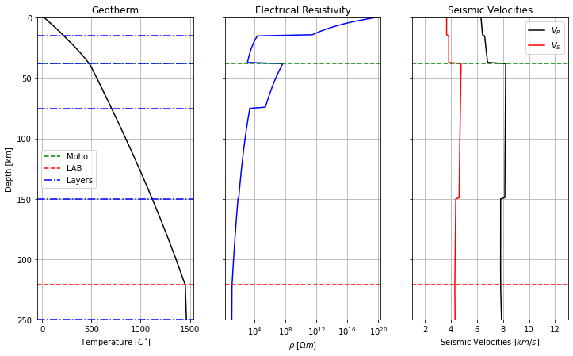
    


```python

```
## <span style="color:green"> Notebook - Inversion of composition from electrical conductivity</span>
<span style="color:purple">Sinan Ozaydin, School of Geosciences, The University of Sydney, NSW 2006, Australia <br/> </span>
<span style="color:purple">sinan.ozaydin@protonmail.com | sinan.ozaydin@sydney.edu.au </span>

Inversion module currently involves only inverting for conductivity 


```python
import numpy as np
import matplotlib.pyplot as plt

import pide
from pide.inversion import conductivity_solver_single_param
from pide.geodyn.geotherm import calculate_hasterok2011_geotherm
```

    /home/sinan/.local/lib/python3.10/site-packages/matplotlib/projections/__init__.py:63: UserWarning: Unable to import Axes3D. This may be due to multiple versions of Matplotlib being installed (e.g. as a system package and as a pip package). As a result, the 3D projection is not available.
      warnings.warn("Unable to import Axes3D. This may be due to multiple versions of "


First, let's define a temperature distribution by generating a continental geotherm with 36 mW/m^2 surface heat flow.


```python
moho = 38 #km
max_depth = 250

T, depth, p, idx_LAB = calculate_hasterok2011_geotherm(SHF = 36, T_0 =25.0,max_depth = max_depth, moho = moho)
```

Let's call a pide object and define the thermal and compositional environment. In this example we use a lherzolite matrix, and Hashin-Shtrikman Lower Bound for phase-mixing coefficient.


```python
p_obj = pide.pide() #creating the initial object
p_obj.set_temperature(T)
p_obj.set_pressure(p)

p_obj.set_composition_solid_mineral(ol = 0.65, opx = 0.2, cpx = 0.1, garnet = 0.05)
p_obj.set_solid_phs_mix_method(2) #Hashin-Shtrikman

```

Now, let's define the thermodynamics of water in the mantle. We choose the mantle water solubility functions of olivine from Padron-Navarta2017. We chose the rest to be determined through olivine model and water partition coefficients that are set. At the and we also add revalue_arrays command to add to compensate for the parameters (e.g., xFe) but needs to be adjusted to the length of the temperature and pressure array. This can be done with **revalue_arrays** method.


```python
p_obj.set_mantle_water_solubility(ol = 4,opx = 3, cpx = 0, garnet = 0)
p_obj.set_mantle_water_partitions(opx_ol = 3, cpx_ol = 4, garnet_ol = 0)
p_obj.revalue_arrays()
```

Here, we calculate the water solubility of the environment we set up. Padron-Navarta2017 model requires Titanium in olivine parameter (wt.) to be set as ti_ol in pide. We use a conservative amount of Ti content of 0.01 (after [Foley et al. 2013; EPSL)](https://doi.org/10.1016/j.epsl.2012.11.025).


```python
p_obj.set_parameter('ti_ol', 0.01)
max_water = p_obj.calculate_bulk_mantle_water_solubility(method = 'array')
```

In the next cell we are just creating a layered MT model with changing resistivities in $\Omega m$.


```python
cond_list_to_invert = np.ones(len(T)) * 1e4 #first 75 km, just creating a array to change the rest.
cond_list_to_invert[75:100] = 1000 #from 75 to 100 km
cond_list_to_invert[100:150] = 100 #from 100 to 150 km
cond_list_to_invert[150:] = 50 #from 150 to 250 km.
cond_list_to_invert = 1.0 / cond_list_to_invert #converting to conductivity
```

Inversion procedure can be carried out by utilising the **conductivity_solver_single_param** method. It conducts a simple grid-search algorithm to reach the minimum misfit. This method calls for the object name (object: pide object), conductivity list to invert for (cond_list: np.ndarray or list), parameter name to invert (param_name: str), uppermost values of the search region (upper_limit_list: np.ndarray or list), lowest values of the search region (lower_limit_list: np.ndarray or list), initial grid search increment value (search_start), acceptence misfit value to stop grid-search (acceptence_treshold), and number or cpus to parallelize the algorithm. The search increment decreases by a factor of 0.5 at each sign change in misfit calculation until it reaches the acceptence threshold value. The function will return the solution values and residual list.


```python
c_list, residual_list = conductivity_solver_single_param(object = p_obj, cond_list = cond_list_to_invert,
param_name = 'bulk_water', upper_limit_list = max_water, lower_limit_list= np.zeros(len(max_water)),
search_start = 30, acceptence_threshold = 0.5, num_cpu = 5)
```

Now let's plot our results.


```python
p_obj.set_bulk_water(c_list)
p_obj.mantle_water_distribute(method = 'array')
cond_calced = p_obj.calculate_conductivity(method = 'array')

fig = plt.figure(figsize = (15,10))
ax = plt.subplot(131)
# ax.plot(cond_list,object.T,label = 'data')
# ax.plot(cond_calced,object.T, label = 'calced')
ax.plot(max_water,depth, label = 'Water Solubility')
ax.plot(c_list,depth,linestyle = '--', label = 'Solved Water Content')
ax.set_ylim(np.amax(depth),np.amin(depth))
ax.set_xlim(0,1000)
ax.set_ylabel('Depth [km]')
ax.set_xlabel(r' Bulk Water Content [$H_2O \, wt. \, ppm$]')
ax.legend()
ax.grid()

ax2 = plt.subplot(132)
ax2.plot(1.0/cond_list_to_invert,depth)
ax2.plot(1.0/cond_calced,depth,linestyle = '--')
ax2.set_xscale('log')
ax2.set_ylim(np.amax(depth),np.amin(depth))
ax2.set_xlim(0.1,1e6)
ax2.set_yticklabels([])
ax2.set_xlabel(r'Resistivity [$\Omega m$]')
ax2.grid()

ax3 = plt.subplot(133)
ax3.plot(residual_list, depth, lw = 0.4)
ax3.set_ylim(np.amax(depth),np.amin(depth))
ax3.set_yticklabels([])
ax3.set_xlabel('Residual [S/m]')
ax3.set_xscale('log')
ax3.grid()

plt.show()
```


    
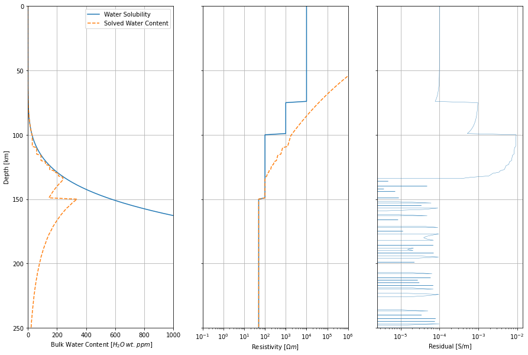
    


As it can be seen, there are large misfit values at depths above 130 kilometers. This is due to our solution space being delimited by the maximum water contents dictated by the study of Padron-Navarta2017. Conductivities here, then, has to be explained some other reason other than water content. Now let's solve the same environment for how much phlogopite needed, first let's reset the pide object by method **reset**. Then we will set the environment as a lherzolite matrix and Hashin-Shtrikman Upper Bound as the mixing relationship. This relationship suggests that the most conductive phase will also be the most interconnected one.


```python
p_obj.reset()

p_obj.set_temperature(T)
p_obj.set_pressure(p)
p_obj.set_composition_solid_mineral(ol = 0.65, opx = 0.2, cpx = 0.1, garnet = 0.05)
p_obj.set_solid_phs_mix_method(2)
p_obj.set_param1_mineral(mica = 0.52)
p_obj.revalue_arrays()
```

Now, let's solve for phlogopite content as put in the pide as mica_frac. Setting the inversion as search start increment of 0.01 fraction to search between 0 to 0.2 fraction.


```python
c_list, residual_list = conductivity_solver_single_param(object = p_obj, cond_list = cond_list_to_invert,
param_name = 'mica_frac', upper_limit_list = np.ones(len(T)) * 0.2,lower_limit_list= np.zeros(len(T)),
search_start = 0.01, acceptence_threshold = 0.001, num_cpu = 4)

cond_calced_phlg = p_obj.calculate_conductivity()
```


```python
fig = plt.figure(figsize = (15,10))
ax = plt.subplot(131)
# ax.plot(cond_list,object.T,label = 'data')
# ax.plot(cond_calced,object.T, label = 'calced')

ax.plot(p_obj.ol_frac,depth,color = 'g',label = 'Olivine')
ax.plot(p_obj.ol_frac + p_obj.opx_frac,depth, color = 'b',label = 'Opx')
ax.plot(p_obj.ol_frac + p_obj.opx_frac + p_obj.cpx_frac,depth, color = 'cyan',label = 'Cpx')
ax.plot(p_obj.ol_frac + p_obj.opx_frac + p_obj.cpx_frac + p_obj.garnet_frac,depth, color = 'r',
        label = 'Garnet')
ax.plot(p_obj.ol_frac + p_obj.opx_frac + p_obj.cpx_frac + p_obj.garnet_frac + p_obj.mica_frac,
        depth, color = 'k',label = 'Mica')
ax.set_xlim(0,1)
ax.legend()
ax.grid()
ax.set_xlabel('Cumulative Volume Fraction [%]')
ax.set_ylabel('Depth [km]')
ax.invert_yaxis()


ax2 = plt.subplot(132)
ax2.plot(p_obj.mica_frac * 1e2, depth, color = 'k')
ax2.invert_yaxis()
ax2.set_yticklabels([])
ax2.grid()
ax2.set_xlabel('Solved Mica Volume Fraction [%]')

# plt.savefig('2.png',dpi = 300)

ax3 = plt.subplot(133)
ax3.plot(1.0/cond_list_to_invert,depth)
ax3.plot(1.0/cond_calced_phlg,depth, linestyle = '--')
ax3.set_xscale('log')
ax3.set_yticklabels([])
ax3.invert_yaxis()
ax3.set_xlabel(r'Resistivity [$\Omega m$]')
ax3.grid()
ax3.set_xlim(0.1,1e6)
plt.show()
```


    
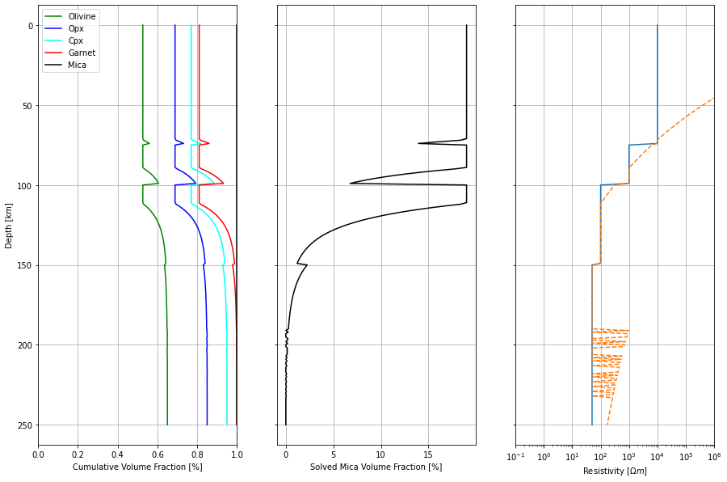
    


As we can see from this figure, the solution cannot be found after 150 km, because even the tiniest fraction of phlogopite will cause the conductivities to be resulting in negative misfit. At the end the algorithm gets out of the phlogopite and just solves for 0 fraction of phlogopite. This problem can be overcame by setting the keyword argument ***low_value_threshold*** to a value to assume that the solved parameter will be zero. Let's assume all solved values below 0.005 to be 0.


```python
p_obj.reset()

p_obj.set_temperature(T)
p_obj.set_pressure(p)
p_obj.set_composition_solid_mineral(ol = 0.65, opx = 0.2, cpx = 0.1, garnet = 0.05)
p_obj.set_solid_phs_mix_method(2)
p_obj.set_param1_mineral(mica = 0.52)
p_obj.revalue_arrays()

c_list, residual_list = conductivity_solver_single_param(object = p_obj, cond_list = cond_list_to_invert,
param_name = 'mica_frac', upper_limit_list = np.ones(len(T)) * 0.2,lower_limit_list= np.zeros(len(T)),
search_start = 0.01, acceptence_threshold = 0.001, num_cpu = 4, low_value_threshold = 0.005)

cond_calced_phlg = p_obj.calculate_conductivity()
```


```python
fig = plt.figure(figsize = (15,10))
ax = plt.subplot(131)
# ax.plot(cond_list,object.T,label = 'data')
# ax.plot(cond_calced,object.T, label = 'calced')

ax.plot(p_obj.ol_frac,depth,color = 'g',label = 'Olivine')
ax.plot(p_obj.ol_frac + p_obj.opx_frac,depth, color = 'b',label = 'Opx')
ax.plot(p_obj.ol_frac + p_obj.opx_frac + p_obj.cpx_frac,depth, color = 'cyan',label = 'Cpx')
ax.plot(p_obj.ol_frac + p_obj.opx_frac + p_obj.cpx_frac + p_obj.garnet_frac,depth, color = 'r',
        label = 'Garnet')
ax.plot(p_obj.ol_frac + p_obj.opx_frac + p_obj.cpx_frac + p_obj.garnet_frac + p_obj.mica_frac,
        depth, color = 'k',label = 'Mica')
ax.set_xlim(0,1)
ax.legend()
ax.grid()
ax.set_xlabel('Cumulative Volume Fraction [%]')
ax.set_ylabel('Depth [km]')
ax.invert_yaxis()


ax2 = plt.subplot(132)
ax2.plot(p_obj.mica_frac * 1e2, depth, color = 'k')
ax2.invert_yaxis()
ax2.set_yticklabels([])
ax2.grid()
ax2.set_xlabel('Solved Mica Volume Fraction [%]')

# plt.savefig('2.png',dpi = 300)

ax3 = plt.subplot(133)
ax3.plot(1.0/cond_list_to_invert,depth)
ax3.plot(1.0/cond_calced_phlg,depth, linestyle = '--')
ax3.set_xscale('log')
ax3.set_yticklabels([])
ax3.invert_yaxis()
ax3.set_xlabel(r'Resistivity [$\Omega m$]')
ax3.grid()
ax3.set_xlim(0.1,1e6)
plt.show()
```


    
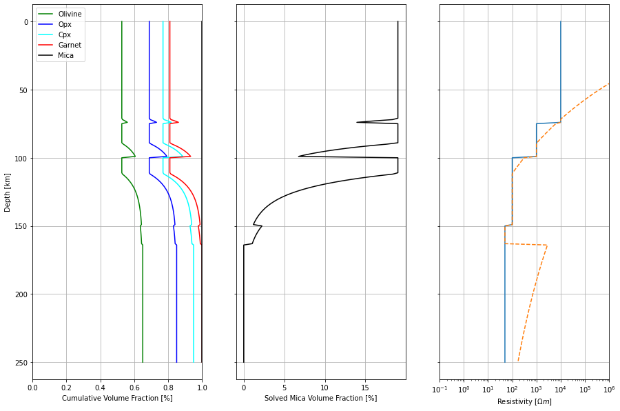
    


Now we can see that problem is not happening anymore!
## <span style="color:green"> Notebook - Mapping metasomatised domains from MT Models</span>
<span style="color:purple">Sinan Ozaydin, School of Geosciences, The University of Sydney, NSW 2006, Australia <br/> </span>
<span style="color:purple">sinan.ozaydin@protonmail.com | sinan.ozaydin@sydney.edu.au </span>

In this notebook, we will explore the calculation of first-order metasomatic additions from inputted MT models. For this exercise, we are going to use the model of [Bedrosian et al., 2021](https://doi.org/10.1029/2021GL092970) and cropped temperature model (WINTERC-G) of [Fullea et al., 2021](https://doi.org/10.1093/gji/ggab094). 


```python
import os
from pathlib import Path
import numpy as np
from scipy.interpolate import griddata
import matplotlib.pyplot as plt
from netCDF4 import Dataset

import pide
from pide.mt.mt_model_read import read_ModEM_rho
from pide.utils.utils import read_csv, associate_coordinates
from pide.utils.gis_tools import lat_lon_to_utm, get_utm_zone_number

#Defining notebook path in the machine that is running.
notebook_path = Path().resolve()
```

    /home/sinan/.local/lib/python3.10/site-packages/matplotlib/projections/__init__.py:63: UserWarning: Unable to import Axes3D. This may be due to multiple versions of Matplotlib being installed (e.g. as a system package and as a pip package). As a result, the 3D projection is not available.
      warnings.warn("Unable to import Axes3D. This may be due to multiple versions of "


First of all, let's read the MT model by using the ***read_ModEM_rho*** function and determine the model center in UTM coordinates to georefererence the model using the functions from ***pide.utils.gis_tools***. We will be using the depths according to 49 and 96 kilometer slices to calculate our metasomatism maps.


```python
wus_rho_path = os.path.join(notebook_path,'..','example_data','WUS_MT_Model','WUS.MT.Bedrosian2021.resistivity.rho')

#model centers for georeferencing
mc_lat = 40.75
mc_lon = -113.25

utm_no = get_utm_zone_number(mc_lon)
mc_x, mc_y = lat_lon_to_utm(mc_lat,mc_lon)

#reading the MT model file
rho, mesh_x, mesh_y, mesh_z = read_ModEM_rho(rho_file_path=wus_rho_path)

#converting x and y to utm coordinates
x = mesh_x
y = mesh_y

#Getting the vertical indexes of 49 and 96 kilometer slices.
idx_49 = (np.abs((mesh_z/1e3) - 49.0)).argmin()
idx_96 = (np.abs((mesh_z/1e3) - 96.0)).argmin()

#Getting the resistivities at 50 and 100 km
rho_49 = rho[idx_49].flatten()
rho_96 = rho[idx_96].flatten()

cond_49 = 1.0/rho_49
cond_96 = 1.0/rho_96

```

Now, let's read the temperature model with the help of utils.read_csv function. and then georefence them into the UTM coordinates.


```python
#Reading the temperature model
T_path = os.path.join(notebook_path,'..','example_data','WUS_MT_Model','WinterCGTemp_Cropped_WUS.lis')
data_T = read_csv(filename=T_path, delim = ' ')
data_T = np.array(data_T[1:], dtype = float) #Skipping header  with 1:

#Getting the data information
data_T_depth = data_T[:,3]
data_T_temp = data_T[:,4] + 273.15 #converting from C to K
data_T_lat = data_T[:,2]
data_T_lon = data_T[:,1] - 360.0 #Converting it to negative before Greenwich.

#Getting all indices of latitude and longitude by using a single depth.
data_T_lat = data_T_lat[np.where(data_T_depth==-49.0)[0]]
data_T_lon = data_T_lon[np.where(data_T_depth==-49.0)[0]]

#Converting latitude and longitudes into the utm coordinates to match the MT model.
x_T, y_T = lat_lon_to_utm(latitude = data_T_lat, longitude = data_T_lon, zone_number = utm_no)

#Minus model center to georeference all x,y points.
x_T = x_T - mc_x
y_T = y_T - mc_y

#Temperature slices at 49 and 96 km.
T_49 = data_T_temp[np.where(data_T_depth==-49.0)[0]]
T_96 = data_T_temp[np.where(data_T_depth==-97.0)[0]]

```

Checking whether the model areas are set up accurately by simply plotting the node points.


```python
plt.plot(x,y,'*', color = 'k', markersize = 3, label = 'MT Grid')
plt.plot(x_T,y_T, 's', color = 'r',label = 'Temperature Grid')
plt.plot(0,0, '^', color = 'g', label = 'Model Center')
plt.legend()
plt.show()
```


    
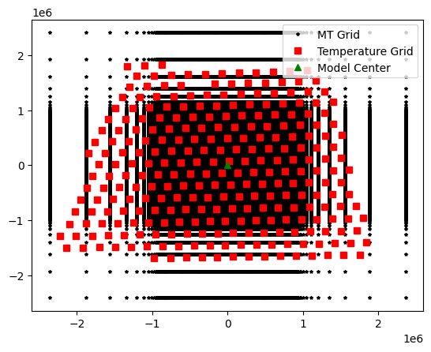
    


We also want to interpolate the temperature data between the points so we will have a more accurate distribution of temperature at each MT x,y location.


```python
#2D interpolation of Temperature field to make 

x_new = np.arange(np.amin(x_T),np.amax(x_T),30e3) #every 5_000 m
y_new = np.arange(np.amin(y_T),np.amax(y_T),30e3) #every 5_000 m

coords_mesh = np.meshgrid(x_new, y_new)

points_interp = np.column_stack((x_T, y_T))

T_49_interp = griddata(points_interp, T_49, (coords_mesh[0], coords_mesh[1]), method = 'cubic')
T_96_interp = griddata(points_interp, T_96, (coords_mesh[0], coords_mesh[1]), method = 'cubic')

T_49_interp = T_49_interp.flatten()
T_96_interp = T_96_interp.flatten()
coords_x = coords_mesh[0].flatten()
coords_y = coords_mesh[1].flatten()

#Applying mask for nan values at T due to interpolation out of bounds
mask = np.isnan(T_49_interp)
T_49_i = T_49_interp[~mask]
T_96_i = T_96_interp[~mask]
coords_x = coords_x[~mask]
coords_y = coords_y[~mask]

#Plotting the new meshes to check whether the interpolation is made correctly.
plt.plot(x,y,'*', color = 'k', markersize = 3, label = 'MT Grid')
plt.plot(coords_x,coords_y, 's', color = 'r',label = 'Temperature Grid', markersize = 0.1)
plt.plot(0,0, '^', color = 'g', label = 'Model Center')
plt.legend()
plt.show()
```


    
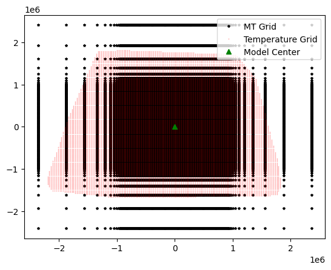
    


Now, we want to find the corresponding index numbers of temperature grid for the each MT grid locality. We can do that by the pide function form ***utils.utils.associate_coordinates*** function.


```python
##associateding coordinates for with

idx_ = associate_coordinates(sample_x = coords_x, sample_y = coords_y, target_x=x, target_y=y, num_cpu = 5)
```

Now that we have our temperature and MT model, we can set up the compositional environment to calculate the metasomatism maps. We assume a Lherzolitic model. To calculate the all metasomatic additions we will basically calculate the dry lherzolite conductivity at each slice and subtract the real MT model from it:

$$\sigma_{Metasomatism} = \sigma_{Observed} - \sigma_{DryLherzolite} \quad \text{(1)}$$


```python
#Setting up and calculating the environment for the 49 km slice and calculating.
p_obj = pide.pide()
p_obj.set_temperature(T_49_i[idx_])
p_obj.set_pressure(49.0 / 33.0) #pressure roughly calculated.
p_obj.set_composition_solid_mineral(ol = 0.6,opx = 0.3,cpx = 0.1)
p_obj.set_mineral_conductivity_choice(ol = 4, opx = 0, garnet = 0, cpx = 6)
p_obj.set_solid_phs_mix_method(1) #HS lower bound

cond_s_49 = p_obj.calculate_conductivity()

#Setting up and calculating the environment for the 49 km slice and calculating.
p_obj = pide.pide()
p_obj.set_temperature(T_96_i[idx_])
p_obj.set_pressure(96.0 / 33.0) #pressure roughly calculated.
p_obj.set_composition_solid_mineral(ol = 0.6,opx = 0.25,cpx = 0.1, garnet= 0.05)
p_obj.set_mineral_conductivity_choice(ol = 4, opx = 0, garnet = 0, cpx = 6)
p_obj.set_solid_phs_mix_method(1) #HS lower bound

cond_s_96 = p_obj.calculate_conductivity()

#Calculating the log values of resistivities.
logsynthetic_49 = np.log10(1.0/cond_s_49)
logsynthetic_96 = np.log10(1.0/cond_s_96)

#Calculating the log values of resistivities observed.
logmodel_49 = np.log10(1.0/cond_49)
logmodel_96 = np.log10(1.0/cond_96)

#Let's plot the histogram of differences for each slice.
plt.figure()
ax = plt.subplot(111)
ax.hist(logsynthetic_49-logmodel_49, label = '49 km')
ax.hist(logsynthetic_96-logmodel_96, label = '96 km')
ax.set_xlabel('Log-Difference Resistivity')
plt.show()
```


    
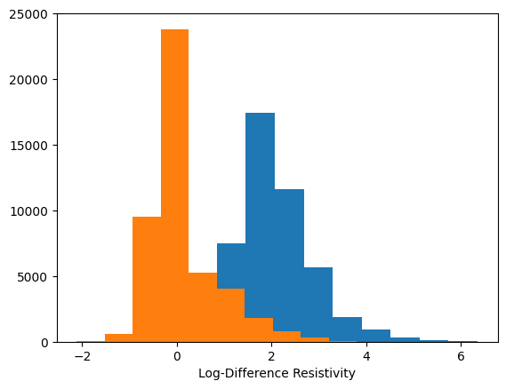
    


Now, let's interpolate these values at 5_000 m to plot nice 2D horizontal sections.


```python
#Setting up the new array.
xi = np.arange(np.amin(x), np.amax(x),5000)
yi = np.arange(np.amin(y), np.amax(y),5000)

x_i,  y_i = np.meshgrid(xi,yi)

points_interp = np.column_stack((x, y))

#Interpolating 49 km
real_model_49 = griddata(points_interp, logmodel_49, (x_i, y_i), method = 'cubic')
synth_model_49 = griddata(points_interp, logsynthetic_49, (x_i, y_i), method = 'cubic')
diff_log_49 = synth_model_49 - real_model_49

#Interpolating 96 km.
real_model_96 = griddata(points_interp, logmodel_96, (x_i, y_i), method = 'cubic')
synth_model_96 = griddata(points_interp, logsynthetic_96, (x_i, y_i), method = 'cubic')
diff_log_96 = synth_model_96 - real_model_96
```

Now, let's plot the figures in Observed model - Synthetic Model - Model Difference array.


```python
fig = plt.figure(figsize = (30,10))
ax1 = plt.subplot(131)
cax1 = ax1.pcolormesh(xi,yi, real_model_49, cmap = 'Spectral')
cax1.set_clim(0,4)
cbar_ax = fig.colorbar(cax1, boundaries= np.linspace(0,4), orientation="horizontal", pad=0.1,
			 ticks = [0,2,4], ax = ax1, label = 'Log-Resistivity [$\Omega m$]')

ax1.set_xlim(-1e6,1e6)
ax1.set_ylim(-1e6,1e6)
ax1.set_xlabel('Easting [m]')
ax1.set_ylabel('Northing [m]')
ax1.set_title('Observed Resistivity Model')

ax2 = plt.subplot(132)
cax2 = ax2.pcolormesh(xi,yi, synth_model_49, cmap = 'Spectral')
cax2.set_clim(0,8)
cbar_ax2 = fig.colorbar(cax2, boundaries= np.linspace(0,8), orientation="horizontal", pad=0.1,
			 ticks = [0,4,8], ax = ax2, label = 'Log-Resistivity [$\Omega m$]')

ax2.set_xlim(-1e6,1e6)
ax2.set_ylim(-1e6,1e6)
ax2.set_xlabel('Easting [m]')
ax2.set_title('Synthetic Dry Lherzolite Resistivity')

ax3 = plt.subplot(133)
cax3 = ax3.pcolormesh(xi,yi, diff_log_49, cmap = 'viridis')
cax3.set_clim(0,6)
cbar_ax3 = fig.colorbar(cax3, boundaries= np.linspace(0,8), orientation="horizontal", pad=0.1,
			 ticks = [0,3,6], ax = ax3, label = 'Log-Resistivity Difference [$\Omega m$]')

ax3.set_xlim(-1e6,1e6)
ax3.set_ylim(-1e6,1e6)
ax3.set_xlabel('Easting [m]')
ax3.set_title('Log-Difference Observed-Synthetic')


plt.show()
```


    
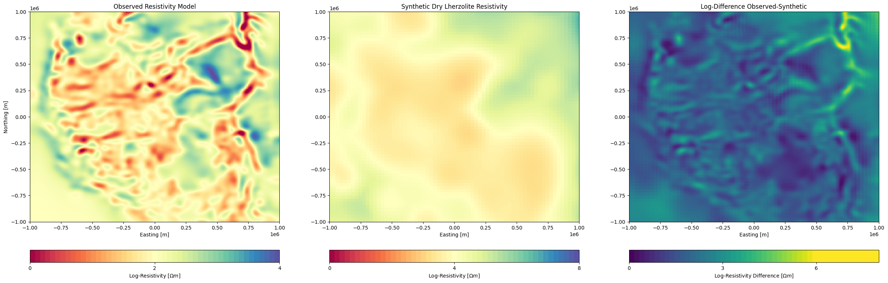
    


```python
fig = plt.figure(figsize = (30,10))
ax4 = plt.subplot(131)
cax4 = ax4.pcolormesh(xi,yi, real_model_96, cmap = 'Spectral')
cax4.set_clim(0,4)
cbar_ax = fig.colorbar(cax4, boundaries= np.linspace(0,4), orientation="horizontal", pad=0.1,
			 ticks = [0,2,4], ax = ax4, label = 'Log-Resistivity [$\Omega m$]')

ax4.set_xlim(-1e6,1e6)
ax4.set_ylim(-1e6,1e6)
ax4.set_xlabel('Easting [m]')
ax4.set_ylabel('Northing [m]')
ax4.set_title('Observed Resistivity Model - 96 km')

ax5 = plt.subplot(132)
cax5 = ax5.pcolormesh(xi,yi, synth_model_96, cmap = 'Spectral')
cax5.set_clim(0,4)
cbar_ax2 = fig.colorbar(cax5, boundaries= np.linspace(0,4), orientation="horizontal", pad=0.1,
			 ticks = [0,2,4], ax = ax5, label = 'Log-Resistivity [$\Omega m$]')

ax5.set_xlim(-1e6,1e6)
ax5.set_ylim(-1e6,1e6)
ax5.set_xlabel('Easting [m]')
ax5.set_title('Synthetic Dry Lherzolite Resistivity - 96 km')

ax6 = plt.subplot(133)
cax6 = ax6.pcolormesh(xi,yi, diff_log_96, cmap = 'viridis')
cax6.set_clim(0,4)
cbar_ax6 = fig.colorbar(cax6, boundaries= np.linspace(0,4), orientation="horizontal", pad=0.1,
			 ticks = [0,2,4], ax = ax6, label = 'Log-Resistivity Difference [$\Omega m$]')

ax6.set_xlim(-1e6,1e6)
ax6.set_ylim(-1e6,1e6)
ax6.set_xlabel('Easting [m]')
ax6.set_title('Log-Difference Observed-Synthetic -  96 km')

plt.show()
```


    
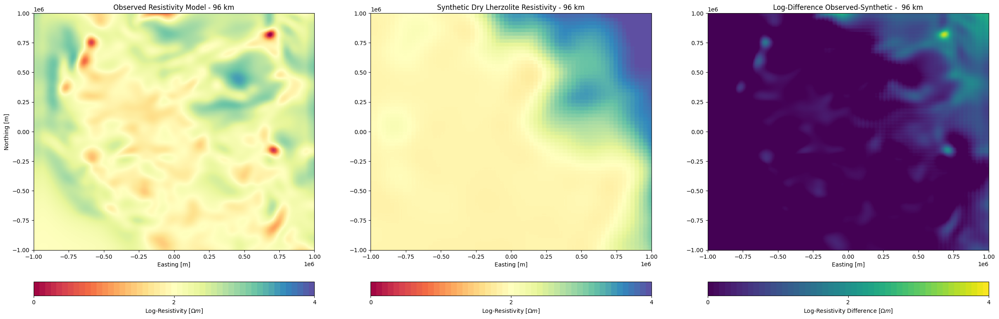
    

## <span style="color:green"> Notebook - Mantle Water Content and Rheology from MT</span>
<span style="color:purple">Sinan Ozaydin, School of Geosciences, The University of Sydney, NSW 2006, Australia <br/> </span>
<span style="color:purple">sinan.ozaydin@protonmail.com | sinan.ozaydin@sydney.edu.au </span>


```python
import os
from pathlib import Path
import numpy as np
from scipy.interpolate import griddata
import matplotlib.pyplot as plt
from netCDF4 import Dataset

import pide
from pide.mt.mt_model_read import read_ModEM_rho
from pide.utils.utils import read_csv, associate_coordinates
from pide.utils.gis_tools import lat_lon_to_utm, get_utm_zone_number
from pide.inversion import conductivity_solver_single_param

import time

notebook_path = Path().resolve()
```

    /home/sinan/.local/lib/python3.10/site-packages/matplotlib/projections/__init__.py:63: UserWarning: Unable to import Axes3D. This may be due to multiple versions of Matplotlib being installed (e.g. as a system package and as a pip package). As a result, the 3D projection is not available.
      warnings.warn("Unable to import Axes3D. This may be due to multiple versions of "


In this notebook, we will convert the MT models of Western United States into water content maps at 96 and 150 km. This will require a simple inversion process with the given environment. We will use the same cells in Notebook 7 to read the models and assign the relevant indexes.

First of all, let's read the MT model by using the ***read_ModEM_rho*** function and determine the model center in UTM coordinates to georeference the model using the functions from ***pide.utils.gis_tools***. We will be using the depths according to 96 and 155 kilometer slices to calculate our water content maps.


```python
wus_rho_path = os.path.join(notebook_path,'..','example_data','WUS_MT_Model','WUS.MT.Bedrosian2021.resistivity.rho')

#model centers for georeferencing
mc_lat = 40.75
mc_lon = -113.25

utm_no = get_utm_zone_number(mc_lon)
mc_x, mc_y = lat_lon_to_utm(mc_lat,mc_lon)

#reading the MT model file
rho, mesh_x, mesh_y, mesh_z = read_ModEM_rho(rho_file_path=wus_rho_path)

#converting x and y to utm coordinates
x = mesh_x
y = mesh_y

#Getting the vertical indexes of 
idx_96 = (np.abs((mesh_z/1e3) - 96.0)).argmin()
idx_155 = (np.abs((mesh_z/1e3) - 155.0)).argmin()

#Getting the resistivities at 50 and 100 km
rho_96 = rho[idx_96].flatten()
rho_155 = rho[idx_155].flatten()

cond_96 = 1.0/rho_96
cond_155 = 1.0/rho_155
```

    /home/sinan/src/SEL/pide/utils/gis_tools.py:42: FutureWarning: This function is deprecated. See: https://pyproj4.github.io/pyproj/stable/gotchas.html#upgrading-to-pyproj-2-from-pyproj-1
      utm_x, utm_y = transform(wgs84, utm, longitude, latitude)


Now, let's read the temperature model with the help of utils.read_csv function. and then georefence them into the UTM coordinates.


```python
#Reading the temperature model
T_path = os.path.join(notebook_path,'..','example_data','WUS_MT_Model','WinterCGTemp_Cropped_WUS.lis')
data_T = read_csv(filename=T_path, delim = ' ')
data_T = np.array(data_T[1:], dtype = float) #Skipping header  with 1:

data_T_depth = data_T[:,3]
data_T_temp = data_T[:,4] + 273.15 #converting from C to K
data_T_lat = data_T[:,2]
data_T_lon = data_T[:,1] - 360.0 #Converting it to negative before Greenwich.

#Getting all indices of latitude and longitude by using a single depth.
data_T_lat = data_T_lat[np.where(data_T_depth==-49.0)[0]]
data_T_lon = data_T_lon[np.where(data_T_depth==-49.0)[0]]

x_T, y_T = lat_lon_to_utm(latitude = data_T_lat, longitude = data_T_lon, zone_number = utm_no)

x_T = x_T - mc_x
y_T = y_T - mc_y


T_96 = data_T_temp[np.where(data_T_depth==-97.0)[0]]
T_155 = data_T_temp[np.where(data_T_depth==-155.0)[0]]

#We want to make these calculations at 50 and 100 km. So only loading the T at those temperatures.
```

    /home/sinan/src/SEL/pide/utils/gis_tools.py:42: FutureWarning: This function is deprecated. See: https://pyproj4.github.io/pyproj/stable/gotchas.html#upgrading-to-pyproj-2-from-pyproj-1
      utm_x, utm_y = transform(wgs84, utm, longitude, latitude)


We also want to interpolate the temperature data between the points so we will have a more accurate distribution of temperature at each MT x,y location.


```python
#2D interpolation of Temperature field to make 

x_new = np.arange(np.amin(x_T),np.amax(x_T),30e3) #every 5_000 m
y_new = np.arange(np.amin(y_T),np.amax(y_T),30e3) #every 5_000 m

coords_mesh = np.meshgrid(x_new, y_new)

points_interp = np.column_stack((x_T, y_T))


T_96_interp = griddata(points_interp, T_96, (coords_mesh[0], coords_mesh[1]), method = 'cubic')
T_155_interp = griddata(points_interp, T_155, (coords_mesh[0], coords_mesh[1]), method = 'cubic')


T_96_interp = T_96_interp.flatten()
T_155_interp = T_155_interp.flatten()
coords_x = coords_mesh[0].flatten()
coords_y = coords_mesh[1].flatten()

#Applying mask for nan values at T due to interpolation out of bounds
mask = np.isnan(T_96_interp)
T_96_i = T_96_interp[~mask]
T_155_i = T_155_interp[~mask]
coords_x = coords_x[~mask]
coords_y = coords_y[~mask]
```

Now, we want to find the corresponding index numbers of temperature grid for the each MT grid locality. We can do that by the pide function form ***utils.utils.associate_coordinates*** function.


```python
##associateding coordinates for with

idx_ = associate_coordinates(sample_x = coords_x, sample_y = coords_y, target_x=x, target_y=y, num_cpu = 5)
```

Now that we have our temperature and MT model, we can set up the compositional environment to calculate the water content maps. To do this we first have to set up the compositional environment and how the water will behave in here.


```python
p_obj = pide.pide()
#T-P and composition
p_obj.set_temperature(T_96_i[idx_])
p_obj.set_pressure(96.0 / 33.0 * np.ones(len(T_96_i[idx_]))) #pressure roughly calculated with Depth[km]/33km - GPa
p_obj.set_composition_solid_mineral(ol = 0.6,opx = 0.25,cpx = 0.1, garnet= 0.05)
p_obj.revalue_arrays()

#water thermodynamics
p_obj.set_mantle_water_partitions(opx = 3, cpx = 6, garnet = 0)
p_obj.set_parameter('ti_ol', 0.1)
p_obj.set_mantle_water_solubility(opx = 3, ol = 4, cpx = 1, garnet = 0)
max_water = p_obj.calculate_bulk_mantle_water_solubility()

p_obj.set_mineral_conductivity_choice(ol = 4, opx = 0, garnet = 0, cpx = 6)
p_obj.set_solid_phs_mix_method(1) #HS lower bound

water_96, residual_list = conductivity_solver_single_param(object = p_obj, cond_list = cond_96,
param_name = 'bulk_water', upper_limit_list = max_water,
		lower_limit_list= np.zeros(len(max_water)), search_start = 20, acceptence_threshold = 0.5,
        num_cpu = 5)
water_96 = np.array(water_96)
```


```python
#Calculating the 155 km slice.
p_obj.reset()

p_obj.set_temperature(T_155_i[idx_])
p_obj.set_pressure(155.0 / 33.0) #pressure roughly calculated with Depth[km]/33km - GPa
p_obj.set_composition_solid_mineral(ol = 0.6,opx = 0.25,cpx = 0.1, garnet= 0.05)
p_obj.set_mineral_conductivity_choice(ol = 4, opx = 0, garnet = 0, cpx = 6)
p_obj.revalue_arrays()

#water thermodynamics
p_obj.set_mantle_water_partitions(opx = 3, cpx = 6, garnet = 0)
p_obj.set_parameter('ti_ol', 0.1)
p_obj.set_mantle_water_solubility(opx = 3, ol = 4, cpx = 1, garnet = 0)
max_water = p_obj.calculate_bulk_mantle_water_solubility()

p_obj.set_mineral_conductivity_choice(ol = 4, opx = 0, garnet = 0, cpx = 6)
p_obj.set_solid_phs_mix_method(1) #HS lower bound

water_155, residual_list = conductivity_solver_single_param(object = p_obj, cond_list = cond_155,
param_name = 'bulk_water', upper_limit_list = max_water,
		lower_limit_list= np.zeros(len(max_water)), search_start = 20, acceptence_threshold = 0.5,
        num_cpu = 5)
```


```python
xi = np.arange(np.amin(x), np.amax(x),5e3)
yi = np.arange(np.amin(y), np.amax(y),5e3)

x_i,  y_i = np.meshgrid(xi,yi)

points_interp = np.column_stack((x, y))

water_96_ = griddata(points_interp, water_96, (x_i, y_i), method = 'cubic')
water_155_ = griddata(points_interp, water_155, (x_i, y_i), method = 'cubic')
res_96 = griddata(points_interp, np.log10(rho_96), (x_i, y_i), method = 'cubic')
res_155 = griddata(points_interp, np.log10(rho_155), (x_i, y_i), method = 'cubic')

fig = plt.figure(figsize = (20,10))
ax1 = plt.subplot(221)
cax1 = ax1.pcolormesh(xi,yi, water_96_, cmap = 'viridis')
cax1.set_clim(0,400)
cbar_ax = fig.colorbar(cax1, boundaries= np.linspace(0,400), orientation="horizontal", pad=0.1,
			 ticks = [0,200,400], ax = ax1, label = r'Bulk Water Content [$H_2O$ wt ppm]')

cont = ax1.contour(xi, yi, water_96_, levels = [50, 100, 200, 400], alpha = 0.5,colors = 'white',linewidths = 0.75, linestyles = '--')
ax1.clabel(cont, cont.levels, inline = True, fontsize = 8, colors = 'white')
ax1.set_xlim(-1e6,1e6)
ax1.set_ylim(-1e6,1e6)
ax1.set_xlabel('Easting [m]')
ax1.set_ylabel('Northing [m]')
ax1.set_title('Water Content at 96 km')

ax2 = plt.subplot(222)
cax2 = ax2.pcolormesh(xi,yi, water_155_, cmap = 'viridis')
cax2.set_clim(0,400)
cbar_ax2 = fig.colorbar(cax2, boundaries= np.linspace(0,400), orientation="horizontal", pad=0.1,
			 ticks = [0,200,400], ax = ax2, label = r'Bulk Water Content [$H_2O$ wt ppm]')

cont = ax2.contour(xi, yi, water_155_, levels = [50, 100, 200, 400], alpha = 0.5,colors = 'white',linewidths = 0.75, linestyles = '--')
ax2.clabel(cont, cont.levels, inline = True, fontsize = 8,colors = 'white')
ax2.set_xlim(-1e6,1e6)
ax2.set_ylim(-1e6,1e6)
ax2.set_xlabel('Easting [m]')
ax2.set_ylabel('Northing [m]')
ax2.set_title('Water Content at 155 km')

ax3 = plt.subplot(223)
cax3 = ax3.pcolormesh(xi,yi, res_96, cmap = 'Spectral')
cax3.set_clim(0,4)
cbar_ax3 = fig.colorbar(cax3, boundaries= np.linspace(0,4), orientation="horizontal", pad=0.1,
			 ticks = [0,2,4], ax = ax3, label = r'Resistivity [$\Omega m$]')

ax3.set_xlim(-1e6,1e6)
ax3.set_ylim(-1e6,1e6)
ax3.set_xlabel('Easting [m]')
ax3.set_ylabel('Northing [m]')

ax4 = plt.subplot(224)
cax4 = ax4.pcolormesh(xi,yi, res_155, cmap = 'Spectral')
cax4.set_clim(0,4)
cbar_ax4 = fig.colorbar(cax4, boundaries= np.linspace(0,4), orientation="horizontal", pad=0.1,
			 ticks = [0,2,4], ax = ax4, label = r'Resistivity [$\Omega m$]')

ax4.set_xlim(-1e6,1e6)
ax4.set_ylim(-1e6,1e6)
ax4.set_xlabel('Easting [m]')
ax4.set_ylabel('Northing [m]')

plt.show()

```


    
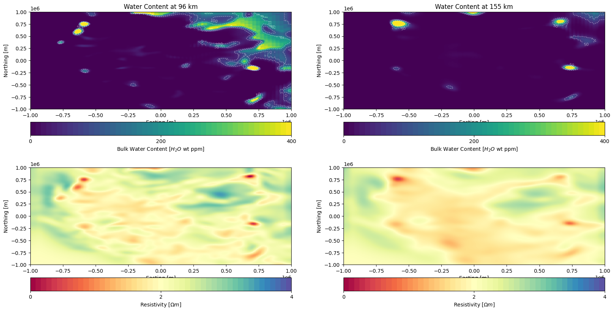
    


Now, let's consider calculating the mantle viscosity with the water content output of this model in accordance with the temperature model we have. The effective viscosity $\eta_{eff}$ can be first calculate by calculation of total strain caused by different olivine deformation mechanisms:

$$\gamma_{total} = \gamma_{diff} + \gamma_{disl} + \gamma_{GBS} \qquad \text{(1)}$$

where $\gamma_{diff}$ is the diffusion creep, $\gamma_{disl}$ is the dislocation creep and $\gamma_{GBS}$ is strain related to grain boundary sliding. Knowing the total strain, now we can calculate the effective viscosity:

$$\eta_{eff} = {\sigma \over {2\gamma_{total}}} \qquad \text{(2)}$$

where $\sigma$ is stress in Pa. Stress here can be calculated via a grain-size ($d$ in m) dependent stress relationship taken from vanderWal et al. (1993, [Paper Link](https://doi.org/10.1029/93GL01382)):

$$\sigma = (0.015 / d)^{1/1.33} \qquad \text{(2)}$$

To follow these actions one has to first calculate the olivine water content from the inversion results:


```python
p_obj.set_bulk_water(water_155)
p_obj.mantle_water_distribute()

#Olivine water content then can be taken from the object
ol_water = p_obj.ol_water
```

Now we can set up the rheology object. First, we have to import


```python
from pide.rheology.olivine_rheology import olivine_rheology

#creating rheology object
rheol_obj = olivine_rheology(T = p_obj.T,P = p_obj.p,water = p_obj.ol_water, xFe = 0.1)
#calculating stress from grain size for ambient mantle with equation 3 with 1 mm grain size
stress_input = rheol_obj.Stress_from_grainSize_vanderWAL1993(grain_size = 1)

#calculating strains from Hirth and Kohlstedt (2003)
diff_strain = rheol_obj.Hirth_Kohlstedt_2003_diff_fugacity(gr_sz = 1,stress = stress_input, melt = 0.0, fugacity_model= 'Zhao2004', calibration_model="Withers2012")
disl_strain = rheol_obj.Hirth_Kohlstedt_2003_dislocation_fugacity(stress = stress_input, melt = 0.0, fugacity_model= 'Zhao2004', calibration_model="Withers2012")
gbs_strain = rheol_obj.Ohuchi_et_al_2014_GBS(gr_sz=1, stress = stress_input, fugacity_model= 'Zhao2004', calibration_model="Withers2012")

#calculating effective viscosity
eff_visc_155 = rheol_obj.calculate_effective_viscosity(stress = stress_input, strain_diff=diff_strain,strain_disl=disl_strain,strain_GBS=gbs_strain)

visc_155 = griddata(points_interp, eff_visc_155, (x_i, y_i), method = 'cubic')
```

Now let's plot the results for the mantle viscosity calculations:


```python
fig = plt.figure(figsize = (13,10))
ax1 = plt.subplot(111)
cax1 = ax1.pcolormesh(xi,yi, np.log10(visc_155), cmap = 'magma_r')
cax1.set_clim(14,23)
cbar_ax = fig.colorbar(cax1, boundaries= np.linspace(14,23), orientation="vertical", pad=0.1,
			 ticks = [14,16,18,20,22], ax = ax1, label = r'Log-Effective Viscosity [Pa.s]')

ax1.clabel(cont, cont.levels, inline = True, fontsize = 8, colors = 'white')
ax1.set_xlim(-1e6,1e6)
ax1.set_ylim(-1e6,1e6)
ax1.set_xlabel('Easting [m]')
ax1.set_ylabel('Northing [m]')
ax1.set_title('Effective Viscosity at 155 km')
```


    Text(0.5, 1.0, 'Effective Viscosity at 155 km')


    
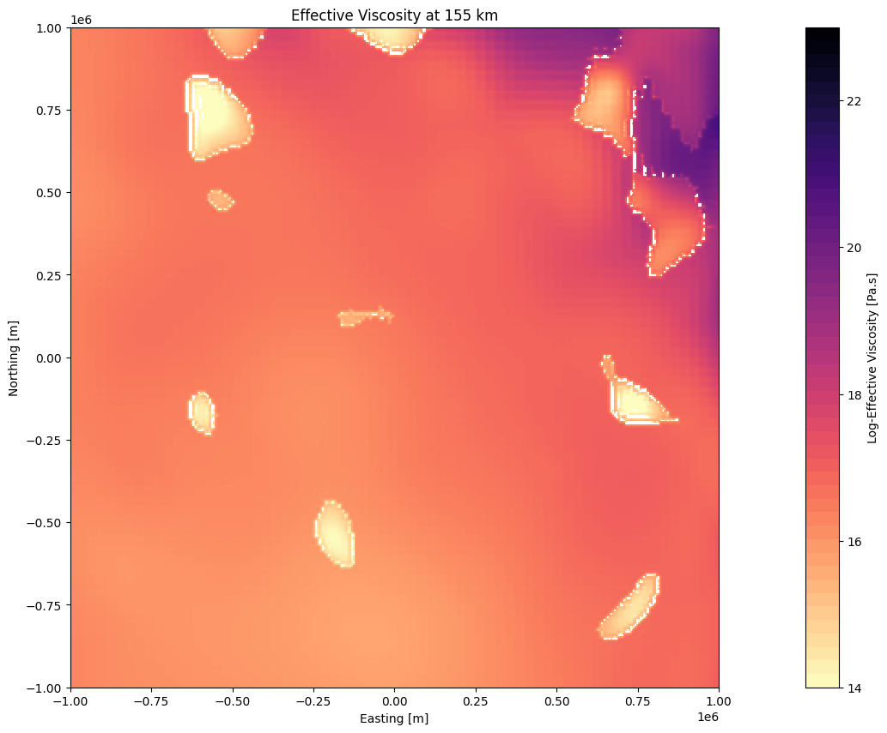
    


```python

```
## <span style="color:green"> Notebook - Conversion of 2D Underworld Model - Subduction Zone</span>
<span style="color:purple">Sinan Ozaydin, School of Geosciences, The University of Sydney, NSW 2006, Australia <br/> </span>
<span style="color:purple">sinan.ozaydin@protonmail.com | sinan.ozaydin@sydney.edu.au </span>

In this notebook, we will convert a numerical model output from underworld to geophysical parameters, electrical conductivity and seismic velocity. First, let's import the functions we are going to use.


```python
import os
from pathlib import Path

import pide
from pide.material import Material
from pide.model import Model
from pide.geodyn.read_uw_model import *
from pide.geodyn.interpolate_fields import interpolate_2d_fields
from pide.geodyn.plot_models import *
from pide.geodyn.material_process import *
from pide.geodyn.write_uw_model import write_2d_field_h5

#setting up source folder of the files
notebook_path = Path().resolve()
source_folder = os.path.join(notebook_path,'..','example_data','uwconversion')
```

    /home/sinan/.local/lib/python3.10/site-packages/matplotlib/projections/__init__.py:63: UserWarning: Unable to import Axes3D. This may be due to multiple versions of Matplotlib being installed (e.g. as a system package and as a pip package). As a result, the 3D projection is not available.
      warnings.warn("Unable to import Axes3D. This may be due to multiple versions of "


Reading the data files of thermomechanical model outputs in h5 formats. They can be read by the ***read_h5_file*** function.


```python
#setting up filename folders for the h5 files.
temp_fnm = os.path.join(source_folder,'temperature-501.h5')
pstrain_fnm = os.path.join(source_folder,'projPlasticStrain-501.h5')
material_fnm = os.path.join(source_folder,'projMaterialField-501.h5')
stress_fnm = os.path.join(source_folder,'projStressField-501.h5')
melt_fnm = os.path.join(source_folder,'projMeltField-501.h5')
pressure_fnm = os.path.join(source_folder,'pressureField-501.h5')
mesh_fnm = os.path.join(source_folder,'mesh.h5')

py_start_fnm = os.path.join(source_folder,'Col262.py')

temp_data = read_h5_file(temp_fnm)
pressure_data = read_h5_file(pressure_fnm)
mesh_data = read_h5_file(mesh_fnm)
material_data = read_h5_file(material_fnm)
pstrain_data = read_h5_file(pstrain_fnm)
stress_data = read_h5_file(stress_fnm)
melt_data = read_h5_file(melt_fnm)


```

We can scrape the material names and their relevant index numbers from the input python script with ***read_uw_material_names*** function. 2D mesh can be set up by ***setup_2d_mesh***. It outputs mesh (np.meshgrid), mesh_center (np.meshgrid), x_mesh and y_mesh (1D np.arrays of mesh), x_mesh_centers and y_mesh centers (1D np.arrays of mesh centers). With the given material_names, we can set up the material array in concordance with the mesh using ***setup_material*** function.


```python
#reading startup py file to get material order and properties.
material_names = read_uw_material_names_from_py_input(py_start_fnm)

#reading 2d mesh params mesh itself, mesh_centers mesh, array in x direction, array in y direction, borders of the mesh[max_x, min_x, max_y, min_y]
mesh, mesh_center, x_mesh, y_mesh, x_mesh_centers, y_mesh_centers, borders_mesh = setup_2d_mesh(mesh_data)

#getting material_array
material_array, air_material_idx = setup_material(material_data, material_names)
```

    #######################
    Setting up the mesh parameters...
                        
                        
                        
    Maximum X:  1536.0   km
    Minimum X:  0.0   km
    Maximum Y:  720.0   km
    Minimum Y:  -48.0   km
     
    Materials included in the py startup file, matching up with the projMaterial.h5 material index identifiers.
    id    materialname
    1    Air_Object
    2    Sticky_Air_Object
    3    Eclogite_Object
    4    Lithospheric_Mantle_Object
    5    Asthenospheric_Mantle_Object
    6    Mantle_Wedge_Object
    7    Oceanic_Sediment
    8    Oceanic_Upper_Crust
    9    Continental_Sediments_UP_Object
    10    Continental_Upper_Crust_UP_Object
    11    Continental_Lower_Crust_UP_Object
    12    Decollement_UP
    13    Continental_Sediments_LP_Object
    14    Continental_Upper_Crust_LP_Object
    15    Continental_Lower_Crust_LP_Object
    16    Decollement_LP
    17    Fault


Read data files can be turned into np arrays with ***setup_uw_data_array_PROJ_2D***.


```python
#getting strain array
pstrain_array = setup_uw_data_array_PROJ_2D(pstrain_data)
stress_array = setup_uw_data_array_PROJ_2D(stress_data)
melt_array = setup_uw_data_array_PROJ_2D(melt_data)

temp_array = setup_uw_data_array_PROJ_2D(temp_data) #mesh
pressure_array = setup_uw_data_array_PROJ_2D(pressure_data) / 1e9 #converting to gigapascal
```

In underworld outputs, PROJ files are smaller in size and also contains data at the mesh centers. On the other hand, some fields are not projected and appear on nodes. To make all our calculations agree with each other. We interpolate all the data to mesh_center locations. This can be done by using ***interpolate_2d_fields*** function. For material_array, it is important to use method as 'nearest' since we do not want floating numbers at the mesh centers and only integers as material indexes.


```python
#Converting larger arrays into mesh_center locations.
temp_array = interpolate_2d_fields(mesh,temp_array,mesh_center)
pressure_array = interpolate_2d_fields(mesh_center,pressure_array,mesh_center)
melt_array = interpolate_2d_fields(mesh,melt_array,mesh_center)
pstrain_array = interpolate_2d_fields(mesh,pstrain_array,mesh_center)
material_array = interpolate_2d_fields(mesh,material_array,mesh_center,method = 'nearest') #using nearest for the material for them to stay integers
```

These values now can be plotted with ***plot_2D_underworld_Field*** function. 


```python
plot_2D_underworld_Field(xmesh = x_mesh_centers, ymesh = y_mesh_centers, Field = material_array,cblimit_up = len(material_names), cblimit_down = 0,
                         log_bool=False, cb_name = 'tab20b',label = 'material.png', cbar_label = 'Material Index',plot_save = False)
plot_2D_underworld_Field(xmesh = x_mesh_centers, ymesh = y_mesh_centers, Field = temp_array, cblimit_up = 1500, cblimit_down = 600,
                         log_bool=False, cb_name = 'coolwarm', label = 'temperature.png',cbar_label = r'Temperature [$C^{\circ}$]', plot_save = False)
plot_2D_underworld_Field(xmesh = x_mesh_centers, ymesh = y_mesh_centers, Field = pstrain_array,cblimit_up = 1e2, cblimit_down = 1e-2, log_bool=True,
                         cb_name = 'binary', cbar_label = 'Plastic Strain',plot_save = False)

```


    
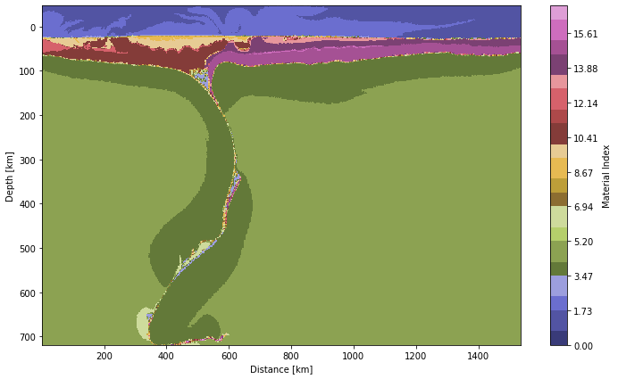
    


    
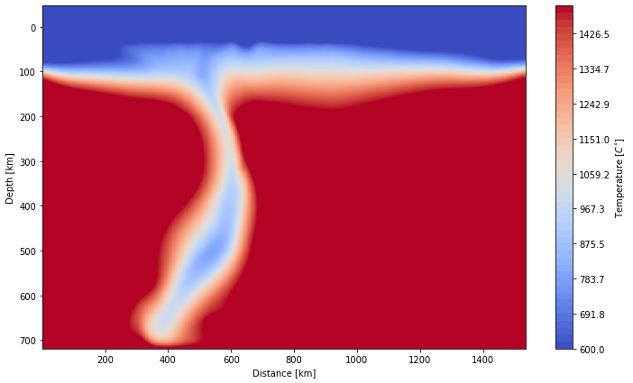
    


    
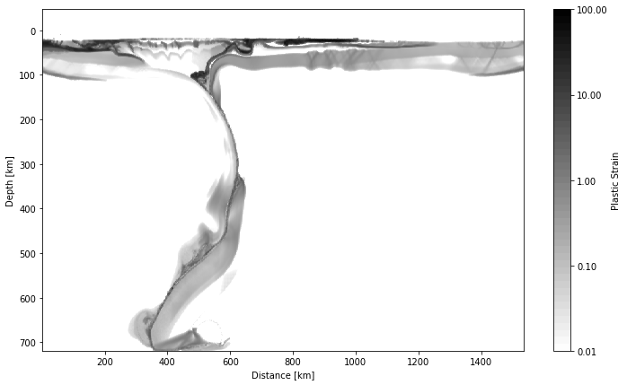
    


To convert the thermomechanical model into geophysical observables, we first have to define material objects that will correspond to materials used in the thermomechanical model. To set this up we have to refer to the material indexes we scraped from the .py file earlier. In this current example we have 14 materials. In these we will define their composition, mineral interconnectivities, water thermodynamic parameters, and how they will behave when they are to be used with ***deform_cond*** functions, which we will get into it in the later cells. For now, we will going to define two materials for each material we see in the thermomechanical model. One that is a 'background' or 'boring' conductivity model. With this, we will have a conservative estimate of the electrical conductivity. On the other hand, we will also define the most conductive endmember composition and conditions for that material. For instance, in the following cell we will define Eclogites as *Eclogite_Object* and *Eclogite_Object_2*:

Eclogite_Object: An dry eclogitic composition where conductivity is controlled by the volumetric percentages of constituent minerals, i.e. Hashin-Shtrikman Model.
Eclogite_Object_2: A dry eclogitic composition where 5% sulphides added into the composition and they are perfectly interconnected.


```python
p_obj = pide.pide()

#DEFINING THE OBJECTS with p_obj.material
Eclogite_Object = Material(name = 'Eclogite_Object', material_index = 3, calculation_type = 'mineral', composition = {'garnet':0.6,'cpx':0.4}, interconnectivities = {'garnet':1, 'cpx':1.5}, 
el_cond_selections = {'garnet':17,'cpx':0}, water = {'garnet':50,'cpx':0}, xfe = {'garnet':0.2, 'cpx':0.5}, solid_phase_mixing_idx = 1, deformation_dict = {'function_method':'exponential',
'conductivity_decay_factor':0.7, 'conductivity_decay_factor_2':0.3, 'strain_decay_factor':0.2,'strain_percolation_threshold':None})

Eclogite_Object_2 = Material(name = 'Eclogite_Object', material_index = 3, calculation_type = 'mineral', composition = {'garnet':0.57,'cpx':0.38, 'sulphide':0.05}, interconnectivities = {'garnet':1, 'cpx':1.5,'sulphide':1.0}, 
el_cond_selections = {'garnet':17,'cpx':0,'sulphide':0}, water = {'garnet':50,'cpx':200}, xfe = {'garnet':0.2, 'cpx':0.5}, solid_phase_mixing_idx = 0,deformation_dict = {'function_method':'exponential',
'conductivity_decay_factor':0.7, 'conductivity_decay_factor_2':0.3, 'strain_decay_factor':0.2,'strain_percolation_threshold':None})
```

In a similar manner, we can define the remaining materials as well. We details of each material defined here will be written as a comment on top of them.


```python
#####################
#Lithospheric Mantle - A lherzolite with 100 ppm water object where conductive counterpart has extra 0.05 sulphide in it.
Lithospheric_Mantle_Object = Material(name = 'Lithospheric_Mantle_Object', material_index = 4,
calculation_type = 'mineral', composition = {'ol':0.65,'opx':0.25,'garnet':0.05,'cpx':0.05},
interconnectivities = {'ol':1,'opx':2,'garnet':5, 'cpx':5}, 
el_cond_selections = {'ol':4, 'opx':0, 'garnet':0,'cpx':0}, water_distr = True, water = {'bulk':100},
xfe = {'ol':0.1,'opx':0.1,'garnet':0.1, 'cpx':0.1}, solid_phase_mixing_idx = 0,
deformation_dict = {'function_method':'exponential',
'conductivity_decay_factor':0.7,  'conductivity_decay_factor_2':0.3, 'strain_decay_factor':0.2,'strain_percolation_threshold':None})

Lithospheric_Mantle_Object_2 = Material(name = 'Lithospheric_Mantle_Object', material_index = 4, 
calculation_type = 'mineral', composition = {'ol':0.62,'opx':0.24,'garnet':0.045,'cpx':0.045,'sulphide':0.05},
interconnectivities = {'ol':1,'opx':2,'garnet':5, 'cpx':5,'sulphide':1}, 
el_cond_selections = {'ol':4, 'opx':0, 'garnet':0,'cpx':0,'sulphide':0}, water_distr = True, water = {'bulk':100},
xfe = {'ol':0.1,'opx':0.1,'garnet':0.1, 'cpx':0.1}, solid_phase_mixing_idx = 0,
deformation_dict = {'function_method':'exponential',
'conductivity_decay_factor':0.7, 'conductivity_decay_factor_2':0.3, 'strain_decay_factor':0.2,'strain_percolation_threshold':None})

#####################
#Asthenospheric mantle - A lherzolite with 100 ppm water object where conductive counterpart has 300 ppm water in it. 
Asthenospheric_Mantle_Object = Material(name = 'Asthenospheric_Mantle_Object', material_index = 5, 
calculation_type = 'mineral', composition = {'ol':0.65,'opx':0.25,'garnet':0.05,'cpx':0.05},
interconnectivities = {'ol':1,'opx':2,'garnet':5, 'cpx':5}, 
el_cond_selections = {'ol':4, 'opx':0, 'garnet':0,'cpx':0}, water_distr = True, water = {'bulk':100},
xfe = {'ol':0.1,'opx':0.1,'garnet':0.1, 'cpx':0.1}, solid_phase_mixing_idx = 0,
deformation_dict = {'function_method':'exponential',
'conductivity_decay_factor':0.7,  'conductivity_decay_factor_2':0.3, 'strain_decay_factor':0.2,'strain_percolation_threshold':None})

Asthenospheric_Mantle_Object_2 = Material(name = 'Asthenospheric_Mantle_Object', material_index = 5,
calculation_type = 'mineral', composition = {'ol':0.65,'opx':0.25,'garnet':0.05,'cpx':0.05},
interconnectivities = {'ol':1,'opx':2,'garnet':5, 'cpx':5}, 
el_cond_selections = {'ol':4, 'opx':0, 'garnet':0,'cpx':0}, water_distr = True, water = {'bulk':300},
xfe = {'ol':0.1,'opx':0.1,'garnet':0.1, 'cpx':0.1}, solid_phase_mixing_idx = 0,
deformation_dict = {'function_method':'exponential',
'conductivity_decay_factor':0.7, 'conductivity_decay_factor_2':0.3, 'strain_decay_factor':0.2,'strain_percolation_threshold':None})

#####################
#Mantle Wedge - A lherzolite with 500 ppm water where conductive counterpart has 1000 ppm water and extra 0.05 sulphide
Mantle_Wedge_Object = Material(name = 'Mantle_Wedge_Object', material_index = 6, calculation_type = 'mineral',
composition = {'ol':0.65,'opx':0.25,'garnet':0.05,'cpx':0.05},
interconnectivities = {'ol':1,'opx':2,'garnet':5, 'cpx':5}, 
el_cond_selections = {'ol':4, 'opx':0, 'garnet':0,'cpx':0}, water = {'bulk':500}, water_distr = True,
xfe = {'ol':0.1,'opx':0.1,'garnet':0.1, 'cpx':0.1}, solid_phase_mixing_idx = 0,
deformation_dict = {'function_method':'exponential',
'conductivity_decay_factor':0.7, 'conductivity_decay_factor_2':0.3, 'strain_decay_factor':0.2,'strain_percolation_threshold':None})

Mantle_Wedge_Object_2 = Material(name = 'Mantle_Wedge_Object', material_index = 6, calculation_type = 'mineral',
composition = {'ol':0.62,'opx':0.24,'garnet':0.045,'cpx':0.045,'sulphide':0.05},
interconnectivities = {'ol':1,'opx':2,'garnet':5, 'cpx':5,'sulphide':1}, 
el_cond_selections = {'ol':4, 'opx':0, 'garnet':0,'cpx':0,'sulphide':0}, water = {'bulk':1000}, water_distr = True,
xfe = {'ol':0.1,'opx':0.1,'garnet':0.1, 'cpx':0.1}, solid_phase_mixing_idx = 0,
deformation_dict = {'function_method':'exponential',
'conductivity_decay_factor':0.7, 'conductivity_decay_factor_2':0.3, 'strain_decay_factor':0.2,'strain_percolation_threshold':None})

#####################
#Oceanic Sediment - Where the oceanic sediment conductivity and velocities calculated with singular value method.
Oceanic_Sediment = Material(name = 'Oceanic_Sediment',material_index = 7, calculation_type = 'value',
resistivity_medium = 200.0,
vp_medium = 6.0, vs_medium = 3.0,
deformation_dict = {'function_method':'exponential',
'conductivity_decay_factor':0.7, 'conductivity_decay_factor_2':0.3, 'strain_decay_factor':0.2,'strain_percolation_threshold':None})

Oceanic_Sediment_2 = Material(name = 'Oceanic_Sediment',material_index = 7, calculation_type = 'value',
resistivity_medium = 50.0,
vp_medium = 6.0, vs_medium = 3.0,
deformation_dict = {'function_method':'exponential',
'conductivity_decay_factor':0.7, 'conductivity_decay_factor_2':0.3, 'strain_decay_factor':0.2,'strain_percolation_threshold':None})

#####################
#Oceanic Upper Crust - Simple basaltic upper crust where conductive counterpart has extra 0.05 sulphide in it
Oceanic_Upper_Crust = Material(name = 'Oceanic_Upper_Crust',material_index = 8, calculation_type = 'mineral',
composition = {'cpx':0.6, 'plag':0.4},
water = {'cpx':0, 'plag':0}, interconnectivities = {'cpx': 1,'plag':1.5}, solid_phase_mixing_idx = 0,
deformation_dict = {'function_method':'exponential',
'conductivity_decay_factor':0.7, 'conductivity_decay_factor_2':0.3, 'strain_decay_factor':0.2,'strain_percolation_threshold':None})

Oceanic_Upper_Crust_2 = Material(name = 'Oceanic_Upper_Crust',material_index = 8, calculation_type = 'mineral',
composition = {'cpx':0.575, 'plag':0.375, 'sulphide': 0.05},
water = {'cpx':0, 'plag':0}, interconnectivities = {'cpx': 1,'plag':1.5,'sulphide':1}, solid_phase_mixing_idx = 0,
deformation_dict = {'function_method':'exponential',
'conductivity_decay_factor':0.7, 'conductivity_decay_factor_2':0.3, 'strain_decay_factor':0.2,'strain_percolation_threshold':None})

#####################
#Oceanic Sediments 1 - Where the oceanic sediment conductivity and velocities calculated with singular value method.
Continental_Sediments_UP_Object = Material(name = 'Continental_Sediments_UP_Object',material_index = 9,
calculation_type = 'value', resistivity_medium = 200.0,
vp_medium = 6.0, vs_medium = 3.0,
deformation_dict = {'function_method':'exponential',
'conductivity_decay_factor':0.7, 'conductivity_decay_factor_2':0.3, 'strain_decay_factor':0.2,'strain_percolation_threshold':None})

Continental_Sediments_UP_Object_2 = Material(name = 'Continental_Sediments_UP_Object',material_index = 9,
calculation_type = 'value', resistivity_medium = 0.01,
vp_medium = 6.0, vs_medium = 3.0,
deformation_dict = {'function_method':'exponential',
'conductivity_decay_factor':0.7, 'conductivity_decay_factor_2':0.3, 'strain_decay_factor':0.2,'strain_percolation_threshold':None})

#####################
#Continental Upper Crust - Granitic upper crust where conductive counterpart has 0.05 graphite in it.
Continental_Upper_Crust_UP_Object = Material(name = 'Continental_Upper_Crust_UP_Object',material_index = 10,
calculation_type = 'rock', composition = {'granite':1.0},interconnectivities = {'granite':1},
el_cond_selections = {'granite':0}, solid_phase_mixing_idx = 0,
deformation_dict = {'function_method':'exponential',
'conductivity_decay_factor':0.7, 'conductivity_decay_factor_2':0.3, 'strain_decay_factor':0.2,'strain_percolation_threshold':None})

Continental_Upper_Crust_UP_Object_2 = Material(name = 'Continental_Upper_Crust_UP_Object',material_index = 10,
calculation_type = 'rock', composition = {'granite':0.95, 'other_rock':0.05},
interconnectivities = {'granite':1,'other_rock':1},
el_cond_selections = {'granite':0,'other_rock':3}, solid_phase_mixing_idx = 0,
deformation_dict = {'function_method':'exponential',
'conductivity_decay_factor':0.7, 'conductivity_decay_factor_2':0.3, 'strain_decay_factor':0.2,'strain_percolation_threshold':None})
#other rock 3 is graphite

#####################
#Continental Lower Crust - Granulite lower crust object where conductive counterpart has 0.05 graphite in it.
Continental_Lower_Crust_UP_Object = Material(name = 'Continental_Lower_Crust_UP_Object',material_index = 11,
calculation_type = 'rock', composition = {'granulite':1.0},interconnectivities = {'granulite':1},
el_cond_selections = {'granulite':0}, solid_phase_mixing_idx = 0,
deformation_dict = {'function_method':'exponential',
'conductivity_decay_factor':0.7, 'conductivity_decay_factor_2':0.3, 'strain_decay_factor':0.2,'strain_percolation_threshold':None})

Continental_Lower_Crust_UP_Object_2 = Material(name = 'Continental_Lower_Crust_UP_Object',material_index = 11,
calculation_type = 'rock', composition = {'granulite':0.95, 'other_rock':0.05},
interconnectivities = {'granulite':1, 'other_rock':1},
el_cond_selections = {'granulite':0,'other_rock':3}, solid_phase_mixing_idx = 0,
deformation_dict = {'function_method':'exponential',
'conductivity_decay_factor':0.7, 'conductivity_decay_factor_2':0.3, 'strain_decay_factor':0.2,'strain_percolation_threshold':None})

#####################
#Decollement - conductivity and velocities calculated with singular value method
Decollement_LP = Material(name = 'Decollement_LP',material_index = 12, calculation_type = 'value',
resistivity_medium = 300.0,
vp_medium = 6.0, vs_medium = 3.0,
deformation_dict = {'function_method':'exponential',
'conductivity_decay_factor':0.7, 'conductivity_decay_factor_2':0.3, 'strain_decay_factor':0.2,'strain_percolation_threshold':None})

Decollement_LP_2 = Material(name = 'Decollement_LP',material_index = 12, calculation_type = 'value',
resistivity_medium = 0.01,
vp_medium = 6.0, vs_medium = 3.0,
deformation_dict = {'function_method':'exponential',
'conductivity_decay_factor':0.7, 'conductivity_decay_factor_2':0.3, 'strain_decay_factor':0.2,'strain_percolation_threshold':None})

#####################
#Continental Sediments - conductivity and velocities calculated with singular value method
Continental_Sediments_LP_Object = Material(name = 'Continental_Sediments_LP_Object', material_index = 13,
calculation_type = 'value', resistivity_medium = 100.0,
vp_medium = 6.0, vs_medium = 3.0,
deformation_dict = {'function_method':'exponential',
'conductivity_decay_factor':0.7, 'conductivity_decay_factor_2':0.3, 'strain_decay_factor':0.2,'strain_percolation_threshold':None})

Continental_Sediments_LP_Object_2 = Material(name = 'Continental_Sediments_LP_Object', material_index = 13,
calculation_type = 'value', resistivity_medium = 1e-2,
vp_medium = 6.0, vs_medium = 3.0,                                             
deformation_dict = {'function_method':'exponential',
'conductivity_decay_factor':0.7, 'conductivity_decay_factor_2':0.3, 'strain_decay_factor':0.2,'strain_percolation_threshold':None})

#####################
#Continental Upper Crust - Granitic upper crust where conductive counterpart has 0.05 graphite in it.
Continental_Upper_Crust_LP_Object = Material(name = 'Continental_Upper_Crust_LP_Object', material_index = 14,
calculation_type = 'rock', composition = {'granite':1.0},interconnectivities = {'granite':1},
el_cond_selections = {'granite':0}, solid_phase_mixing_idx = 0,
deformation_dict = {'function_method':'exponential',
'conductivity_decay_factor':0.7, 'conductivity_decay_factor_2':0.3, 'strain_decay_factor':0.2,'strain_percolation_threshold':None})

Continental_Upper_Crust_LP_Object_2 = Material(name = 'Continental_Upper_Crust_LP_Object',material_index = 14,
calculation_type = 'rock', composition = {'granite':0.95, 'other_rock':0.05},
interconnectivities = {'granite':1,'other_rock':1},
el_cond_selections = {'granite':0,'other_rock':3}, solid_phase_mixing_idx = 0,
deformation_dict = {'function_method':'exponential',
'conductivity_decay_factor':0.7, 'conductivity_decay_factor_2':0.3, 'strain_decay_factor':0.2,'strain_percolation_threshold':None})


#####################
#Continental Lower Crust - Granulite lower crust object where conductive counterpart has 0.05 graphite in it.
Continental_Lower_Crust_LP_Object = Material(name = 'Continental_Lower_Crust_LP_Object', material_index = 15,
calculation_type = 'rock', composition = {'granulite':1.0},interconnectivities = {'granulite':1},
el_cond_selections = {'granulite':0}, solid_phase_mixing_idx = 0,
deformation_dict = {'function_method':'exponential',
'conductivity_decay_factor':0.7, 'conductivity_decay_factor_2':0.3, 'strain_decay_factor':0.2,'strain_percolation_threshold':None})

Continental_Lower_Crust_LP_Object_2 = Material(name = 'Continental_Lower_Crust_LP_Object',material_index = 15,
calculation_type = 'rock', composition = {'granulite':0.95, 'other_rock':0.05},
interconnectivities = {'granulite':1, 'other_rock':1},
el_cond_selections = {'granulite':0,'other_rock':3}, solid_phase_mixing_idx = 0,
deformation_dict = {'function_method':'exponential',
'conductivity_decay_factor':0.7, 'conductivity_decay_factor_2':0.3, 'strain_decay_factor':0.2,'strain_percolation_threshold':None})

#####################
#Decollement - conductivity and velocities calculated with singular value method
Decollement_UP = Material(name = 'Decollement_UP',material_index = 16, calculation_type = 'value',
resistivity_medium = 100.0,
vp_medium = 6.0, vs_medium = 3.0,
deformation_dict = {'function_method':'exponential',
'conductivity_decay_factor':0.7, 'conductivity_decay_factor_2':0.3, 'strain_decay_factor':0.2,'strain_percolation_threshold':None})

Decollement_UP_2 = Material(name = 'Decollement_UP',material_index = 16, calculation_type = 'value',
resistivity_medium = 1e-2,
vp_medium = 6.0, vs_medium = 3.0,
deformation_dict = {'function_method':'exponential',
'conductivity_decay_factor':0.7, 'conductivity_decay_factor_2':0.3, 'strain_decay_factor':0.2,'strain_percolation_threshold':None})

#####################
#Fault - conductivity and velocities calculated with singular value method
Fault = Material(name = 'Fault', material_index = 17, calculation_type = 'value', resistivity_medium = 100.0,
vp_medium = 6.0, vs_medium = 3.0,
deformation_dict = {'function_method':'exponential',
'conductivity_decay_factor':0.7, 'conductivity_decay_factor_2':0.3, 'strain_decay_factor':0.2,'strain_percolation_threshold':None})
Fault_2 = Material(name = 'Fault', material_index = 17, calculation_type = 'value', resistivity_medium = 1e-2,
vp_medium = 6.0, vs_medium = 3.0,
deformation_dict = {'function_method':'exponential',
'conductivity_decay_factor':0.7, 'conductivity_decay_factor_2':0.3, 'strain_decay_factor':0.2,'strain_percolation_threshold':None})

```

Now, we want to put them in a list in order to put them in a *Model* object. We also want to define a *material_skip_list*, which is the node skip rate for each material included in the lists. This is useful for something like asthenosphere where we do not have much heterogeneity and value can be calculated on a basis of calculating only some of the nodes.


```python
#creating material_object_list:
material_object_list = [Eclogite_Object,Lithospheric_Mantle_Object,Asthenospheric_Mantle_Object,Mantle_Wedge_Object,Oceanic_Sediment,Oceanic_Upper_Crust, Continental_Sediments_UP_Object,
Continental_Upper_Crust_UP_Object,Continental_Lower_Crust_UP_Object,Decollement_LP,Continental_Sediments_LP_Object,Continental_Upper_Crust_LP_Object,
Continental_Lower_Crust_LP_Object,Decollement_UP,Fault]

material_object_list_2 = [Eclogite_Object_2,Lithospheric_Mantle_Object_2,Asthenospheric_Mantle_Object_2,Mantle_Wedge_Object_2,Oceanic_Sediment_2,Oceanic_Upper_Crust_2, Continental_Sediments_UP_Object_2,
 Continental_Upper_Crust_UP_Object_2,Continental_Lower_Crust_UP_Object_2,Decollement_LP_2,Continental_Sediments_LP_Object_2,Continental_Upper_Crust_LP_Object_2,
 Continental_Lower_Crust_LP_Object_2,Decollement_UP_2,Fault_2]

material_skip_list = [None,5,20,None,None,None,None,None,None,None,None,None,None,None,None]
```

Now, we are creating the model object by assigning it the material lists, material array, temperature, pressure, melt, and plastic strain fields. After that, we can simply calculate the conductivities by saying, ***object.calculate_conductivity***. Number of CPUs can be specified.


```python
#creating model_object
mt_model_object = Model(material_list = material_object_list, material_array = material_array, material_list_2 = material_object_list_2, T = temp_array, P = pressure_array, model_type = 'underworld_2d', melt = melt_array,
p_strain = pstrain_array, material_node_skip_rate_list = material_skip_list)
backgr_cond = mt_model_object.calculate_model(type = 'conductivity', num_cpu = 5)
```

    Initiating calculation for the materials appended to the model.
    ##############################################################
    The conductivity for the material  Eclogite_Object  is calculated.
    The conductivity for the material  Lithospheric_Mantle_Object  is calculated.
    The conductivity for the material  Asthenospheric_Mantle_Object  is calculated.
    The conductivity for the material  Mantle_Wedge_Object  is calculated.
    The conductivity for the material  Oceanic_Sediment  is calculated.
    The conductivity for the material  Oceanic_Upper_Crust  is calculated.
    The conductivity for the material  Continental_Sediments_UP_Object  is calculated.
    The conductivity for the material  Continental_Upper_Crust_UP_Object  is calculated.
    The conductivity for the material  Continental_Lower_Crust_UP_Object  is calculated.
    The conductivity for the material  Decollement_LP  is calculated.
    The conductivity for the material  Continental_Sediments_LP_Object  is calculated.
    The conductivity for the material  Continental_Upper_Crust_LP_Object  is calculated.
    The conductivity for the material  Continental_Lower_Crust_LP_Object  is calculated.
    The conductivity for the material  Decollement_UP  is calculated.
    The conductivity for the material  Fault  is calculated.
    ##############################################################


```python
plot_2D_underworld_Field(xmesh = x_mesh_centers, ymesh = y_mesh_centers, Field = backgr_cond,cblimit_up = 1e3,
cblimit_down = 1e-8, log_bool=True, cb_name = 'Spectral_r',cbar_label = 'Conductivity [S/m]',plot_save = False)
```


    
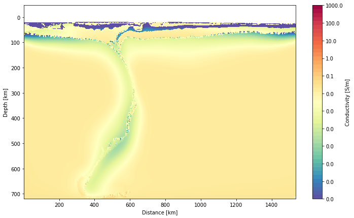
    


```python
mt_model_object = Model(material_list = material_object_list_2, material_array = material_array, T = temp_array, P = pressure_array,
                        model_type = 'underworld_2d', melt = melt_array,
p_strain = pstrain_array, material_node_skip_rate_list = material_skip_list)
max_cond = mt_model_object.calculate_model(type = 'conductivity', num_cpu = 6)

plot_2D_underworld_Field(xmesh = x_mesh_centers, ymesh = y_mesh_centers, Field = max_cond,cblimit_up = 1e3,
cblimit_down = 1e-8, log_bool=True, cb_name = 'Spectral_r',cbar_label = 'Conductivity [S/m]',plot_save = False)
```

    Initiating calculation for the materials appended to the model.
    ##############################################################
    The conductivity for the material  Eclogite_Object  is calculated.
    The conductivity for the material  Lithospheric_Mantle_Object  is calculated.
    The conductivity for the material  Asthenospheric_Mantle_Object  is calculated.
    The conductivity for the material  Mantle_Wedge_Object  is calculated.
    The conductivity for the material  Oceanic_Sediment  is calculated.
    The conductivity for the material  Oceanic_Upper_Crust  is calculated.
    The conductivity for the material  Continental_Sediments_UP_Object  is calculated.
    The conductivity for the material  Continental_Upper_Crust_UP_Object  is calculated.
    The conductivity for the material  Continental_Lower_Crust_UP_Object  is calculated.
    The conductivity for the material  Decollement_LP  is calculated.
    The conductivity for the material  Continental_Sediments_LP_Object  is calculated.
    The conductivity for the material  Continental_Upper_Crust_LP_Object  is calculated.
    The conductivity for the material  Continental_Lower_Crust_LP_Object  is calculated.
    The conductivity for the material  Decollement_UP  is calculated.
    The conductivity for the material  Fault  is calculated.
    ##############################################################


    
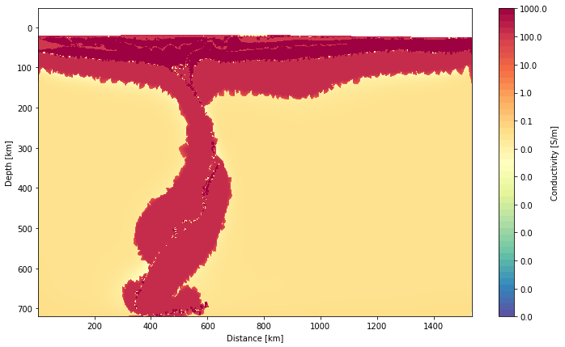
    


```python
deform_cond, misfit = mt_model_object.calculate_deformation_related_conductivity(method = 'plastic_strain',
                                                        cond_min = backgr_cond,
                                                        cond_max = max_cond,                                      
                                                        low_deformation_threshold = 1e-2, high_deformation_threshold = 1e2, num_cpu = 6)
```

    The deformation related conductivity for the material  Eclogite_Object  is calculated.
    The deformation related conductivity for the material  Lithospheric_Mantle_Object  is calculated.
    The deformation related conductivity for the material  Asthenospheric_Mantle_Object  is calculated.
    The deformation related conductivity for the material  Mantle_Wedge_Object  is calculated.
    The deformation related conductivity for the material  Oceanic_Sediment  is calculated.
    The deformation related conductivity for the material  Oceanic_Upper_Crust  is calculated.
    The deformation related conductivity for the material  Continental_Sediments_UP_Object  is calculated.
    The deformation related conductivity for the material  Continental_Upper_Crust_UP_Object  is calculated.
    The deformation related conductivity for the material  Continental_Lower_Crust_UP_Object  is calculated.
    The deformation related conductivity for the material  Decollement_LP  is calculated.
    The deformation related conductivity for the material  Continental_Sediments_LP_Object  is calculated.
    The deformation related conductivity for the material  Continental_Upper_Crust_LP_Object  is calculated.
    The deformation related conductivity for the material  Continental_Lower_Crust_LP_Object  is calculated.
    The deformation related conductivity for the material  Decollement_UP  is calculated.
    The deformation related conductivity for the material  Fault  is calculated.


```python
plot_2D_underworld_Field(xmesh = x_mesh_centers, ymesh = y_mesh_centers, Field = deform_cond,
						 cblimit_up = 1e3, cblimit_down = 1e-8, log_bool=True,
						 cb_name = 'Spectral_r',cbar_label = 'Conductivity [S/m]',
						 plot_save = False,label = 'cond_meshed.png')
```


    
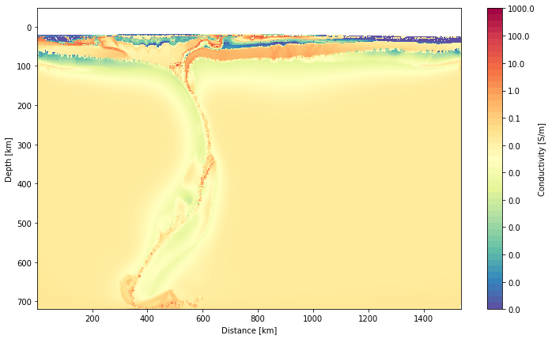
    


Using the first material list (conservative estimate), we can calculate the seismic velocities of the model with the following code block:


```python
seismic_model_object = Model(material_list = material_object_list, material_array = material_array, T = temp_array,
                             P = pressure_array,
                        model_type = 'underworld_2d', melt = melt_array,
p_strain = pstrain_array, material_node_skip_rate_list = material_skip_list)

v_p, v_s = seismic_model_object.calculate_model(type = 'seismic', num_cpu = 5)

plot_2D_underworld_Field(xmesh = x_mesh_centers, ymesh = y_mesh_centers, Field = v_p,cblimit_up = 8,
cblimit_down = 6, log_bool=False, cb_name = 'coolwarm_r',cbar_label = r'$V_P$ [km/s]',plot_save = False)

plot_2D_underworld_Field(xmesh = x_mesh_centers, ymesh = y_mesh_centers, Field = v_s, cblimit_up = 5,
cblimit_down = 3, log_bool=False, cb_name = 'coolwarm_r',cbar_label = r'$V_S$ [km/s]',plot_save = False)
```

    Initiating calculation for the materials appended to the model.
    ##############################################################
    The conductivity for the material  Eclogite_Object  is calculated.
    The conductivity for the material  Lithospheric_Mantle_Object  is calculated.
    The conductivity for the material  Asthenospheric_Mantle_Object  is calculated.
    The conductivity for the material  Mantle_Wedge_Object  is calculated.
    The conductivity for the material  Oceanic_Sediment  is calculated.
    The conductivity for the material  Oceanic_Upper_Crust  is calculated.
    The conductivity for the material  Continental_Sediments_UP_Object  is calculated.
    The conductivity for the material  Continental_Upper_Crust_UP_Object  is calculated.
    The conductivity for the material  Continental_Lower_Crust_UP_Object  is calculated.
    The conductivity for the material  Decollement_LP  is calculated.
    The conductivity for the material  Continental_Sediments_LP_Object  is calculated.
    The conductivity for the material  Continental_Upper_Crust_LP_Object  is calculated.
    The conductivity for the material  Continental_Lower_Crust_LP_Object  is calculated.
    The conductivity for the material  Decollement_UP  is calculated.
    The conductivity for the material  Fault  is calculated.
    ##############################################################


    
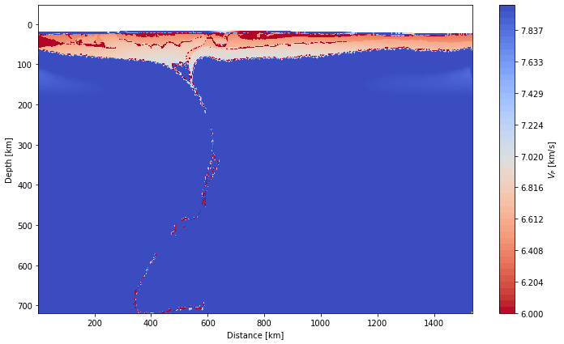
    


    
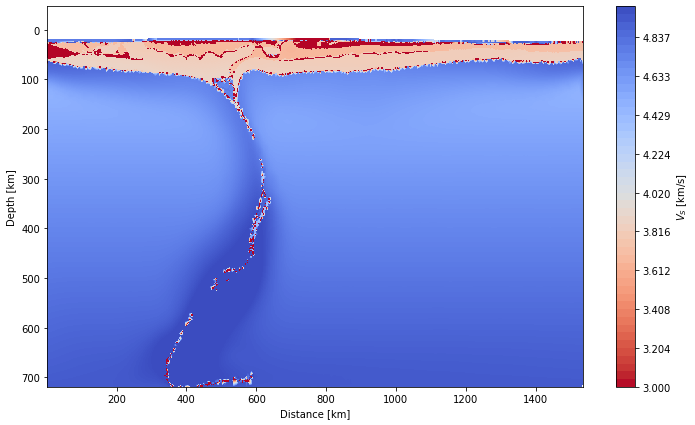
    


```python

```
