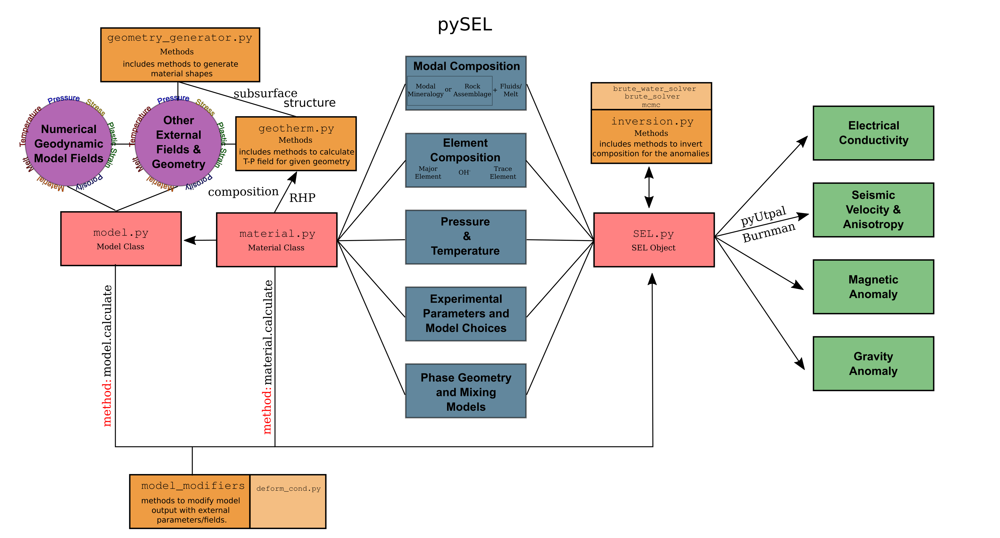

# Summary

# Statement of need
Geophysical models of the Earth often produce results that are hard to interpret due to the inherently heterogeneous and complex nature of the Earth systems. Experimental petrology and mineral physics studies have been commonly utilised to make quantified interpretations more grounded in reality than speculation of geological/geodynamic phenomena. These studies include the investigation of geophysical parameters such as electrical conductivity, magnetic susceptibility, seismic velocity and anisotropy of minerals and rocks; petrological examination of phase transitions; solidus and liquidus curves of rock assemblages; major or trace element partitioning and solubilities of minerals; and phase-mixing models. Many such tools are designed for each or some of the components, most of which usually involve a graphical interface [@Ozaydin2020; @Abers2016], or a web-based application [@Pommier2011]. `pygeoSEL` is built to address the need for a library that can be easily utilised to make such petrophysical calculations and build other scientific tools. It also aims to host toolkits that can be utilised for specific purposes, such as building realistic and petrophysically driven synthetic models and conversion of numerical plate tectonic models into geophysical observables. 

# Package Summary

`pygeoSEL` is a Python3 library to calculate geophysical observables employing the results from experimental petrology, mineral/rock physics and thermodynamic modelling studies. The geophysical observables currently included in the library are electrical conductivity, seismic velocity, seismic anisotropy, and magnetic and gravitational anomalies.

The general workflow diagram of the library can ben seen in Figure 1. The library has three main classes used in these calculations: `SEL`, `material` and `model`. 

`SEL` is the main class in which the electrical conductivity and seismic-related observables are calculated. In order to achieve this, the relevant parameters have to be defined in the SEL object with the associated functions (e.g., composition, water content, interconnectivity). Just using the SEL, for instance, the user can make a figure of all calculations of all the olivine electrical conductivity and seismic velocity models for olivine (Figure 2). While experimental parameters for electrical conductivity and magnetic properties are defined and calculated within the `pygeoSEL`, seismic velocity and anisotropy can be calculated by @pyUtpal or @Burnman libraries.

`material` is the class that can be specified as a holder of pre-defined material properties. For instance, one can create a Lherzolite material by mixing specific modal proportions of ol, opx, cpx and gt. This class allows the user to define some parameters tied to other parameters via user-defined functions. For example, water content can be defined as a function with changing modal opx and temperature in the material.

`model` class, on the other hand, is where a collection of materials can be appended with specific positions in 3D space. This `model` field can be associated with the external mapping of `material` objects. Figure 3, we can see the calculated geophysical observables (electrical conductivity and seismic velocity) of a model where the material field is extracted from a numerical model of a xxx zone.

The `model` class, on the other hand, is where a collection of `materials`  can be appended with specific positions in 3D space. This `model` field can be associated with the external mapping of `material` objects. In Figure 3, we can see the calculated geophysical observables (electrical conductivity and seismic velocity) of a `model` where the material field is extracted from a numerical model of a xxx zone. `model` is also where the user can calculate the magnetic and gravitational anomalies solely since these observables are dependent on the position of the materials and instantly assigned magnetic and density parameters only. 

`pygeoSEL` also comes with several tools that can exploit this structure. 'model_modifier' functions, for instance, can be used to calculate certain specific hypothesis tests. `inversion` modules, on the other hand, can be utilised to invert for specific input parameters that fit real geophysical data.

# Acknowledgements
This study is supported by the Australian Research Council (ARC)Linkage Grant #Grantnumber and ARD DP Grant #Grantnumber. 

# References